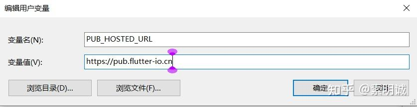
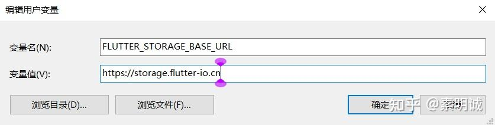
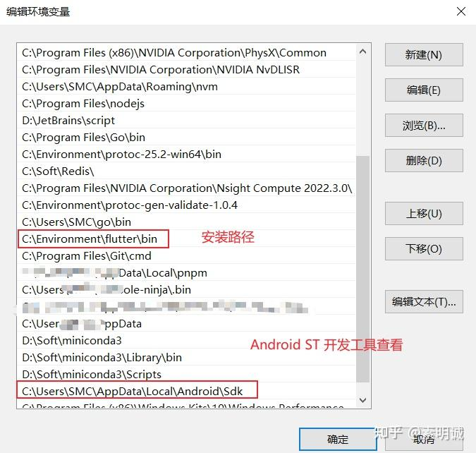
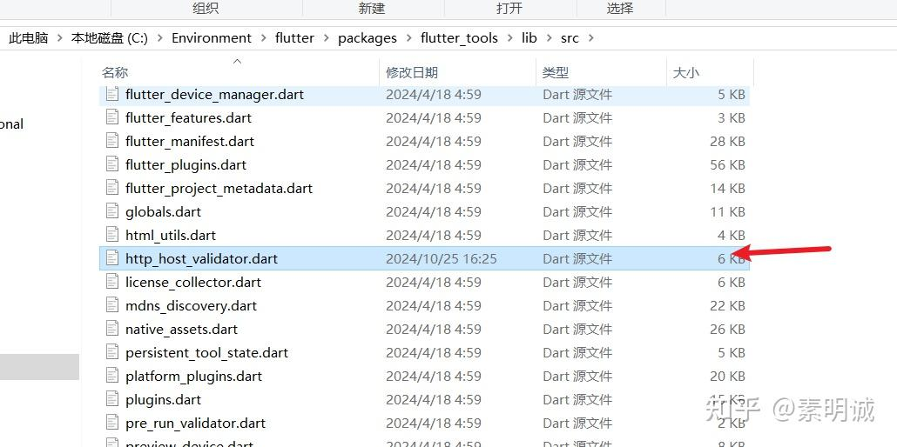
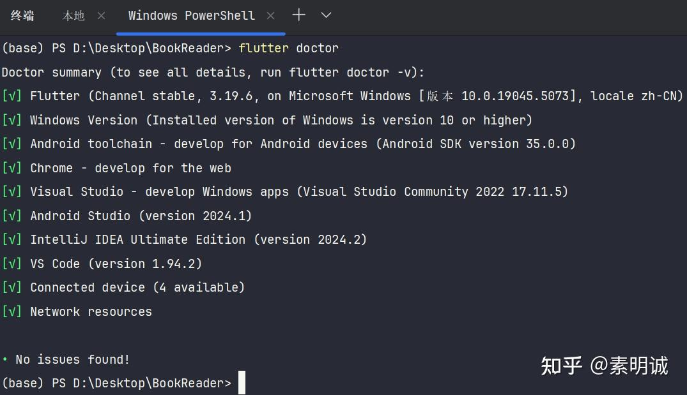

# Windows 环境下配置 Fultter 开发环境


 **Link:** [https://zhuanlan.zhihu.com/p/3157207574]

## 必须安装的部分  
### 安装 Android Studio 或 Visual Studio Code  

这里我习惯 Android Studio ，下载安装 [https://developer.android.com/studio?hl=zh-cn](https://developer.android.com/studio?hl=zh-cn)

Android Studio 没有汉化可以去下载 IDEA 对应的汉化包插件，装

### 安装 Flutter SDK  

参考：[https://docs.flutter.dev/get-started/install/windows/mobile#install-the-flutter-sdk](https://docs.flutter.dev/get-started/install/windows/mobile#install-the-flutter-sdk)

### 安装Visual Studio  

[https://visualstudio.microsoft.com/zh-hans/downloads/](https://visualstudio.microsoft.com/zh-hans/downloads/)

下载后，选择安装 C++ 桌面工具即可，大概10GB左右

## 环境变量配置  
### 用户变量  

PUB\_HOSTED\_URL=[https://pub.flutter-io.cn](https://pub.flutter-io.cn)

FLUTTER\_STORAGE\_BASE\_URL=[https://storage.flutter-io.cn](https://storage.flutter-io.cn)

### 系统变量  

把 SDK 和 flutter\bin 添加到 Path

### Git 配置代理  
```
git config --global http.proxy http://127.0.0.1:7890
git config --global https.proxy http://127.0.0.1:7890
```
### 修改 kMaven  
```
const String kMaven = 'http://maven.aliyun.com/nexus/content/groups/public/';
```


如果你的修改不生效，需要先删除 \flutter\bin 目录，再重新执行 flutter doctor

## 检查是否安装成功  

flutter doctor 检查是否都安装成功且配置成功了

### 配置成功  

