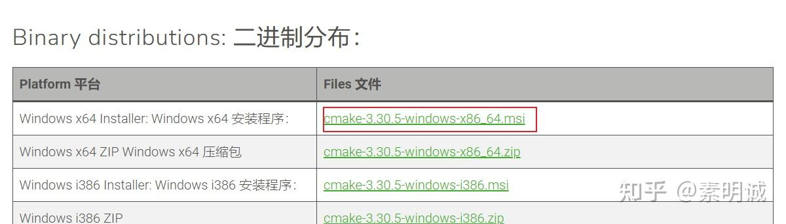
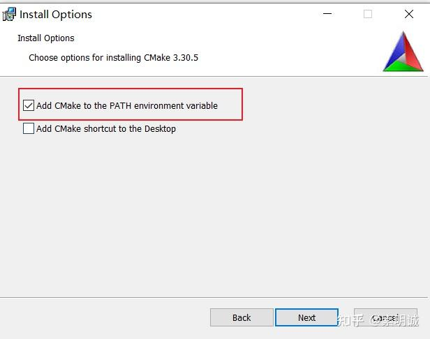
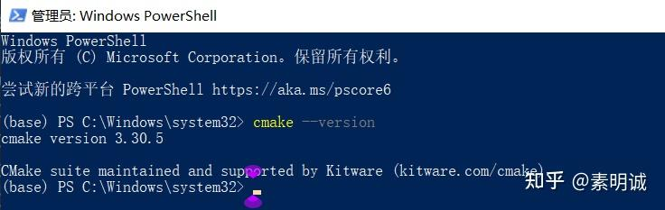

# Windows 上安装 CMake


CMake 是一个构建系统生成器，它主要解决了跨平台编译和构建软件的复杂性问题，允许开发者使用单一的配置文件来管理和生成适用于多种编译环境的项目文件。

## CMake 解决了什么问题

想象下你是一个软件开发者，你的任务是开发可以在 Windows、Linux 和 macOS 上运行的应用程序。每个操作系统都有其特定的编译器和工具链，这意味着你可能需要为每个平台编写和维护不同的构建脚本或项目文件。

使用 CMake，你只需要编写一套 CMakeLists.txt 配置文件。CMake 可以根据这个配置文件生成适用于各个平台的构建文件。例如：

1. 在 Windows 上，CMake 可以生成 Visual Studio 的解决方案文件。
2. 在 Linux 上，CMake 可以生成 Makefiles，这些 Makefiles 又可以被 GNU Make 工具使用来编译程序。
3. 在 macOS 上，CMake 同样可以生成 Makefiles 或者 Xcode 项目文件。

这样，你就不需要手动适配和管理每个平台的构建过程，大大简化了跨平台开发的复杂性。

## 安装 CMake

### 下载 CMake

- 访问 [https://cmake.org/download/](https://cmake.org/download/)，下载适用于 Windows 的 CMake 安装包。

### 安装 CMake

运行下载的安装程序。



在安装过程中，选择"Add CMake to the system PATH for all users"或"Add CMake to the system PATH for the current user"选项，这样可以在命令行中直接调用 CMake。



## 验证 CMake 安装

打开命令行工具（CMD 或 PowerShell）：

```bash
cmake --version
```



## 使用 CMake 测试一个简单的项目

### 创建一个简单的 C++项目

1. 创建一个新文件夹作为项目文件夹，例如`CMakeTest`
2. 在该文件夹内创建一个名为`CMakeLists.txt`的文件，输入以下内容：

```cmake
cmake_minimum_required(VERSION 3.10)
project(HelloCMake)
add_executable(hello hello.cpp)
```

3. 在同一文件夹中创建一个`hello.cpp`的 C++源文件，输入以下简单代码：

```cpp
#include <iostream>

int main() {
    std::cout << "Hello, CMake!" << std::endl;
    return 0;
}
```

### 生成和构建项目

1. 在命令行中，导航到你的`CMakeTest`目录
2. 创建一个名为`build`的目录来存放构建输出：

```bash
mkdir build
cd build
```

3. 运行 CMake 生成构建系统：

```bash
cmake ..
```

4. 构建项目：

```bash
cmake --build .
```

### 运行生成的程序

1. 在`build`目录中，你会找到编译后的可执行文件（在 Windows 中是`hello.exe`）
2. 运行它：

```bash
./hello
```

如果看到输出"Hello, CMake!"，则表示 CMake 已正确安装并能够用于构建项目。

这些步骤将帮助你安装 CMake 并验证它是否能在你的系统上正常工作，同时也提供了一个简单的例子来展示如何使用 CMake 来构建 C++程序。如果遇到任何问题，你可以查看 CMake 的[官方文档](https://cmake.org/documentation/)，其中包含了更多高级功能和详细指南。