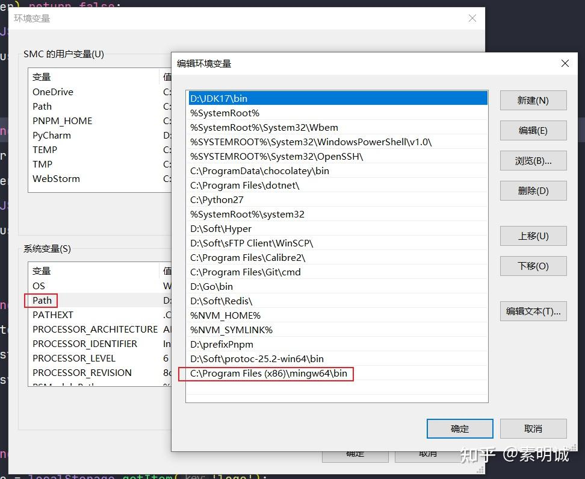
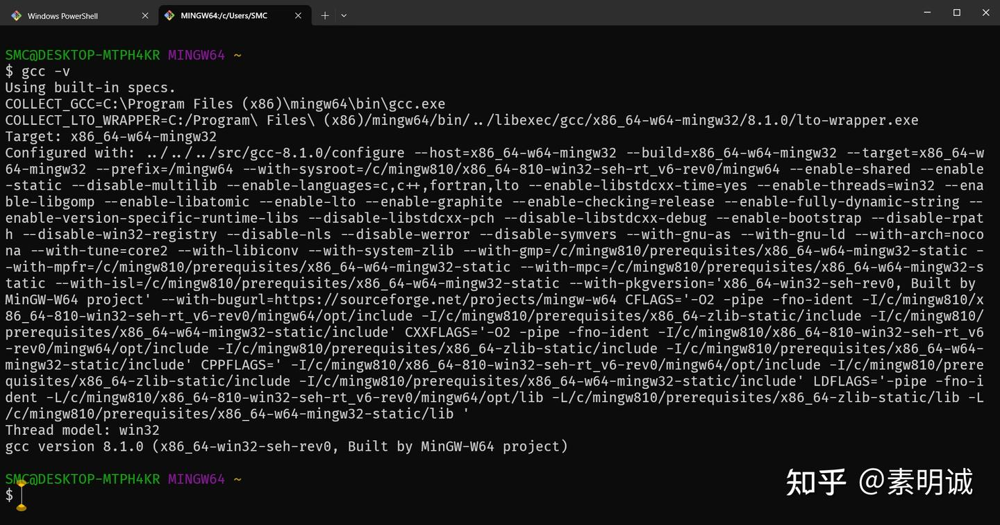

# Windows 安装 MinGW-W64

## MinGW 离线安装

1. 进入官网[https://www.mingw-w64.org/downloads/](https://www.mingw-w64.org/downloads/)
2. 浏览器搜索 `SourceForge` ,点击进入 [https://sourceforge.net/projects/mingw-w64/files/mingw-w64/mingw-w64-release/](https://sourceforge.net/projects/mingw-w64/files/mingw-w64/mingw-w64-release/)
3. 搜索`x86_64-win32-seh` ，各位可以自行选择其他的版本。
4. 下载解压，在系统环境变量配置

## 验证是否成功

```
gcc -v
```

## MinGW 在线安装

1. 进入官网[https://www.mingw-w64.org/downloads/](https://www.mingw-w64.org/downloads/)
2. 浏览器搜索 SourceForge ,点击进入 [https://sourceforge.net/projects/mingw-w64/files/mingw-w64/mingw-w64-release/](https://sourceforge.net/projects/mingw-w64/files/mingw-w64/mingw-w64-release/)
3. 搜索`MinGW-W64 Online Installer` 找到并且下载在线安装版本
4. 在线安装可能会有网络问题，推荐离线包，配置环境变量就可以用了
