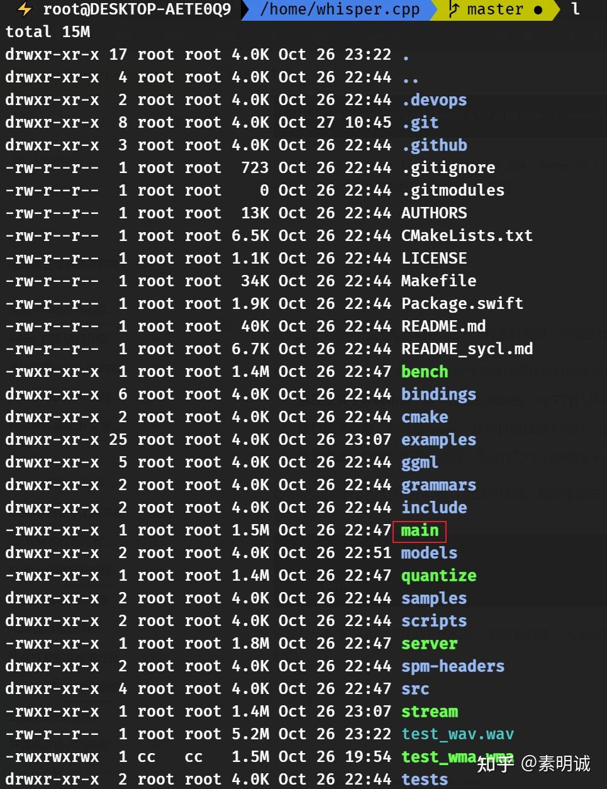
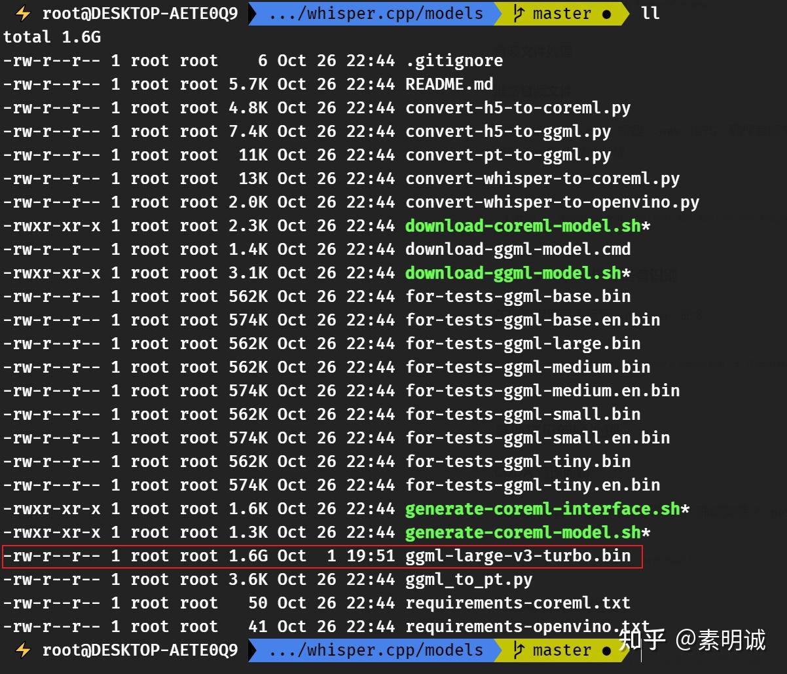

# Whisper.cpp 安装与使用教程


 **Link:** [https://zhuanlan.zhihu.com/p/2765143936]

## 环境准备  

Ubuntu 22.04 或其他 Linux 发行版，windows 上要配置的东西比较多，不推荐。

CUDA 支持的 Nvidia GPU (可选)

## 安装编译工具  

安装编译所需的工具

```
sudo apt install build-essential
```
## 下载与编译 Whisper.cpp  

使用 git 克隆 `whisper.cpp` 项目

```
git clone https://github.com/ggerganov/whisper.cpp.git
cd whisper.cpp
```
## 编译项目  

在项目根目录下运行 `make` 命令

```
make
```

如果您有 CUDA 环境，可以加速编译

```
make -j
```

编译后会出现 main 可执行文件

## 模型下载  

进入 `models` 目录并下载所需的模型

```
cd models
./download-ggml-model.sh large-v3-turbo
```
## 音频文件处理  

**准备音频文件**

因为 `whisper.cpp` 需要 `.wav` 格式，确保音频文件为 `.wav` 格式，可以使用 `ffmpeg` 进行转换，没有`ffmpeg`需要提前下载

```
apt install ffmpeg
ffmpeg -i /home/whisper.cpp/test_wma.wma -acodec pcm_s16le -ac 1 -ar 16000 /home/whisper.cpp/test_wav.wav
```
### 使用 Whisper 进行语音识别  

在项目根目录下运行 `whisper` 命令

```
./main -m ./models/ggml-large-v3-turbo.bin -f /home/whisper.cpp/test_wav.wav
```
## 实时语言转换  
```
./stream -m ./models/ggml-large-v3-turbo.bin -f your_audio_device
```
## 其他常见问题处理  

**CUDA 编译问题**

如果遇到 CUDA 相关的编译问题，确保安装了 `nvidia-cuda-toolkit` 和对应的驱动

```
sudo apt install nvidia-cuda-toolkit
```

**ccache 提升编译速度**

安装 `ccache` 来缓存编译结果

```
sudo apt install ccache
```
### 在 WSL (Windows Subsystem for Linux) 上实现音频输入和输出  
### 在 Windows 上下载并设置 PulseAudio  

下载 PulseAudio for Windows 并将其解压到您的系统上的某个位置，例如 `C\PulseAudio`。

编辑 `C\PulseAudio\etc\pulse\default.pa` 文件，确保添加以下行以启用网络音频支持

```
load-module module-native-protocol-tcp auth-ip-acl=127.0.0.1 auth-anonymous=1
```

同时，您可能需要编辑 `C\PulseAudio\etc\pulse\daemon.conf` 文件，并设置

```
exit-idle-time = -1
```

运行 PulseAudio 服务

```
C\PulseAudio\bin\pulseaudio.exe
```
### 配置 WSL 以使用 PulseAudio  

在 WSL 中安装 PulseAudio 客户端工具（如果尚未安装）

```
sudo apt update
sudo apt install pulseaudio
```

配置 WSL 使用从 Windows 主机运行的 PulseAudio，编辑 `~/.bashrc` 或相应的 shell 配置文件，并添加

```
export PULSE_SERVER=tcplocalhost
```
### 测试音频功能  

在 WSL 中，您现在应该能够通过 PulseAudio 来播放音频。例如，使用 `aplay` 或其他音频软件测试播放声音。

确保在配置过程中，Windows 防火墙允许 PulseAudio 和相关网络通信。这些步骤概述了在 WSL 中启用音频的基本方法，可以适用于大多数需要音频输入输出的场景

### 参考文档  

* [https://zhuanlan.zhihu.com/p/2765143936/https//www.freedesktop.org/wiki/Software/PulseAudio/Ports/Windows/Support/](https://zhuanlan.zhihu.com/p/2765143936/https//www.freedesktop.org/wiki/Software/PulseAudio/Ports/Windows/Support/)
* [https://zhuanlan.zhihu.com/p/2765143936/https//ktkr3d.github.io/2020/08/01/Enabling-sound-in-WSL/index.html](https://zhuanlan.zhihu.com/p/2765143936/https//ktkr3d.github.io/2020/08/01/Enabling-sound-in-WSL/index.html)

