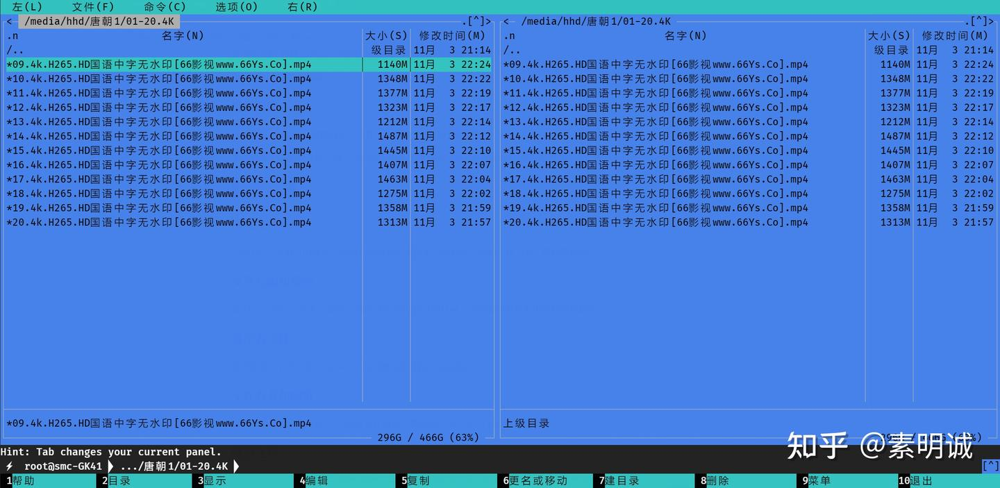
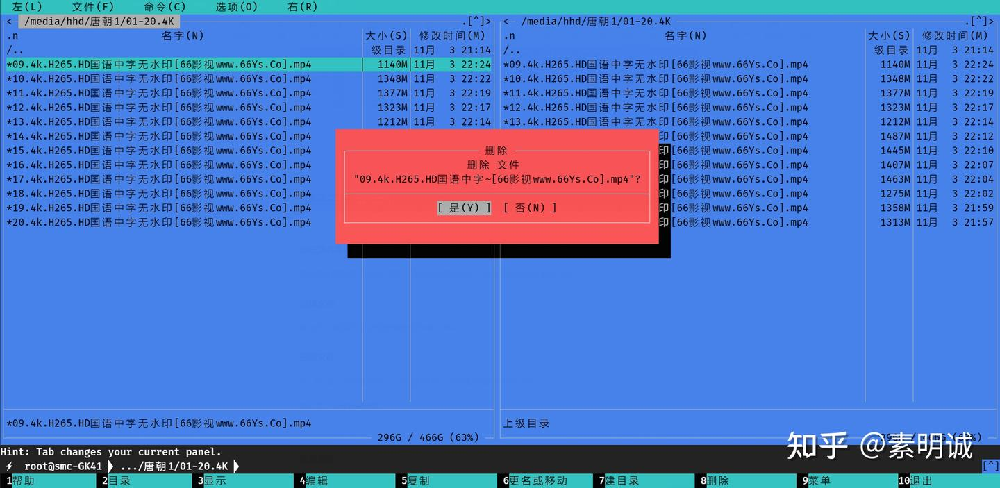

# Linux mc 文件管理工具，快速删除文件

 

## 使用mc删除文件  
### 启动mc  

在终端输入 `mc` 命令，打开 Midnight Commander 界面。

### 浏览文件系统  

使用箭头键浏览文件和文件夹。左侧和右侧面板可以分别显示不同目录的内容。

### 选择文件  

使用方向键移动光标到要删除的文件或文件夹上。

### 删除文件  

按 `F8` 键，系统会弹出一个确认对话框，询问是否删除选中的文件。

确认后，文件将被删除。

### 批量删除  

可以使用 `Insert` 键选择多个文件，然后按 `F8` 进行批量删除。

下面是每个功能的具体示例，帮助你更好地理解 Midnight Commander (MC) 的使用

## 其他操作  
### 浏览文件系统  

启动 MC，使用方向键在左侧和右侧窗格中浏览不同的目录。例如，按 `Tab` 键切换窗格。

### 文件复制和移动  

选中一个文件，按 `F5` 复制，或按 `F6` 移动到目标目录。在弹出的对话框中选择目标路径。

### 重命名文件  

选中要重命名的文件，按 `F6`，然后输入新名称，最后确认。

### 文件查看和编辑  

选中一个文本文件，按 `F3` 查看文件内容。要编辑，按 `F4` 打开内置编辑器。

### 搜索文件  

按 `Ctrl + S`，输入要搜索的文件名或模式（如 `*.txt`），然后 MC 会在当前目录及子目录中搜索。

### 批量选择文件  

按 `Insert` 键选中多个文件。完成选择后，按 `F5` 或 `F6` 进行批量复制或移动。

### 比较文件  

选中两个文件（按 `Insert` 选中），然后按 `F9`，选择“文件”菜单中的“比较”选项，查看它们的差异。

### 支持压缩和解压缩  

选中一个压缩文件（如 `.zip`），按 `F4` 解压或按 `F5` 创建新的压缩文件。

### 访问 FTP/SFTP 服务器  

在 MC 中，按 `Ctrl + \`，输入 FTP/SFTP 服务器地址（如 `ftp//example.com`），然后输入用户名和密码，连接后可以管理远程文件。

### 文件属性和权限管理  

选中一个文件，按 `F9`，选择“文件”菜单中的“属性”，可以查看和修改文件的权限和所有者。

### 执行外部命令  

在 MC 界面中，按 `Ctrl + O` 切换到命令行模式，输入所需的命令（如 `ls -l`），然后按 `Enter` 执行。

通过这些示例，你可以更全面地了解如何使用 MC 进行各种文件管理操作。

## 注意事项  

**隐藏文件**默认情况下，`mc` 可能不显示以 `.` 开头的隐藏文件。如果需要查看和删除这些文件，可以在 `mc` 的设置中调整显示选项。