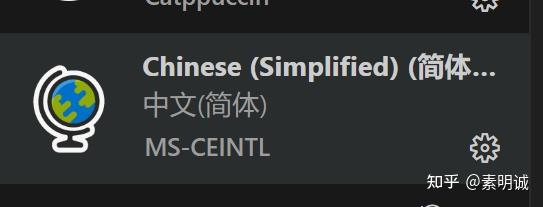

# VS Code 安装使用中文（简体）插件

 **Link:** [https://zhuanlan.zhihu.com/p/9195788878]

## 确认插件安装成功  

确保中文插件已经正确安装。在VS Code的扩展视图中搜索“Chinese”（简体中文），检查是否有安装标记。

## 激活语言包  

有时安装语言包后需要重新启动VS Code才能生效。尝试关闭并重新启动VS Code。

## 手动设置语言  

如果自动切换没有生效，你可以手动设置语言。打开命令面板（`Ctrl+Shift+P`），然后输入 `Configure Display Language`，选择它。在打开的语言列表中选择中文（简体）`zh-cn`，然后重启VS Code。

## 检查配置文件  

打开VS Code的用户设置（`文件 > 首选项 > 设置` 或使用快捷键 `Ctrl+,`），在搜索栏输入 `locale`。检查 "locale": "zh-cn" 是否设置正确。

## 重新安装中文插件  

如果以上步骤都未能解决问题，尝试卸载中文插件后重启VS Code，然后重新安装该插件。

通过上述步骤，通常能够解决中文显示问题。如果问题依然存在，可能需要检查是否有其他插件或设置干扰了语言包的正常工作。

