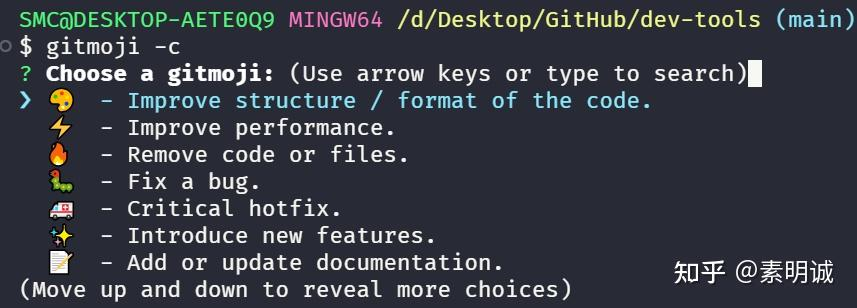

# gitmoji-cli 使用


 **Link:** [https://zhuanlan.zhihu.com/p/9024310737]

### 安装 gitmoji-cli  

首先，确保你的计算机上安装了 Node.js 和 npm。然后，通过 npm 安装 `gitmoji-cli`：

```
npm install -g gitmoji-cli
```
### 使用 gitmoji-cli  

安装完成后，你可以通过以下命令开始使用 `gitmoji-cli`：

**初始化 gitmoji-cli**： 使用命令 `gitmoji -i` 可以初始化 gitmoji 提交钩子（hook）。这会在你的项目中设置一个自动提示符，当你用 `git commit` 命令时，它会提示你选择一个 gitmoji。

**查看所有可用的 gitmojis**： 执行 `gitmoji -l` 可以列出所有可用的 gitmojis。这可以帮助你熟悉不同 gitmojis 的用途。



选择后提交即可