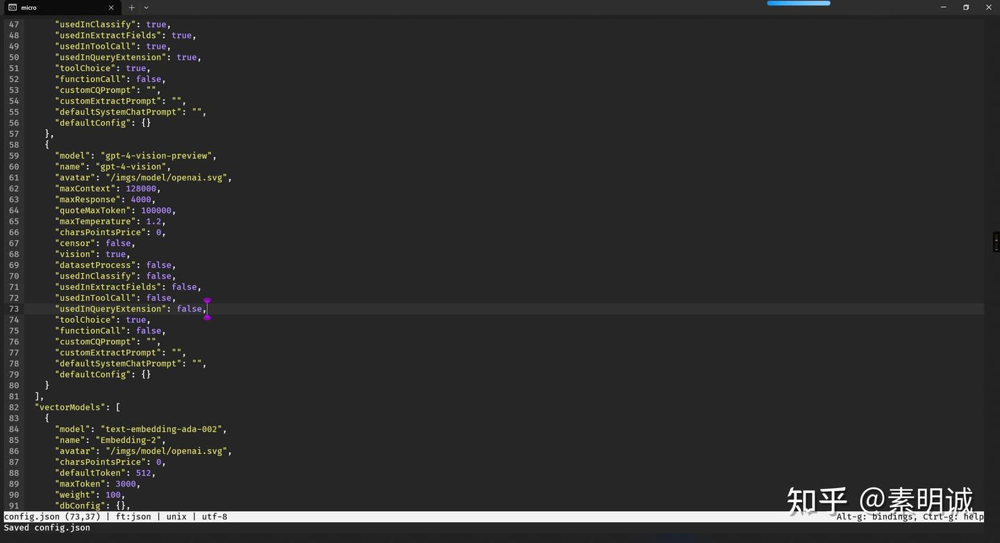

# Ubuntu nano 启动鼠标滚动

## nano 设置鼠标滚动

在某些版本的 `nano` 和在某些终端中，你可以启用鼠标支持，使得可以使用鼠标来移动光标和滚动文本。要尝试启用鼠标支持，你可以启动 `nano` 时加上 `-m` 或 `--mouse` 选项：

```
nano -m filename
```

或者，你可以在 `~/.nanorc` 文件（如果没有，就创建一个）中添加以下设置来永久启用鼠标支持：

```
set mouse
```

这个设置会允许你使用鼠标点击位置来移动光标，但是否能滚动取决于终端和 `nano` 的版本。

## 使用 micro

[https://github.com/zyedidia/micro.git](https://github.com/zyedidia/micro.git)## 使用

一开始我只是想让 nano 开启默认的鼠标滚轮，后来发现了 micro 这款编辑器，推荐一下

`micro` 是一个现代的、易于使用的终端基文本编辑器，自带全面的鼠标支持

```
sudo apt install micro  # 在 Debian/Ubuntu 上安装
```

然后，使用 `micro` 打开文件

```
micro filename
```



使用 ctrl + E 进入命令模式

```
quit  // 退出
```

**如果您喜欢这篇文章，不妨给它点个赞并收藏，感谢您的支持！**
