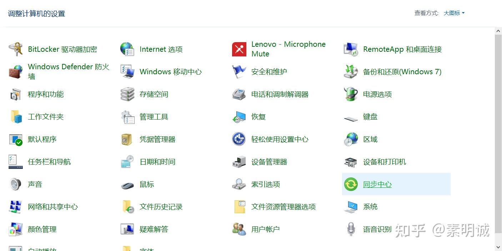
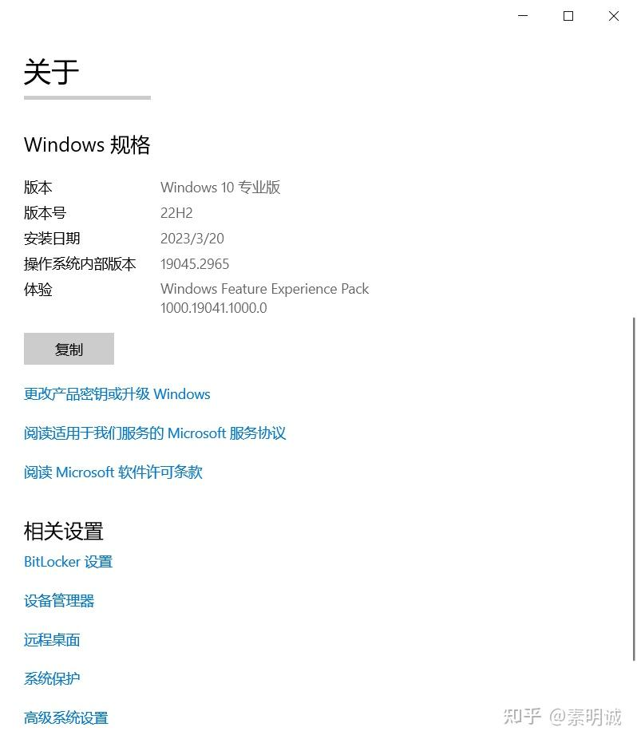
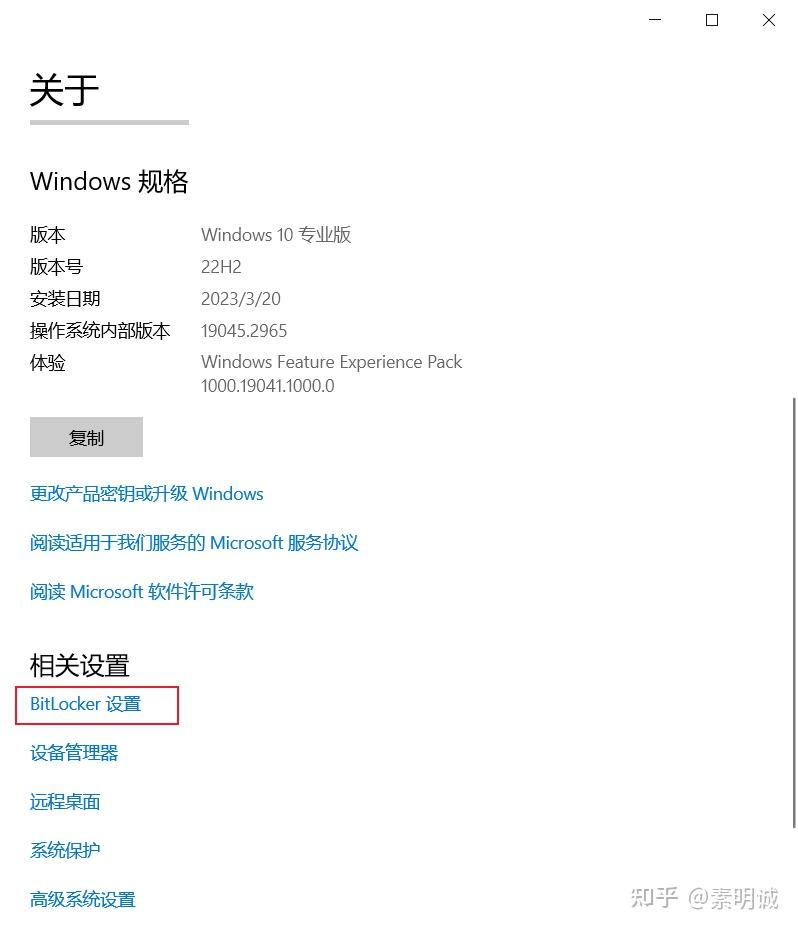
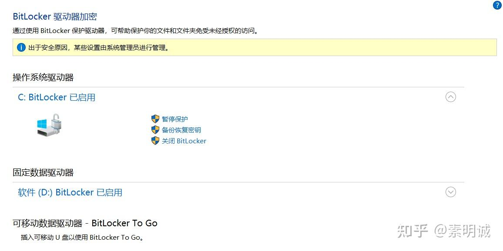
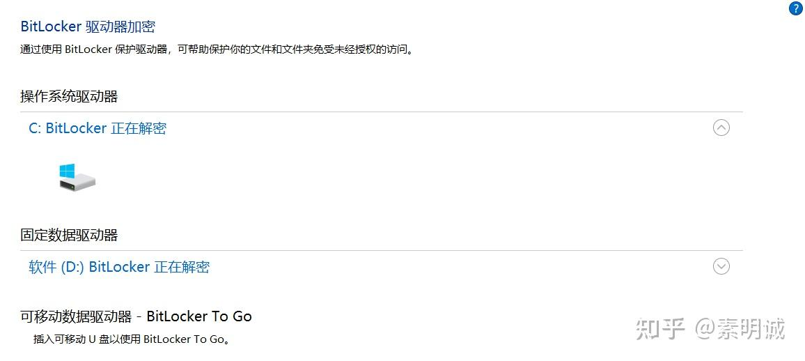
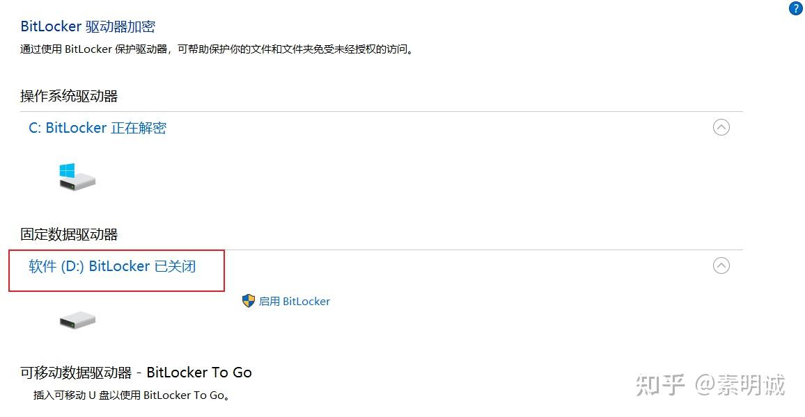

# Win10 取消 BitLocker 加密

 **Link:** [https://zhuanlan.zhihu.com/p/691486902]

### 控制面板  
### 选择系统  
### 选择BitLocker  
### 选择关闭  
### 解密  
### 等待解密完成  

解密过程可能需要一些时间，具体时间取决于磁盘上的数据量。在解密过程中，你可以继续使用电脑，但可能会注意到一些性能上的减慢。

### 完成  

解密后就可以对分区进行修改了，否则我的C盘总是满满的

