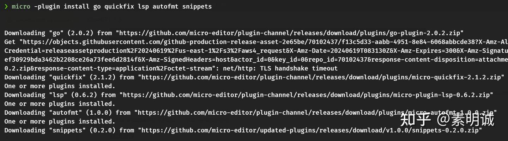

# Linux Micro 使用和常用插件配置


 **Link:** [https://zhuanlan.zhihu.com/p/704287914]

## 安装 Micro  

**Linux/macOS**：可以通过包管理器安装，如在 macOS 上使用 Homebrew: `brew install micro`

**Windows**：可以通过 Scoop 或 Chocolatey 安装：`scoop install micro` 或 `choco install micro`

**启动编辑器**

在终端中输入 `micro` 后跟文件名即可打开文件进行编辑，例如：`micro example.txt`

### 常用操作  

`Ctrl-D` 输入 quit 退出

`Ctrl-S`保存

## 查找操作  

**查找下一个**

在查找模式下，按下 `Enter` 将会查找下一个匹配项。

或者，按下 `Ctrl-N` 在查找结果中向下移动到下一个匹配项。

**查找上一个**

在查找模式下，按下 `Ctrl-P` 在查找结果中向上移动到上一个匹配项。

### 取消查找  

在查找模式下，按下 `Esc` 键或者 `Ctrl-C` 可以取消当前的查找操作，回到正常的编辑模式。

## 配置 Micro  

Micro 的配置文件通常存放在用户目录下的 `.config/micro/settings.json` 文件中。

可以通过修改这个文件来改变默认的设置，例如设置 tab 的大小，是否自动缩进等。

### 自定义快捷键  

你可以在 `~/.config/micro/bindings.json` 中定义自己的键绑定，以覆盖默认的快捷键配置。

### 使用命令面板  

可以通过 `Ctrl-E` 启动，然后输入任何内置命令或自定义命令来执行。

### 使用插件  

Micro 支持插件来扩展功能。可以通过 `micro -plugin install [plugin_name]` 来安装插件。

常用插件如 `go`, `python` 提供了语言特定的语法高亮和其他功能。

[插件地址](https://micro-editor.github.io/plugins.html)### go 开发推荐插件  
```
micro -plugin install go quickfix lsp autofmt snippets
```

**注意，下载需要一段时间**

