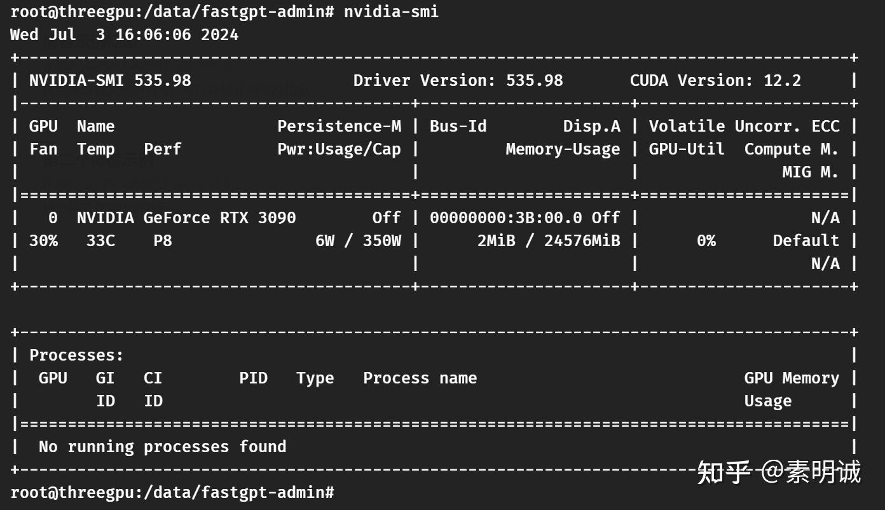

# Linux 命令 nvidia-smi 参数

 **Link:** [https://zhuanlan.zhihu.com/p/706829182]

## 命令nvidia-smi输出的信息  
### 表格标题和版本信息  

**NVIDIA-SMI**：显示 `nvidia-smi` 工具的版本号

**Driver Version**：当前安装的NVIDIA驱动版本

**CUDA Version**：系统支持的CUDA版本，这对开发者来说很重要，因为它决定了可以使用的CUDA工具和功能

### GPU 列表  

**对于每块GPU，表格都会显示以下信息，从左到右介绍**

**GPU**：GPU的编号，从0开始

**Name**：GPU的型号，例如“NVIDIA GeForce RTX 3090”

**Persistence-M**：持久性模式的开关状态，通常在服务器和需长时间运行的环境中启用

**Bus-Id**：GPU在系统中的PCI总线ID

**Disp.A**：显示活动状态，显示是否有显示器连接到这块GPU

**Volatile Uncorr. ECC**：显示是否启用了易失性未校正的错误校正码（ECC），通常用于计算密集型任务的可靠性

### 性能指标  

**Fan**：风扇速度的百分比

**Temp**：GPU的当前温度

**Perf**：性能状态，从P0（最高性能）到P12（最低性能）

**Pwr/Cap：**当前功率使用量和功率上限

**Memory-Usage**：GPU内存的使用情况，显示已使用和总计的内存（例如，“2MiB / 24576MiB”）

**GPU-Util**：GPU利用率的百分比，显示GPU被使用的程度

**Compute M.**：计算模式，通常是“Default”或“Exclusive”，影响GPU的访问控制

**MIG M.**：如果启用了多实例GPU（MIG），这里会显示状态

### 进程信息  

**这部分列出了当前在GPU上运行的所有进程**

**PID**：进程ID

**Type**：进程类型，通常是C（计算）或G（图形）

**Process name**：进程名称

**GPU Memory Usage**：该进程使用的GPU内存量

