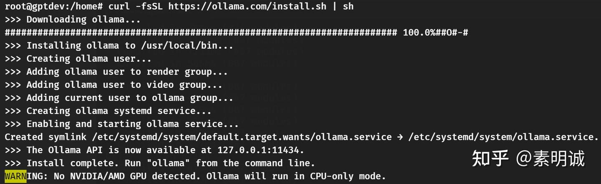

# Linux Ollama 常用命令和 API 调用


 **Link:** [https://zhuanlan.zhihu.com/p/708491108]

## 安装 ollama  
```
curl -fsSL https://ollama.com/install.sh | sh
```
## 下载模型  

下载 gemma 进行测试，下次成功后会直接进入跟模型的交互模式。可以直接在命令行聊天

```
ollama run gemma:2b
```

你也可以下载自己需要的 [https://ollama.com/library](https://ollama.com/library)

## 查看模型  
```
root@gptdev:/home# ollama list
NAME            ID              SIZE    MODIFIED       
gemma:2b        b50d6c999e59    1.7 GB  24 minutes ago
```
## 查看模型详情  
```
root@gptdev:/home# ollama show gemma:2b
  Model                             
        arch                    gemma                
        parameters              3B                   
        quantization            Q4_0                 
        context length          8192                 
        embedding length        2048                 
                                          
  Parameters                        
        repeat_penalty  1                          
        stop            "<start_of_turn>"          
        stop            "<end_of_turn>"            
                                          
  License                           
        Gemma Terms of Use                        
        Last modified: February 21, 2024          
```
## 删除模型  
```
ollama rm <model-name>
```
## 运行模型  
```
root@gptdev:/home# ollama run gemma:2b
```
## 退出交互模式  
```
Use Ctrl + d or /bye to exit.
>>> /bye
```
## 使用 API 调用  

generate **一次性回答**

```
root@gptdev:/home# curl -XPOST http://localhost:11434/api/generate -d '{"model": "gemma:2b", "prompt": "星星为什么是一闪一闪的?", "stream": false}'

回答↓
{
  "model": "gemma:2b",
  "created_at": "2024-07-12T08:35:18.532841683Z",
  "response": "星星不是一闪一闪的。星星是光源，是通过核反应产生光子的天体。",
  "done": true,
  "done_reason": "stop",
  "context": [],
  "total_duration": 3780790485,
  "load_duration": 41295298,
  "prompt_eval_count": 33,
  "prompt_eval_duration": 134544000,
  "eval_count": 23,
  "eval_duration": 3562200000
}
```

**聊天**

```
root@gptdev:/home# curl http://localhost:11434/api/chat -d '{                                                                                      
  "model": "gemma:2b",
  "messages": [
    { "role": "system", "content": "You are an astronomer. Answer the following questions based on your knowledge of astronomy." },
    { "role": "user", "content": "星星为什么是一闪一闪的?中文回答~" }
  ],
  "stream": false
}

回答↓
{
  "model": "gemma:2b",
  "created_at": "2024-07-12T08:39:00.414947479Z",
  "message": {
    "role": "assistant",
    "content": "星星是由于其表面反射的灯光造成的。 这是因为星光的波长比地球的光波长更长，这意味着当它从遥远的星系中进入地球时，它被地球表面吸收的更多光线。 这使得我们可以看到的那部分光被反射回来，我们就能看到星星。\n\n星星之所以闪闪是因为它们非常光亮。 这意味着它们发射的光线非常强，可以照亮整个地球表面。 当我们看到星星时，我们看到的是它们反射回来的光。\n\n星星是宇宙中最亮的天体，可以见到的最远的天体。"
  },
  "done_reason": "stop",
  "done": true,
  "total_duration": 21237384982,
  "load_duration": 45647661,
  "prompt_eval_count": 54,
  "prompt_eval_duration": 372113000,
  "eval_count": 125,
  "eval_duration": 20685706000
}
```

个人觉得 Ollama 真心挺不错的，让跑大模型这件事变的简单了，专心搞业务就行了。

