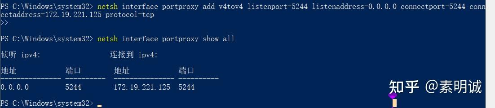
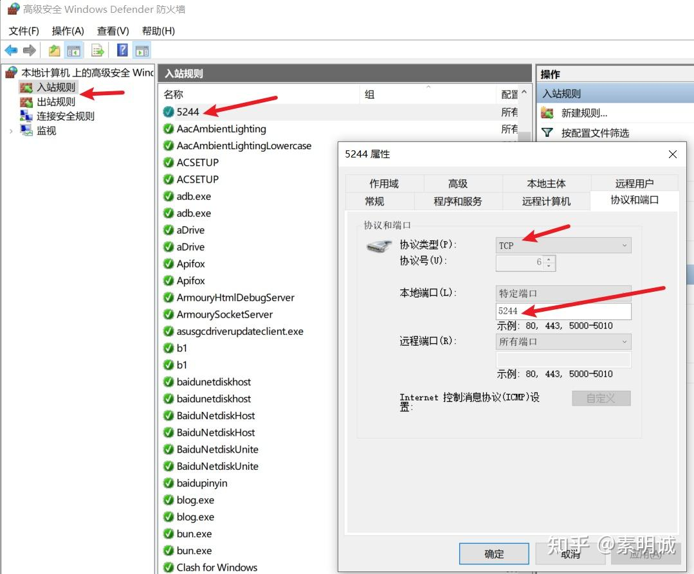

# Windows 上为 WSL2 设置端口转发，实现局域网访问


 **Link:** [https://zhuanlan.zhihu.com/p/719666030]

## 查看WSL的IP  
```
 ✘⚡ root@DESKTOP-AETE0Q9  /home/cc  hostname -I
172.19.221.125 172.20.0.1 172.17.0.1
```

172.19.221.125 就是WSL的IP，一会转发到这个IP

## 在windows上进行端口转发  
```
netsh interface portproxy add v4tov4 listenport=5244 listenaddress=0.0.0.0 connectport=5244 connectaddress=172.19.221.125 protocol=tcp
```
### 参数说明  

**`add v4tov4`**: 指示 `netsh` 添加一个IPv4到IPv4的端口转发规则。

**`listenport=5244`**: 设置侦听端口，即外部设备将连接到这个端口。在这个例子中，Windows机器将监听在端口5244上的所有入站连接。

**`listenaddress=0.0.0.0`**: 设置侦听地址。特殊的IP地址 `0.0.0.0` 表示接收通过任何网络接口到达该端口的数据，这使得从任何网络接入都被接受。

**`connectport=5244`**: 设置连接端口，即当数据到达侦听端口时，数据将被转发到此端口。在此例中，转发的目标端口同样是5244。

**`connectaddress=172.19.221.125`**: 设置连接地址，即数据将被转发到这个IP地址。这通常是内部网络中的一个设备（如WSL2实例）的地址。

**`protocol=tcp`**: 指定使用TCP协议进行端口转发。这意味着规则适用于TCP连接，这是大多数网络应用程序（如HTTP服务器、数据库等）的常用协议。

### windows上添加入站规则  
## 在windows上进行测试  


可以访问了，局域网也没问题

  
  
