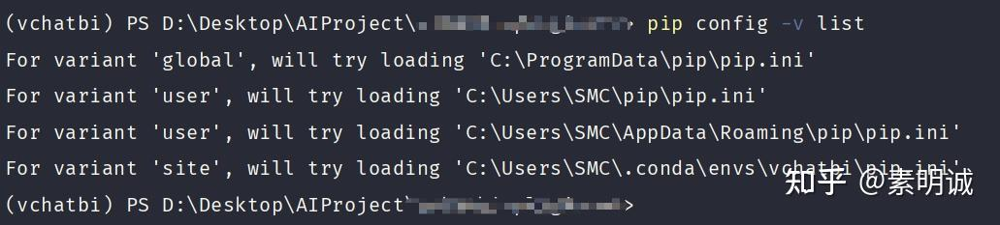

# Windows pip 配置国内源


 

## 查看当前 pip 位置  
```
pip config -v list
```
## 配置文件说明  

**全局配置**

```
C:\ProgramData\pip\pip.ini
这是系统级别的配置，对所有用户有效。
```

**用户配置**

```
C:\Users\SMC\pip\pip.ini
C:\Users\SMC\AppData\Roaming\pip\pip.ini
这些是当前用户的配置文件，只对当前用户有效。
```

**虚拟环境配置**

```
C:\Users\SMC\.conda\envs\vchatbi\pip.ini
这是特定于 `vchatbi` 虚拟环境的配置，只在这个虚拟环境中有效。
```
## 编辑配置文件  

你可以选择编辑上述任一配置文件来设置 pip 源。根据你的需要，选择合适的文件进行编辑

**如果你希望改变的设置对所有用户都有效**，编辑全局配置文件。

**如果只希望影响当前用户**，编辑用户配置文件。

**如果只想影响特定虚拟环境中的 pip 行为**，编辑虚拟环境的配置文件。

假设你想要修改用户级别的配置文件 `C:\Users\SMC\AppData\Roaming\pip\pip.ini`，添加或修改内容如下

```
[global]
index-url = https://pypi.tuna.tsinghua.edu.cn/simple
```
## 常用源  

**清华大学 Tuna 镜像源**

```
https://pypi.tuna.tsinghua.edu.cn/simple
```

**阿里云 PyPI 镜像**

```
https://mirrors.aliyun.com/pypi/simple/
```

**中国科技大学**

```
https://pypi.mirrors.ustc.edu.cn/simple/
```

**华为云**

```
https://mirrors.huaweicloud.com/repository/pypi/simple
```

**腾讯云**

```
http://mirrors.cloud.tencent.com/pypi/simple
```

**网易开源镜像站**

```
http://mirrors.163.com/pypi/simple/
```

**豆瓣源**

```
http://pypi.douban.com/simple/
```