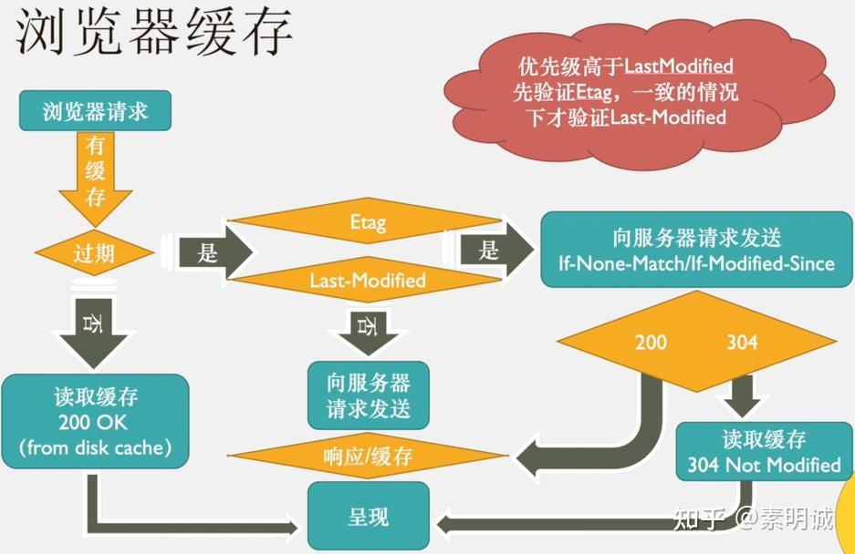
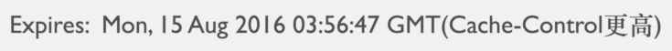

# 强缓存和协商缓存

## 一、浏览器缓存

### 为什么要缓存？

当你请求网页的时候拿到了数据资源，这个时候用户要等待一段时间才能看见网页渲染在你的面前。这时候产品就说了，你要提高用户体验啊，那就出现了各种缓存技术，例如 CDN 缓存、浏览器缓存、数据本地存储等等反正缓存策略就是为了优化用户体验的。

### 缓存的优点

节省服务器流量、减轻服务器压力、加快客户端访问速度、提升用户体验、提升网站性能

### 字段名称

**`Cache-Control`缓存控制（响应头）**

1. `no-cache`：指示浏览器忽略资源缓存副本，强制到服务器获取资源（浏览器依然缓存）
2. `no-store`：强制缓存在任何情况下都不要保留任何副本
3. `max-age=3153600`：指示缓存副本的有效时长，从请求时间开始到过期时间之间的秒数。
4. `public`：表明响应可以被任何对象（包括 发送请求的客户端，代理服务器，等等）缓存。
5. `private`：不共享缓存，只能被单个用户缓存（代理服务器无法缓存它）

**Expires 有效期限**

启用缓存和定义缓存时间。告诉浏览器缓存资源，缓存过期时间，如果还没过该时间点则不发请求。

在`HTTP1.1`中，使用`Cache-Control：max-age=秒`，来代替。

**Last-Modified 最后修改时间**

表示服务器本地记录中的文件最后修改时间，由**服务器**发送给**客户端**。

**If-Modified-Since 何时修改**

表示浏览器缓存记录中该文件的最后服务器修改时间，由**客户端**发送给**服务器**。

**ETag 实体标签**

Etag 是 Entity tag 的缩写，可以理解为“被请求变量的实体值”，Etag 是**服务端**的一个资源的标识。所谓的服务端资源可以是一个 Web 页面，也可以是 JSON 或 XML 等。服务器单独负责判断记号是什么及其含义，并在 HTTP 响应头中将其传送到客户端。

比如，浏览器第一次请求一个资源的时候，服务端给予返回，并且返回了 ETag: "50b1c1d4f775c61:df3" 这样的字样给浏览器，当浏览器再次请求这个资源的时候，浏览器会将 If-None-Match: W/"50b1c1d4f775c61:df3" 传输给服务端，服务端拿到该 Etag，对比资源是否发生变化，如果资源未发生改变，则返回 304 HTTP 状态码，不返回具体的资源。

**If-None-Match**

它表示客户端已经存储了服务器返回的资源的 ETag ，并且希望在该资源未被修改时获取一个缓存副本。如果该资源已被修改，服务器应该正常返回该资源的新版本，并且返回的响应应该不包含 `304 Not Modified` 状态代码。

## 二、缓存资源

浏览器在第一次请求后会缓存资源，再次请求的时候会经历以下步骤。

1. 浏览器判断该资源 header 中的信息，根据 Expires 和 Chache-control 来判断是否是强缓存，如果是，直接从缓存获取数据
2. 如果不是，浏览器会发送一次请求到服务器，这次请求会携带 IF-Modified-Since 或者 IF-None-Match，他们的值分别是第一次请求返回的 Last-Modified 或者是 Etag，根据携带的字段值服务器会进行判断是否返回资源。如果是命中，服务器返回 304 状态码，浏览器直接从本地获取资源。如果是否，服务器返回新的资源，并且更新 header 中相关的字段信息。

## 三、强缓存和协商缓存

### 强缓存

Expires 和 Chache-control 都是标识时间的字段，需要注意的是如果二者同时出现，Chache-control 的优先级是高于 Expires 。

但 Expires 是 HTTP1.0 的规范，时间格式是 GTM 字符串，如如果服务器时间和客户端时间差别较大时，会导致内存混乱。而服务器的时间和用户实际时间不正常是很正常的现象，所以在使用 Expires 的时候会出现一些问题，建议还是使用 Chache-control 来标识时间

Cache-Control 这个字段是 http 1.1 的规范，一般常用该字段的 max-age 值来进行判断，它是一个相对时间所以比较准确

### 协商缓存

协商缓存是由**服务器来决定**，这个资源到底是否更新。整个过程也是涉及到两个字段。在第一次请求的 header 中会出现 Last-Modified 或是 Etag，注意是第一次请求的时候就会有，因为要通过这个字段来判断资源是否可用。

如果是 Etag 对应的是 if-None-Match 字段，是一段唯一标识符，告诉服务器本地缓存文件的最后修改时间。

如果是 Last-Modified 对应的是 if-Modified-Since 字段，是一段时间格式的字符串，比如是哈希值，服务端判断哈希是否一致。HTTP 中并没有指定如何生成 ETag，这个由开发者自行决定。

以上两种，如果服务端判断一样，则返回 304 Not Modified，如果不一致则返回新的资源，并且更新本地缓存
