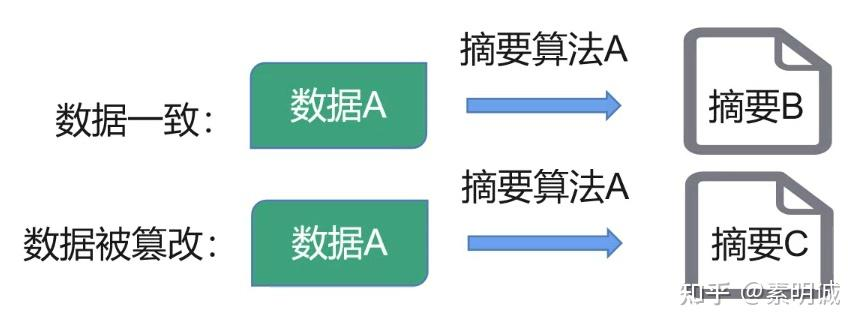

# HTTP/HTTPS的区别

 **Link:** [https://zhuanlan.zhihu.com/p/604401513]

## HTTP/HTTPS的主要区别  

HTTP 是一种无状态的协议，它不提供任何对数据的加密或安全保护。因此，任何人都可以在传输过程中查看或修改数据。

HTTPS 是在 HTTP 基础上增加了 SSL/TLS 加密协议的安全版本。它通过在客户端和服务器之间建立加密连接来保护数据的隐私和完整性。因此，当您使用 HTTPS 访问 Web 页面时，您可以确保您的数据不会被第三方窃取或篡改。

|  | HTTP | HTTPS |
| --- | --- | --- |
| 是否为加密传输 | 明文传输 | 混合加密传输 |
| 如何建立连接 | TCP/IP三次握手 | TCP三次握手 + SSL/TLS握手 |
| 默认端口 | 80 | 443 |
| 证书 | 没有 | 服务端CA数字证书 |

## HTTPS工作原理  

1. TCP协议三次握手，建立TCP连接
2. 服务利用TCP将证书发送给浏览器
3. 浏览器通过本地Root CA验证网站证书
4. 浏览器用证书的公钥加密：协商对称加密的算法和密码
5. 服务器相应，确定对称加密算法和密码
6. 会话建立，来往数据使用对称加密

## SSL/TLS  

SSL (Secure Sockets Layer) 和 TLS (Transport Layer Security) 是加密协议，用于在两个通信节点之间提供安全连接。它们是为了保护数据在网络上传输过程中不被窃取或篡改而设计的。

SSL 和 TLS 是两种相似的协议，不同点在于 TLS 是 SSL 的替代品。

TLS 引入了一些改进，例如更强的加密算法和更好的认证方式。

因此，现在已经不再使用 SSL，而是使用 TLS。

## SSL/TLS原理  

1. 建立连接：客户端与服务端建立连接，进行 SSL/TLS 协议的握手（Handshake）。
2. 证书验证：服务器发送公钥证书给客户端，客户端验证证书的有效性，包括证书颁发机构是否可信任，证书内容是否匹配网站信息等。
3. 密钥交换：使用预定义的密钥交换算法，如Diffie-Hellman，生成公共密钥，并使用该密钥加密下一步通信。
4. 加密通信：使用公共密钥加密数据，并通过网络发送。
5. 解密接收：服务器接收到加密数据，使用公共密钥进行解密。
6. 结束连接：客户端与服务端完成通信后进行四次握手，结束连接。

整个过程中使用的证书都是由第三方机构颁发的，确保了数据安全和双方身份的正确性。

## 数据传输过程  
