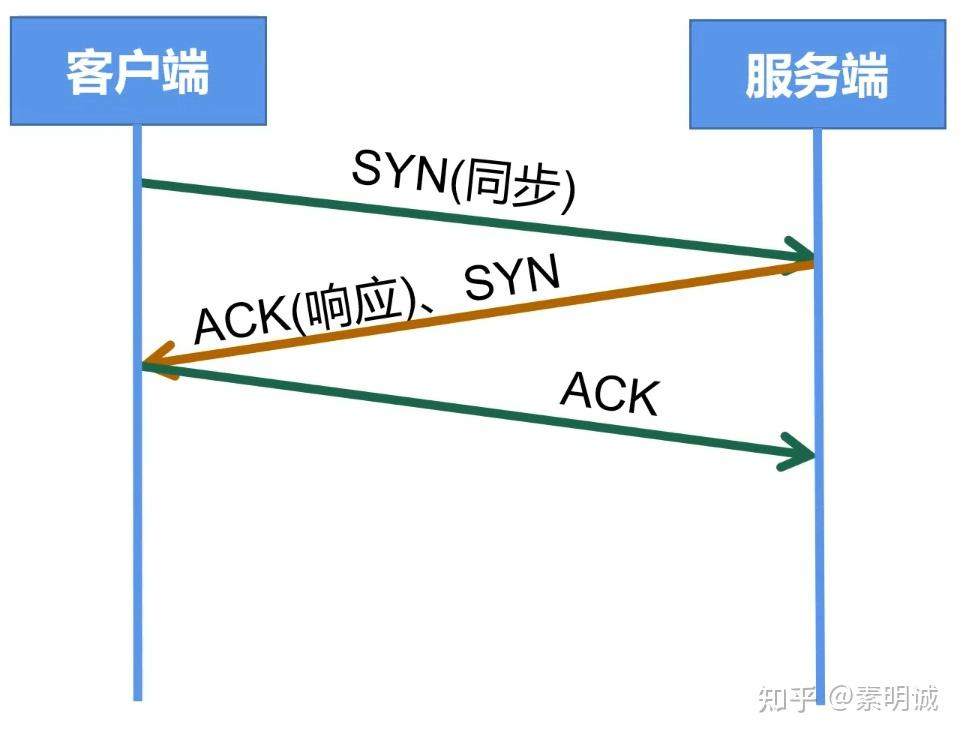
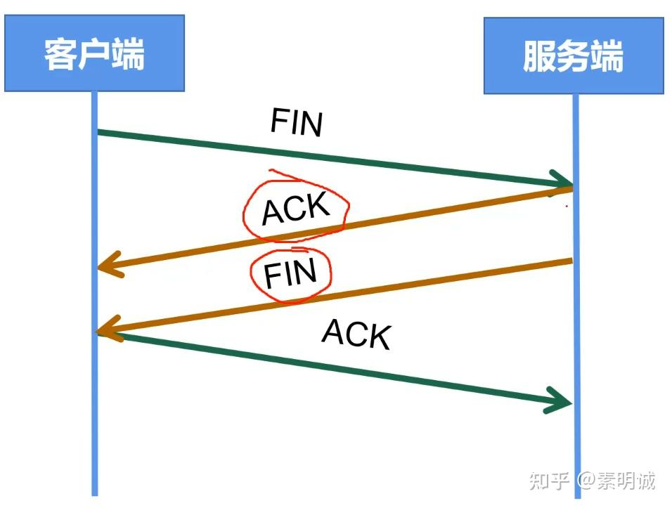

# 为什么是三次握手、四次挥手？

 **Link:** [https://zhuanlan.zhihu.com/p/605669100]

## 三次握手  

因为二者都处于在一个初始状态，都是是为了建立连接，所以ACK响应这个步骤就可以是一步。

## 四次挥手  

可能服务端给客户端发送的请求还没收回来，或者是客户端发送的请求服务端还没有响应，所以在挥手的时候，服务端自己要准备一段时间，中间这两步是没有办法合二为一的，所以必须是四次。

