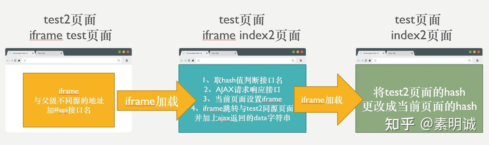
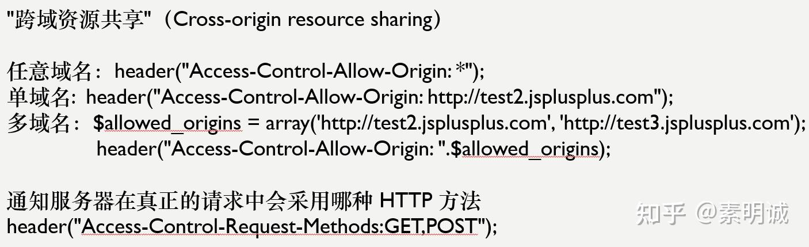

# 解决跨域的九种方案


 **Link:** [https://zhuanlan.zhihu.com/p/604626804]

## 一、Proxy  

配置 vue.config.js

```
amodule.exports = {
    devServer: {
        host: '127.0.0.1',
        port: 8084,
        open: true,// vue项目启动时自动打开浏览器
        proxy: {
            '/api': { // '/api'是代理标识，用于告诉node，url前面是/api的就是使用代理的
                target: "http://xxx.xxx.xx.xx:8080", //目标地址，一般是指后台服务器地址
                changeOrigin: true, //是否跨域
                pathRewrite: { // pathRewrite 的作用是把实际Request Url中的'/api'用""代替
                    '^/api': "" 
                }
            }
        }
    }
}
```

通过Axios发送请求

```
axios.defaults.baseURL = '/api'
```

**二、中间层**

express框架

```
var express = require('express');
const proxy = require('http-proxy-middleware')
const app = express()
app.use(express.static(__dirname + '/'))
app.use('/api', proxy({ target: 'http://localhost:8088', 
                        changeOrigin: false
                      }));

module.exports = app

```

**三、Nginx** 

```
server {
    listen    80;
    # server_name www.josephxia.com;
    location / {
        root  /var/www/html;
        index  index.html index.htm;
        try_files $uri $uri/ /index.html;
    }
    location /api {
        proxy_pass  http://127.0.0.1:8888;
        proxy_redirect   off;
        proxy_set_header  Host       $host;
        proxy_set_header  X-Real-IP     $remote_addr;
        proxy_set_header  X-Forwarded-For  $proxy_add_x_forwarded_for;
    }
}

```

**四、JSONP**

跨域获取`JSON`数据的一种非官方的使用模式

1. `JSON`和`JSONP`不是一个类型。
2. `JSON`是数据交换格式。
3. `JSONP`是一种跨域获取`JSON`数据的交互技术 非正式的协议。
4. `JSONP`抓取的资源并不直接是`JSON`数据，而是带有`JSON`数据参数的函数执行。

**优点**

1. 兼容性好，可以运行在远古的浏览器中，不需要 XMLHttpReques t或 ActiveX 的支持。
2. 请求后可以通过 callback 的方式回传结果，JQ 有封装好的 JSONP 方法可以使用。

**缺点**

1. 它只支持 GET 请求，不支持其他类型的请求。因为 Script 是通过 GET 请求发送的
2. 不能解决两个页面直接进行 JavaScript 调用的问题

## 五、设置基础域名同源+iframe  

前端来做，前提是基础域名必须相同

[Document.domain - Web API 接口参考 | MDN](https://developer.mozilla.org/zh-CN/docs/Web/API/Document/domain)## 六、window.name+iframe（传比较简单的值）  

`window.name`的特点：

1. 每个浏览器窗口都有一个全局变量`window`(包含`iframe`框架`contentWindow`)

2. 每个`window`对象都有一个`name`属性（注意：一个窗口只有一个`name`属性）

3. 该窗口被关闭前(生命周期内)，所有页面共享一个`name`属性并有读写的权限

4. 无论该窗口在被关闭前，载入什么页面，都不会改变`name`值

5. 存储约为`2M`的字符串

如果父级窗口地址源和`iframe`的地址源不同，父级无法通过`iframe.contentWindow.name`获取值，但`iframe`内部不受该规则限制

解决方案：先让`iframe`中的页面程序保存`window.name`, 然后跳转与父级窗口同源的另一个页面，父级页面可以从当前的`iframe`拿到该页面的`window.name`

## 七、postmessage+iframe（不常用）  

**不常用原因：**

1. 伪造数据端漏洞
2. `XSS`攻击
3. 兼容性问题
4. 调试的时候也容易出现问题

变量参数：`otherWindow.postMessage(message, targetOrigin)`

* `otherWindow`: 接收方的引用
* `message`: 要发送到接受方的数据
* `targetOrigin`: 接收方的源，还有必须要有监听`message`事件

**八、hash+iframe（不常用）**

## 九、cors跨域  

后端可能会存在安全问题，这种方式需要协商

  



