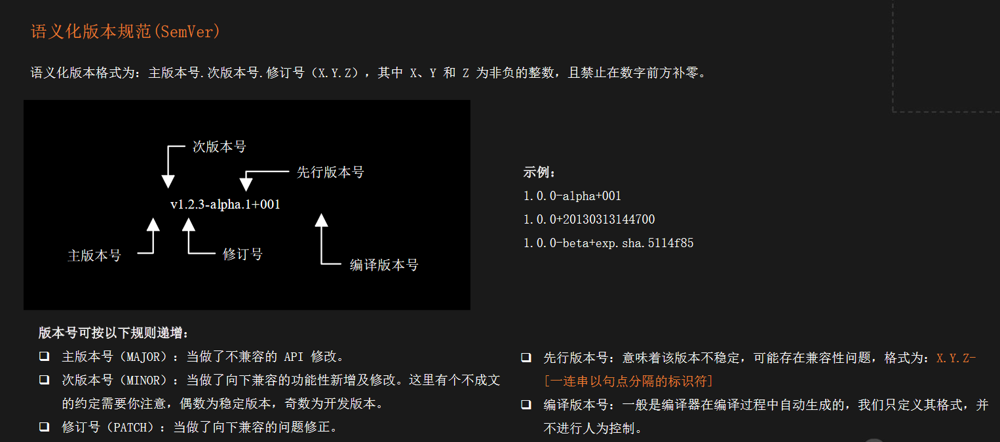
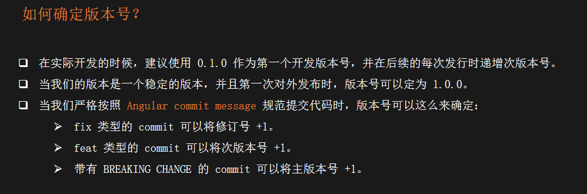
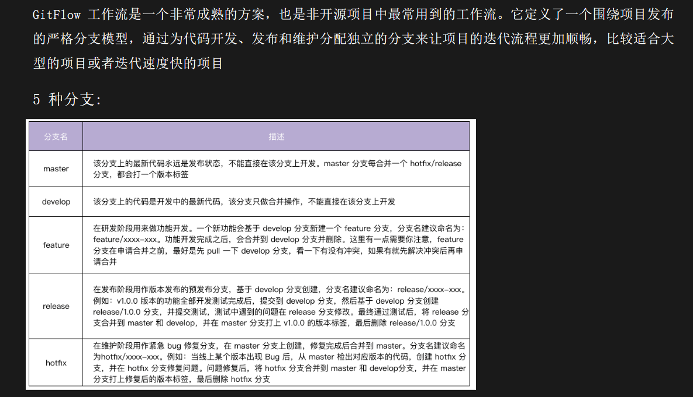
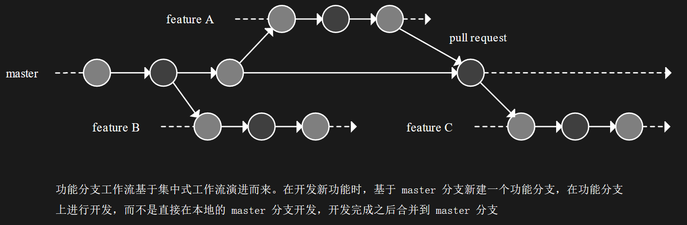
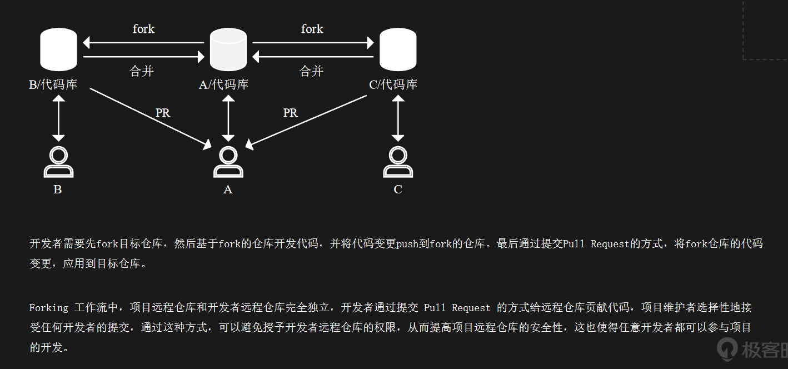

| 类型 | 类别 | 说明 |
| --- | --- | --- |
| feat | production | 新增功能 |
| fix | production | bug 修复 |
| perf | production | 性能优化，提升性能的代码更改 |
| style | development | 代码格式变更 |
| refactor | production | 代码重构，既不修复错误也不添加功能的代码更改 |
| test | development | 新增测试用例，或是现有的测试用例 |
| ci | development | CI/CD 修改 |
| docs | development | 文档类的更新，包括修改用户文档或者开发文档 |
| chore | development | 其他类型，依赖管理、辅助工具变动等 |

## 非开源项目

## 开源项目

