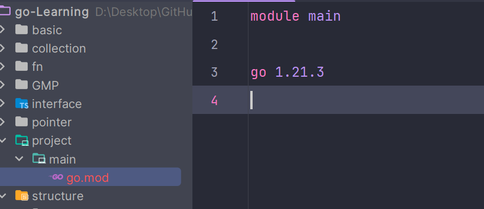
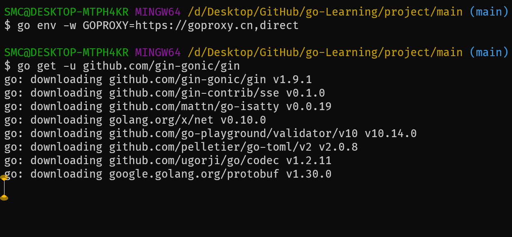
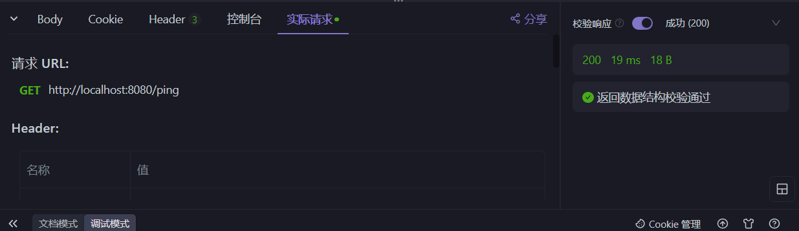

# 使用 Gin 框架构建 Go 应用程序

## 初始化模块

```bash
go mod init main
```

## 生成文件



## 安装 Gin

```bash
go get -u github.com/gin-gonic/gin
```

如果遇到网络问题，可以更换代理。

## 更换代理

```bash
go env -w GOPROXY=https://goproxy.cn,direct
```



## 使用 Git 克隆安装

如果仍然无法安装，可以通过 Git 克隆方式：

```bash
git clone https://github.com/gin-gonic/gin.git
cd gin
go install
```

## 新建 `main.go`

```go
package main

import (
	"net/http"

	"github.com/gin-gonic/gin"
)

func main() {
	// 创建默认的 Gin 路由器
	router := gin.Default()

	// 添加一个简单的 GET 路由
	router.GET("/ping", func(c *gin.Context) {
		c.JSON(http.StatusOK, gin.H{
			"message": "pong",
		})
	})

	// 运行服务器，默认监听在 localhost:8080
	router.Run()
}
```

## 运行应用程序

```bash
go run main.go
```




## 日志含义

### Logger 和 Recovery 中间件的警告

```plaintext
[GIN-debug] [WARNING] Creating an Engine instance with the Logger and Recovery middleware already attached.
```

这是提示 Gin 引擎实例已经附加了 Logger 和 Recovery 中间件，这是默认行为，不需要担心。

### 运行在 "debug" 模式的警告

```plaintext
[GIN-debug] [WARNING] Running in "debug" mode. Switch to "release" mode in production.
 - using env:   export GIN_MODE=release
 - using code:  gin.SetMode(gin.ReleaseMode)
```

表示当前应用程序运行在调试模式。在生产环境中，建议切换到发布模式以提高性能并减少日志输出。可以通过设置环境变量 `GIN_MODE=release` 或在代码中调用 `gin.SetMode(gin.ReleaseMode)` 来实现。

### 关于代理的警告

```plaintext
[GIN-debug] [WARNING] You trusted all proxies, this is NOT safe. We recommend you to set a value.
```

这表示应用程序被配置为信任所有代理服务器，可能存在安全风险。建议仅信任受信任的代理，或者配置特定的代理列表。

### 端口配置信息

```plaintext
[GIN-debug] Environment variable PORT is undefined. Using port :8080 by default
```

表示环境变量 `PORT` 未定义，Gin 默认使用端口 8080。可以通过设置 `PORT` 环境变量来更改监听端口。

### 监听服务信息

```plaintext
[GIN-debug] Listening and serving HTTP on :8080
```

表示应用程序正在端口 8080 上监听并提供 HTTP 服务。

### 请求日志

```plaintext
[GIN] 2024/01/08 - 17:11:35 | 200 |            0s |             ::1 | GET      "/ping"
```

这是一条请求日志，显示了请求的详细信息：

- **时间**：请求发生的时间。
- **状态码**：返回的 HTTP 状态码，200 表示成功。
- **耗时**：处理请求所花费的时间。
- **客户端 IP**：请求的来源 IP 地址，`::1` 表示本地 IPv6 地址。
- **方法和路径**：请求的方法和路径。

## 切换到发布模式

在生产环境中，建议将 Gin 切换到发布模式以提高性能。可以通过以下方式实现：

### 使用环境变量

在运行应用程序之前，设置环境变量：

```bash
export GIN_MODE=release
```

### 在代码中设置

在 `main.go` 文件中添加：

```go
gin.SetMode(gin.ReleaseMode)
```

## 配置信任的代理

为了安全起见，应该配置信任的代理列表。例如，如果应用程序位于反向代理之后，可以指定代理的 IP 地址：

```go
router.SetTrustedProxies([]string{"192.168.1.1"})
```

将 `"192.168.1.1"` 替换为实际的代理服务器 IP 地址。

## 更改监听端口

可以在 `router.Run()` 中指定端口号：

```go
router.Run(":8081")
```

或者通过设置环境变量 `PORT`：

```bash
export PORT=8081
```

## 添加自定义路由

可以添加更多的路由来处理不同的请求。例如，添加一个 `/hello` 路由：

```go
router.GET("/hello", func(c *gin.Context) {
	c.JSON(http.StatusOK, gin.H{
		"message": "Hello, sumingcheng!",
	})
})
```

## 总结

通过以上步骤，我们成功地使用 Gin 框架构建了一个简单的 Go 应用程序，并了解了日志中的常见提示信息。记得在生产环境中调整配置，提高应用程序的性能和安全性。
