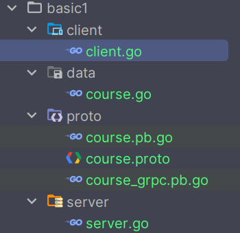

# 使用 Protocol Buffers 和 gRPC 构建课程服务

## 定义 `.proto` 文件

首先，我编写了一个 `course.proto` 文件，定义了课程信息的消息类型和服务接口：

```protobuf
syntax = "proto3";

option go_package = "./;proto";

message CourseInfo {
  int32 cid = 1;
  string cname = 2;
  string teacher = 3;
}

message CourseResponse {
  int32 code = 1;
  string msg = 2;
  repeated CourseInfo data = 3;
  map<string, string> extra = 4; // 附加信息
}

message CourseRequest {
  string type = 1;
}

service Course {
  rpc GetCourseList (CourseRequest) returns (CourseResponse);
}
```

## 编译 `.proto` 文件

使用以下命令编译生成 Go 代码：

```bash
protoc -I . course.proto --go_out=. --go-grpc_out=.
```

## 编写数据文件

创建一个 `data.go` 文件，用于存储课程信息：

```go
package data

import "your_project_path/proto"

var LanguageCourses = []*proto.CourseInfo{
  {Cid: 1, Cname: "Go", Teacher: "张三"},
  {Cid: 2, Cname: "Python", Teacher: "李四"},
  {Cid: 3, Cname: "Java", Teacher: "王五"},
}

var ComputerCourses = []*proto.CourseInfo{
  {Cid: 4, Cname: "计算机基础", Teacher: "赵六"},
  {Cid: 5, Cname: "数据结构", Teacher: "孙七"},
  {Cid: 6, Cname: "算法", Teacher: "周八"},
}
```

## 实现服务端

在服务端实现 `GetCourseList` 方法：

```go
package main

import (
  "context"
  "your_project_path/data"
  "your_project_path/proto"
  "google.golang.org/grpc"
  "net"
)

type CourseService struct {
  proto.UnimplementedCourseServer
}

func (s *CourseService) GetCourseList(ctx context.Context, req *proto.CourseRequest) (*proto.CourseResponse, error) {
  switch req.Type {
  case "language":
    return &proto.CourseResponse{
      Code: 0,
      Msg:  "success",
      Data: data.LanguageCourses,
      Extra: map[string]string{
        "note": "语言课程列表",
      },
    }, nil
  case "computer":
    return &proto.CourseResponse{
      Code: 0,
      Msg:  "success",
      Data: data.ComputerCourses,
    }, nil
  default:
    return &proto.CourseResponse{
      Code: 1,
      Msg:  "invalid course type",
    }, nil
  }
}

func main() {
  server := grpc.NewServer()
  proto.RegisterCourseServer(server, &CourseService{})
  listener, err := net.Listen("tcp", ":8080")
  if err != nil {
    panic(err)
  }
  if err := server.Serve(listener); err != nil {
    panic(err)
  }
}
```

## 实现客户端

在客户端调用服务端的 `GetCourseList` 方法：

```go
package main

import (
  "context"
  "encoding/json"
  "fmt"
  "your_project_path/proto"
  "google.golang.org/grpc"
  "google.golang.org/grpc/credentials/insecure"
)

func main() {
  conn, err := grpc.Dial(":8080", grpc.WithTransportCredentials(insecure.NewCredentials()))
  if err != nil {
    panic(err)
  }
  defer conn.Close()

  client := proto.NewCourseClient(conn)
  response, err := client.GetCourseList(context.Background(), &proto.CourseRequest{
    Type: "language",
  })
  if err != nil {
    panic(err)
  }

  jsonData, err := json.Marshal(response)
  if err != nil {
    panic(err)
  }
  fmt.Println(string(jsonData))
}
```

## 项目目录结构



## 注意事项

- **包路径替换**：在代码中，将 `your_project_path` 替换为实际的项目路径。
- **错误处理**：在实际应用中，应完善错误处理逻辑，避免程序崩溃。

## 最佳实践

- **代码优化**：使用易读的变量名，如将 `Course` 改为 `CourseService`，提高代码可读性。
- **版本管理**：使用 Go Modules 管理依赖，确保包版本的稳定性。
- **协议编译**：建议将编译命令写入脚本或 Makefile，方便后续维护。
