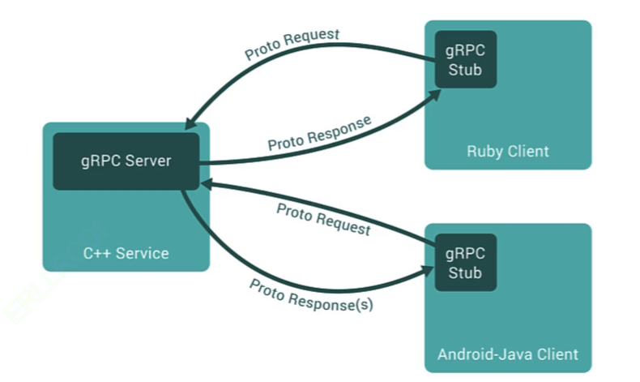

# 深入理解 HTTP、gRPC 与数据格式

## HTTP/1.1 与 HTTP/2

在研究网络协议时，我发现 HTTP/1.1 和 HTTP/2 在特性上有显著的区别。以下是我整理的对比：

| **特性**       | **HTTP/1.1**                               | **HTTP/2**                                   |
| -------------- | ------------------------------------------ | -------------------------------------------- |
| 格式           | 文本（可读性好，效率较低）                 | 二进制（效率高，机器友好，不易阅读）         |
| 连接复用       | 有限（并发多个请求需要多个 TCP 连接）      | 多路复用（多个请求可在单一连接上并行传输）   |
| 头部压缩       | 无（头部信息每次完整发送，可能冗余）       | HPACK 压缩（减少传输冗余的头部信息）         |
| 服务器推送     | 不支持（客户端请求什么，服务器才发送什么） | 支持（服务器可主动发送客户端可能需要的资源） |
| 优先级和流控制 | 不支持（请求处理顺序由发送顺序决定）       | 支持（可设置数据流的优先级和流量控制）       |
| 安全性         | 加密可选（HTTPS）                          | 多数实现要求 TLS 加密，更安全                |

## gRPC

gRPC 是由 Google 开发的高性能、开源和通用的 RPC 框架。RPC（Remote Procedure Call）是一种使程序能够像调用本地对象一样调用远程服务器上方法的协议。通过 gRPC，我可以在客户端直接调用服务器上的方法，而不必关心底层网络细节，极大地简化了分布式系统的开发，效率提升 👍。

gRPC 基于 HTTP/2 协议，支持双向流、流控制、头部压缩和多路复用等特性。这些特性使其在移动设备、物联网等对带宽和性能要求高的场景中表现出色。

### 支持语言

gRPC 支持多种编程语言，具体列表可以参考其 GitHub 主页：[https://github.com/grpc](https://github.com/grpc)

## Protocol Buffers (Protobuf) 和 JSON 对比

在数据序列化方面，我比较了 Protocol Buffers（Protobuf）和 JSON，发现两者在多个方面有明显的区别：

| **特性**     | **Protobuf**                       | **JSON**                   |
| ------------ | ---------------------------------- | -------------------------- |
| 格式         | 二进制                             | 文本                       |
| 大小         | 较小，二进制格式                   | 较大，尤其在数据结构复杂时 |
| 可读性       | 需要解析器和 `.proto` 文件         | 人类可读，易于理解         |
| 序列化速度   | 快，二进制格式                     | 慢，文本格式               |
| 解析速度     | 快，解析过程简化                   | 慢，需要解析文本           |
| 语言支持     | 多种语言，需 `.proto` 文件生成代码 | 几乎所有语言都有原生支持   |
| 数据定义     | 严格，需先定义 `.proto` 文件       | 灵活，无严格结构要求       |
| 兼容性       | 考虑向后和向前兼容性               | 兼容性取决于实现           |
| 网络传输效率 | 高效，数据更小                     | 低效，尤其在带宽受限时     |
| 易于调试     | 需要工具查看二进制数据，复杂       | 直接可读，易于调试         |
| 扩展性       | 易于更新和扩展，不破坏现有代码     | 扩展可能需要重构           |
