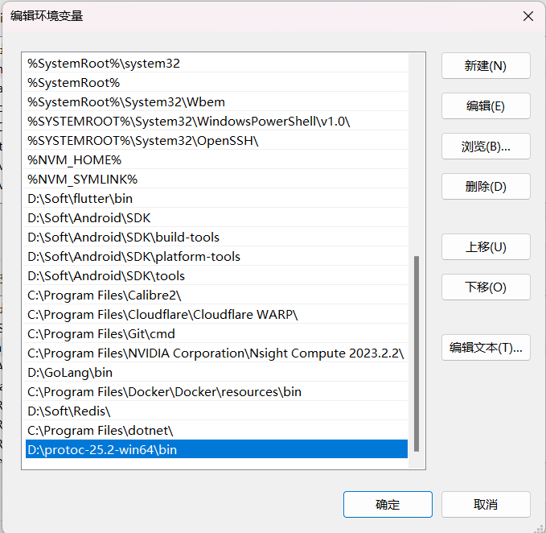
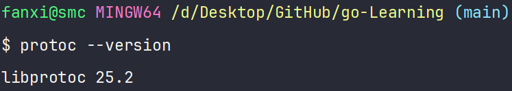
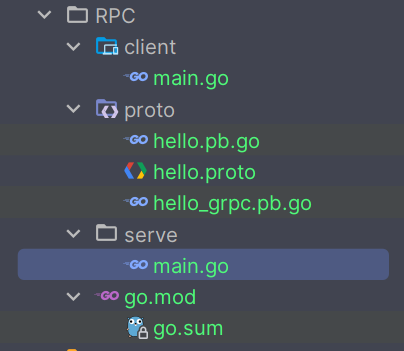

# 在 Windows 上使用 Go 语言开发 gRPC 应用

## 安装必要的工具

### 初始化 Go 模块

```go
go mod init proto
go get -u google.golang.org/grpc
```

### 下载 Protocol Buffers

前往 [https://github.com/protocolbuffers/protobuf/releases/tag/v25.2](https://github.com/protocolbuffers/protobuf/releases/tag/v25.2) 下载适用于当前系统的 Protocol Buffers 二进制文件。

### 配置系统环境变量 Path

将 Protocol Buffers 的 `bin` 目录添加到系统环境变量 `Path` 中。



### 验证安装

```go
protoc --version
```

应输出 `libprotoc 25.2`。



### 安装 Go 的 Protocol Buffers 插件

```go
go install google.golang.org/protobuf/cmd/protoc-gen-go@latest
go install google.golang.org/grpc/cmd/protoc-gen-go-grpc@latest
```

## 编写 .proto 文件

在项目目录下创建 `hello.proto`：

```protobuf
syntax = "proto3";
package proto;
option go_package = "./;proto";

message HelloRequest {
  string greeting = 1;
}

message HelloResponse {
  string reply = 1;
}

service Greeter {
  rpc SayHello (HelloRequest) returns (HelloResponse);
}
```

## 生成 Go 代码

在 `proto` 目录下执行：

```go
protoc --go_out=. --go-grpc_out=. hello.proto
```

生成 `hello.pb.go` 和 `hello_grpc.pb.go` 文件。

### 目录结构

```plaintext
go-Learning/
│
└───RPC/
    │   go.mod
    │
    ├───client/
    │       main.go
    │
    ├───server/
    │       main.go
    │
    └───proto/
            hello.proto
            hello.pb.go
            hello_grpc.pb.go
```



## 编写服务端代码

在 `server/main.go` 中：

```go
package main

import (
	"context"
	"log"
	"net"

	"google.golang.org/grpc"
	pb "hello/proto"
)

type server struct {
	pb.UnimplementedGreeterServer
}

func (s *server) SayHello(ctx context.Context, req *pb.HelloRequest) (*pb.HelloResponse, error) {
	reply := "Hello " + req.Greeting
	return &pb.HelloResponse{Reply: reply}, nil
}

func main() {
	listener, err := net.Listen("tcp", ":50051")
	if err != nil {
		log.Fatalf("监听端口失败 %v", err)
	}

	grpcServer := grpc.NewServer()
	pb.RegisterGreeterServer(grpcServer, &server{})

	log.Println("服务端正在监听端口 50051...")
	if err := grpcServer.Serve(listener); err != nil {
		log.Fatalf("启动服务端失败 %v", err)
	}
}
```

## 编写客户端代码

在 `client/main.go` 中：

```go
package main

import (
	"context"
	"log"
	"time"

	"google.golang.org/grpc"
	pb "hello/proto"
)

func main() {
	conn, err := grpc.Dial("localhost:50051", grpc.WithInsecure(), grpc.WithBlock())
	if err != nil {
		log.Fatalf("连接服务端失败 %v", err)
	}
	defer conn.Close()

	client := pb.NewGreeterClient(conn)

	ctx, cancel := context.WithTimeout(context.Background(), time.Second)
	defer cancel()

	response, err := client.SayHello(ctx, &pb.HelloRequest{Greeting: "sumingcheng"})
	if err != nil {
		log.Fatalf("调用 SayHello 方法失败 %v", err)
	}

	log.Printf("服务端回复 %s", response.GetReply())
}
```

## 注意事项

- 确保 `protoc` 和 Go 插件已正确安装，并在环境变量中配置。

- 在生成 Go 代码时，确保在正确的目录下执行命令。

- 服务端和客户端使用的端口号和地址需保持一致。

- 在代码中替换测试内容为 `sumingcheng`。

- 如果遇到任何问题，可以参考官方文档或社区资源进行排查。

💡 使用易于理解的变量名和清晰的代码结构，可以提高代码的可读性和维护性。
