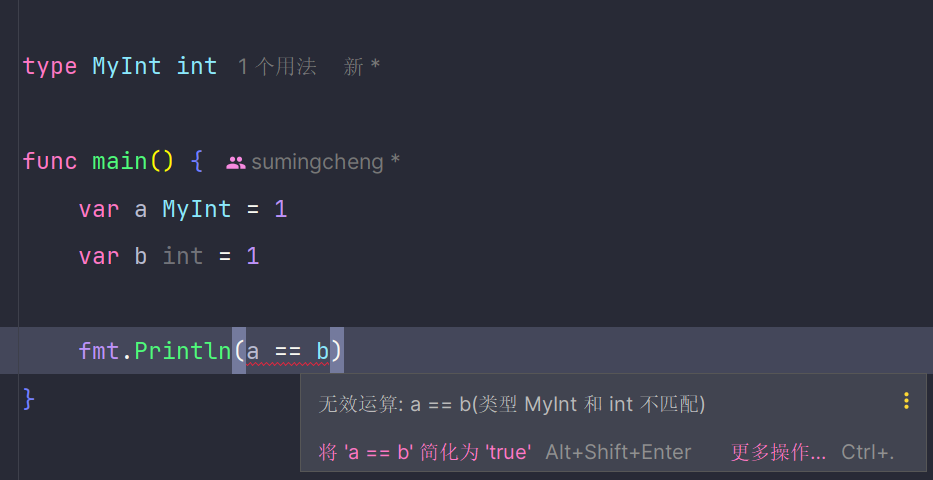

# Go 泛型、方法和自定义类型

## 自定义类型

Go 语言在 1.18 版本中引入了泛型功能，在 1.19 和 1.20 版本中进行了进一步的改进和优化。使用泛型时需要确保 Go 版本 >= 1.18。



## 方法

Go 语言的一个特色是可以在类型上附加方法，增强了方法的集成性。

```go
package main

import "fmt"

func main() {
    var numbers ComputeSlice = []int{1, 2}
    fmt.Println(numbers.Sum())
    fmt.Println(numbers.Subtract())
    fmt.Println(numbers.Multiply())
    fmt.Println(numbers.Divide())
}

type ComputeSlice []int

func (cs ComputeSlice) Sum() int {
    return cs[0] + cs[1]
}

func (cs ComputeSlice) Subtract() int {
    return cs[0] - cs[1]
}

func (cs ComputeSlice) Multiply() int {
    return cs[0] * cs[1]
}

func (cs ComputeSlice) Divide() int {
    return cs[0] / cs[1]
}
```

在上述示例中，我定义了一个自定义类型 `ComputeSlice`，并为其添加了 `Sum`、`Subtract`、`Multiply` 和 `Divide` 方法。这样可以直接对 `ComputeSlice` 类型的实例进行计算，代码更加简洁明了。

## 相同类型的参数

在定义函数时，如果多个参数类型相同，可以简化类型的书写。

```go
package main

import "fmt"

func main() {
    sum(1, 2)
}

func sum(a, b int) {
    fmt.Println(a + b)
}
```

在这个例子中，`a` 和 `b` 都是 `int` 类型，我们可以只在最后一个参数后面写类型 `int`，更加简洁。

## 泛型

泛型是在使用时才确定类型的。在 Go 中，泛型需要显式定义才能使用。

```go
package main

import "fmt"

func main() {
    res1 := add(1, 2)
    fmt.Println(res1)

    res2 := add("hello", "world")
    fmt.Println(res2)

    res3 := add(1.1, 2.2)
    fmt.Println(res3)
}

func add[T int | string | float64](a T, b T) T {
    return a + b
}
```

Go 语言中的泛型必须有类型约束，需要在函数名后面加上 `[T]`，表示这是一个泛型函数。上面的 `add` 函数可以接受 `int`、`string` 或 `float64` 类型的参数。

### 常用的泛型类型参数字母

- **T**：Type，表示一个通用的类型。
- **E**：Element，表示集合中的元素类型。
- **K**：Key，表示键的类型。
- **V**：Value，表示值的类型。
- **R**：Result，表示返回类型。
- **U**、**S**：用于多个类型参数时的第二或第三个类型参数。

### 参数限定

1. 在函数调用时，可以显式指定类型，限定参数类型。

   ```go
   res := add[int](1, 2)
   ```

2. 如果不写 `[]`，Go 会自动推断类型。

### 泛型的使用

```go
package main

import "fmt"

func main() {
    map1 := map[string]interface{}{"a": 1, "b": 2}
    map2 := map[string]interface{}{"x": "sumingcheng", "y": "example"}

    // 创建一个切片，元素类型为 map[string]interface{}
    maps := make([]map[string]interface{}, 0)

    maps = append(maps, map1, map2)

    printElements(maps)
}

func printElements[E any](elements []E) {
    for _, element := range elements {
        fmt.Println(element)
    }

    length := len(elements)
    fmt.Println("切片长度:", length)
}
```

在这个示例中，我定义了一个泛型函数 `printElements`，可以接受任何类型的切片并打印其元素。

## 注意事项

- 在使用泛型时，确保类型约束合理，避免不必要的类型转换。
- 定义方法时，注意接收者类型是否为指针，指针接收者可以修改接收者的值。
- 在并发情况下使用闭包，需要注意数据的同步，必要时使用互斥锁等同步机制。
