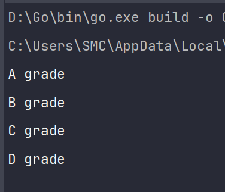
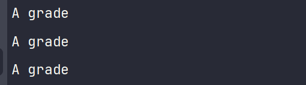

# Go 条件判断

Go 语言的条件判断主要使用 `if`、`else`、`else if` 和 `switch`，虽然与其他主流编程语言类似，但也有一些独特的特点。我在这里分享一下对这些条件判断的理解和使用方法。

## `if` 语句

在 Go 语言中，`if` 语句可以包含一个可选的初始化语句，该语句会在条件判断之前执行。此外，`if` 条件表达式不需要使用括号包围，但代码块必须使用花括号 `{}`。

```go
func checkNumber(num int) {
    if remainder := num % 2; remainder == 0 {
        fmt.Println(num, "是偶数")
    } else {
        fmt.Println(num, "是奇数")
    }
}
```

在上述代码中，我使用了一个初始化语句 `remainder := num % 2`，`remainder` 的作用域仅限于 `if-else` 代码块内部。

## `else` 和 `else if` 语句

`else` 和 `else if` 的使用方式与 `if` 类似，需要注意的是，`else` 或 `else if` 必须紧跟在 `if` 语句的右花括号 `}` 之后，不能换行。`else if` 提供了额外的条件判断，避免了多层嵌套的 `if-else` 结构。

```go
func checkScore(score int) {
    if score >= 90 {
        fmt.Println("A级")
    } else if score >= 80 {
        fmt.Println("B级")
    } else if score >= 70 {
        fmt.Println("C级")
    } else {
        fmt.Println("D级")
    }
}
```

在这个例子中，我根据分数输出对应的等级，`else if` 语句使得代码逻辑清晰明了。

## `switch` 语句

Go 语言的 `switch` 语句有一些不同于其他语言的特点。首先，它可以不使用表达式，在这种情况下，`switch` 会匹配 `true`。其次，`switch` 语句可以包含初始化语句，就像 `if` 语句一样。此外，`case` 语句可以包含多个条件，使用逗号 `,` 分隔。

```go
func checkNumber(num int) {
    switch remainder := num % 2; remainder {
    case 0:
        fmt.Println(num, "是偶数")
    default:
        fmt.Println(num, "是奇数")
    }
}
```

在上面的 `switch` 示例中，我使用了初始化语句 `remainder := num % 2`，然后根据 `remainder` 的值进行判断。

```go
func checkScore(score int) {
    switch {
    case score >= 90:
        fmt.Println("A级")
    case score >= 80:
        fmt.Println("B级")
    case score >= 70:
        fmt.Println("C级")
    default:
        fmt.Println("D级")
    }
}
```

在这个示例中，我的 `switch` 后没有跟任何表达式，`case` 条件会从上到下依次判断，匹配到第一个满足条件的分支后执行。

### `fallthrough` 语句

Go 语言的 `switch` 语句在每个 `case` 后默认会自动结束，无需显式地写出 `break`。如果希望继续执行下一个 `case`，需要使用 `fallthrough` 语句。

```go
func checkScore(score int) {
    switch {
    case score >= 90:
        fmt.Println("A级")
        fallthrough
    case score >= 80:
        fmt.Println("B级")
        fallthrough
    case score >= 70:
        fmt.Println("C级")
        fallthrough
    default:
        fmt.Println("D级")
    }
}
```



在这个例子中，使用了 `fallthrough`，所以当分数大于等于 90 时，会连续输出所有等级。

### 多重匹配

Go 语言的 `switch` 语句可以在 `case` 中匹配多个条件，条件之间使用逗号 `,` 分隔。

```go
func main() {
    checkScore(90)
    checkScore(80)
    checkScore(70)
}

func checkScore(score int) {
    switch {
    case score >= 90, score >= 80, score >= 70:
        fmt.Println("A级")
    default:
        fmt.Println("D级")
    }
}
```



在这个示例中，`case` 条件包含了多个表达式，任何一个表达式为 `true`，都会执行对应的代码块。

---
