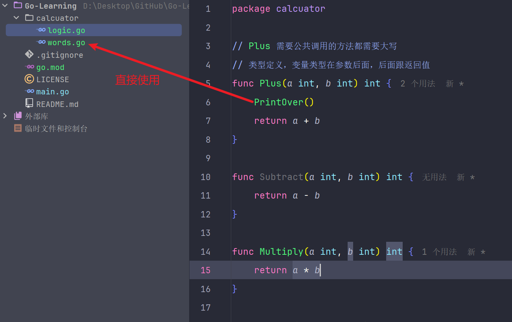

# Go 命令与函数使用

## 命令

### go build

`go build` 用于编译 Go 代码。编译后会在当前目录下生成一个可执行文件。例如 **go build hello.go** 编译 **hello.go** 文件。

我通常在开发完成后使用 `go build` 来生成可执行文件，方便在不同环境下部署。

### go run

`go run` 是一个便捷命令，编译并立即执行 Go 程序。例如 **go run hello.go** 编译并运行 **hello.go** 文件。

在调试阶段，我经常使用 `go run` 快速测试代码 😊。

### go get

`go get` 用于从远程代码库下载并安装 Go 包和依赖。例如 **go get github.com/gorilla/mux** 下载 **mux** 包。

当我需要引入新的第三方库时，会使用 `go get` 命令。

### go install

`go install` 用于编译并安装 Go 包和可执行文件。例如 **go install .** 安装当前包。

我经常在本地安装自己的包，方便其他项目引用。

### go test

`go test` 用于运行 Go 程序中的测试。例如 **go test** 运行当前包的测试。

为了确保代码质量，我会编写单元测试并使用 `go test` 进行测试。

### go fmt

`go fmt` 用于格式化 Go 源代码文件。例如 **go fmt ./...** 格式化当前目录及其子目录中的所有 Go 文件。

我习惯在提交代码前运行 `go fmt`，以保持代码风格一致。

### go vet

`go vet` 用于检查 Go 源代码中可能的错误。例如 **go vet ./...** 检查当前目录及其子目录中的所有 Go 文件。

在正式发布前，我会使用 `go vet` 检查潜在的问题。

### go mod

`go mod` 是与 Go 的模块支持有关的一组命令，用于管理依赖关系。例如 **go mod init my-module** 初始化一个新的模块，**go mod tidy** 删除不需要的模块。

使用 `go mod` 可以有效管理项目的依赖，确保版本一致性。

### go clean

`go clean` 删除源码包和关联源码包里编译生成的文件。

当我需要清理项目生成的临时文件时，会使用 `go clean`。

### go doc

`go doc` 查看文档。

使用 `go doc` 可以查看包或符号的文档，有助于了解函数或类型的用法。

### go env

`go env` 查看项目环境变量。

当我需要检查 Go 环境配置时，会使用 `go env`。

### go version

`go version` 查看版本。

通过 `go version` 可以确认当前使用的 Go 版本，避免版本差异导致的问题。

## Go 文件的使用

在使用 Go 文件时，我注意到以下几点。

有 `main` 函数的文件，必须有 `package main` 声明。

一个文件中只允许有一个 `main` 函数。

在同一文件夹的同级目录中，不允许有多个 `main` 方法。

运行 Go 文件时，`main` 方法会自动被调用。

在包的内部调用时，不需要导入包名，包内部是通用的。



## 函数

以下是我在 `calculator` 包中定义的四个基本运算函数：

```go
package calculator

// Plus 添加两个整数并返回结果。
// 需要公开调用的函数应以大写字母开头。
// 在 Go 中，变量类型在参数名之后，后跟返回类型。
func Plus(a int, b int) int {
	return a + b
}

// Subtract 从 a 中减去 b 并返回结果。
func Subtract(a int, b int) int {
	return a - b
}

// Multiply 将两个整数相乘并返回结果。
func Multiply(a int, b int) int {
	return a * b
}

// Divide 将 a 除以 b 并返回结果。
// 注意避免除以零的情况。
func Divide(a int, b int) int {
	return a / b
}
```

## 使用函数

在打印信息时，我通常使用 **fmt.Println**，因为它的行为明确且一致，适合生产环境。

**println** 主要用于调试阶段，我不推荐在生产代码中使用它，因为其实现可能因系统和 Go 版本而异。

下面是我演示如何使用前面定义的 `calculator` 包中的函数：

```go
package main

import (
	"Go-Learning/calculator"
	"fmt"
)

func main() {
	fmt.Println("计算器")
	var result int = calculator.Plus(1, 2)
	fmt.Println(result)

	// println 和 fmt.Println 有区别
	var result2 int = calculator.Multiply(1, 2)
	println(result2) // println 不推荐在生产环境中使用

	// 类型推断会推断出 result3 的类型，所以不用定义类型
	result3 := calculator.Divide(1, 2)
	fmt.Println(result3)

	// sumingcheng
}
```
