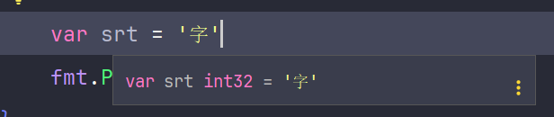

# Go rune 类型

**rune** 是 Go 语言中的一个内置类型，它是 **int32** 的别名，通常用于表示 Unicode 码点，即 Unicode 字符的数值表示。在处理文本时，**rune** 类型非常重要且常用。

在 Go 语言中，一个中文字符通常占用 3 个字节。

## Unicode 码点

Unicode 是一个字符编码标准，为每个字符分配一个唯一的编号，称为码点。这些码点的范围从 **0** 到 **0x10FFFF**，总共有 **1,114,112** 个可能的值。

**rune** 类型用于表示这些码点，由于它是 **int32** 的别名，其范围为 **-2,147,483,648** (**-0x80000000**) 到 **2,147,483,647** (**0x7FFFFFFF**)。

## 文本处理

在处理字符串时，我通常使用 **rune** 类型来处理可能包含多字节字符的文本。UTF-8 编码的字符串可能包含多个字节的字符，使用 **rune** 可以确保每个字符都被正确处理，而不会因为字节边界而被截断。

## 类型转换

我可以将 **byte** 或 **string** 类型转换为 **rune** 类型，以便处理 Unicode 字符。以下代码演示了如何遍历字符串并输出每个字符及其 Unicode 码点：

```go
package main

import (
    "fmt"
)

func main() {
    s := "hello, sumingcheng"

    for _, r := range s {
        fmt.Printf("%c (%U)\n", r, r)  // 输出每个字符及其 Unicode 码点
    }
}
```

Go 的 **unicode/utf8** 包提供了一组函数，帮助我在 **rune** 和 UTF-8 编码之间进行转换。下面的代码演示了如何解码 UTF-8 字符串中的第一个 **rune**：

```go
package main

import (
    "fmt"
    "unicode/utf8"
)

func main() {
    s := "sumingcheng"
    r, size := utf8.DecodeRuneInString(s)  // 解码字符串中的第一个 rune
    fmt.Printf("%c (%U), size: %d\n", r, r, size)
}
```

此外，Go 的 **unicode** 包提供了函数，用于分析和处理 **rune** 类型的字符。例如，检查一个 **rune** 是否是字母：

```go
package main

import (
    "fmt"
    "unicode"
)

func main() {
    r := 'a'
    fmt.Println(unicode.IsLetter(r))  // 输出 true，表示 r 是一个字母
}
```

**rune** 类型是处理 Unicode 文本时 Go 语言的核心部分，为处理多字节字符提供了方便的方式。

## 为什么要有 rune 类型



### Unicode 支持

**rune** 类型允许表示 Unicode 码点，支持全球字符集，使 Go 语言在处理国际化文本时更加便利。

### 字符处理

使用 **rune**，我可以方便地处理单个字符，尤其是在多字节字符的场景下，如 UTF-8 编码的文本。

### 类型安全

通过 **rune** 类型，代码更清晰地表达了正在处理字符而非整数值，增强了类型安全性。

### 标准库集成

Go 的标准库提供了许多针对 **rune** 类型的函数和方法，使字符处理更加容易和高效。
