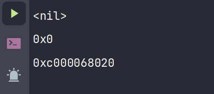
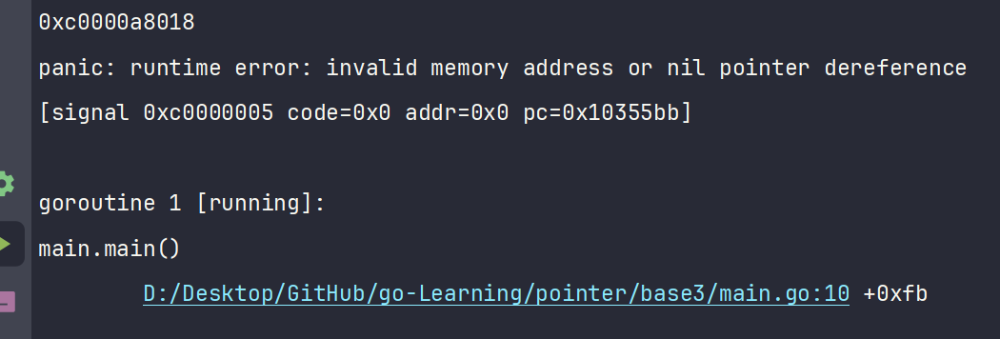

# C 语言与 Go 语言中的指针比较

## C 语言指针

```c
#include <stdio.h>

int main() {
    int number = 10;
    int *intPtr = &number; // 指向整数的指针
    printf("指针指向的值: %d\n", *intPtr);

    // 指针运算
    intPtr++;
    printf("递增后的指针地址: %p\n", intPtr);

    // 类型转换
    char *charPtr = (char *)intPtr;
    printf("转换为 char 类型指针后的地址: %p\n", charPtr);

    return 0;
}
```

在这个示例中，我首先定义了一个整数变量 `number`，然后使用 `&` 获取其地址并赋给指针 `intPtr`。通过 `*intPtr`，可以获取指针指向的值。

接下来，对指针进行自增操作 `intPtr++`，这会使指针指向下一个整数地址。然后，将 `intPtr` 转换为 `char` 类型的指针 `charPtr`，以展示指针类型转换的用法。

## Go 语言指针

```go
package main

import "fmt"

func main() {
    number := 10
    intPtr := &number // 指向整数的指针
    fmt.Println("指针指向的值:", *intPtr)

    // Go 不支持指针算术
    // intPtr++ // 这会报错

    // Go 不允许随意的指针类型转换
    // var charPtr *byte = (*byte)(intPtr) // 这也会报错
}
```

在 Go 语言中，我同样定义了一个整数变量 `number`，并使用 `&` 获取其地址赋给指针 `intPtr`。通过 `*intPtr`，可以获取指针指向的值。

需要注意的是，Go 不支持指针运算，也不允许将一种类型的指针强制转换为另一种类型的指针，这与 C 语言有显著区别。

## 主要区别

### 指针算术

在 C 语言中，我可以对指针进行算术运算，例如自增 `ptr++`，这会使指针指向下一个内存地址。然而，Go 语言不支持这种操作，以防止意外修改错误的内存位置。

### 类型转换

C 语言允许将指针从一种类型转换为另一种类型，例如将 `int*` 转换为 `char*`。但在 Go 语言中，指针类型转换非常受限，不允许随意转换。

## 指针的使用

指针的基本用法包括：

- **指针类型**：例如 `*int`、`*bool` 等。
- **指针值**：使用 `&` 符号获取变量的地址，例如 `&number`。
- **指针取值**：使用 `*` 符号获取指针指向的值，例如 `*intPtr`。

## 指针的作用

指针在编程中有以下作用：

- 动态分配内存。
- 使用指针进行参数传递，即传递指针的值，这一点非常重要。
- 修改函数外部的变量值，或在函数内部修改外部变量。

## 动态分配内存空间

### `new` 函数

`new` 函数用于分配一个类型的内存，并返回指向该类型零值的指针。

```go
ptr := new(T)
```

其中，`T` 是任意类型，`ptr` 是指向新分配的 `T` 类型零值的指针。

```go
numPtr := new(int) // 分配一个 int 类型的内存，numPtr 是指向该内存的指针
```

使用 `new` 分配的内存被初始化为零值，例如，数值类型的零值是 `0`，布尔类型的零值是 `false`。

### `make` 函数

`make` 函数用于为切片（slice）、映射（map）和通道（channel）分配并初始化内存。

```go
slice := make([]T, length, capacity)
```

其中，`T` 是元素类型，`length` 是长度，`capacity` 是容量（可选）。

```go
numSlice := make([]int, 10, 100) // 创建一个长度为 10，容量为 100 的切片
```

使用 `make` 分配的内存已经初始化，可直接使用。

## 交换两个值

```go
package main

import "fmt"

func main() {
    num1 := 1
    num2 := 2

    swapValues(&num1, &num2)
    fmt.Println(num1, num2)
    fmt.Println(&num1, &num2)
}

func swapValues(a, b *int) {
    *a, *b = *b, *a
}
```

在这个示例中，我定义了两个整数变量 `num1` 和 `num2`，并通过指针传递给函数 `swapValues`。在函数内部，使用指针解引用交换了两个变量的值。

## 野指针

```go
package main

import "fmt"

func main() {
    var intPtr *int
    fmt.Println(intPtr)
    fmt.Printf("%p\n", intPtr)
    fmt.Println(&intPtr)
}
```



## 打印结果的差异

### `fmt.Println(intPtr)`

- 变量 `intPtr` 是一个 `*int` 类型的指针，未初始化。
- 在 Go 中，未初始化的指针默认值是 `nil`，表示它不指向任何内存地址。
- 因此，这行代码会打印出 `nil`。

### `fmt.Printf("%p\n", intPtr)`

- 使用 `%p` 格式化指针 `intPtr` 的值。
- 由于 `intPtr` 是 `nil`，在内存中表示为 `0x0`。

### `fmt.Println(&intPtr)`

- 这里的 `&intPtr` 获取变量 `intPtr` 本身的内存地址。
- 即使 `intPtr` 为 `nil`，它自身仍然有一个有效的内存地址，例如 `0xc000006028`。

## 关于野指针

- **野指针** 在 C/C++ 中指的是指向未知或随机内存地址的指针，可能导致程序崩溃或行为异常。
- 在 Go 语言中，未初始化的指针默认值为 `nil`，不会指向随机内存地址。
- 解引用 `nil` 指针会引发运行时错误，避免了野指针带来的风险。



## Go 语言的切片和映射

切片和映射作为引用类型，当传递给函数时，实际上是传递了对底层数据的引用。因此，函数内部对它们的修改会直接影响到原始数据，无需使用指针。

### 切片（Slices）

```go
package main

import "fmt"

func modifySlice(slice []int) {
    slice[0] = 100
}

func main() {
    mySlice := []int{1, 2, 3}
    fmt.Println("修改前:", mySlice)

    modifySlice(mySlice)
    fmt.Println("修改后:", mySlice)
}
```

在这个示例中，函数 `modifySlice` 修改了切片的第一个元素。由于切片是引用类型，修改会直接反映到原始切片 `mySlice` 上。

### 映射（Maps）

映射也是引用类型，传递给函数时，无需使用指针。

```go
package main

import "fmt"

func modifyMap(m map[string]int) {
    m["key1"] = 100
}

func main() {
    myMap := map[string]int{"key1": 1, "key2": 2}
    fmt.Println("修改前:", myMap)

    modifyMap(myMap)
    fmt.Println("修改后:", myMap)
}
```

在这个示例中，函数 `modifyMap` 修改了映射的值，修改同样会直接反映到原始映射 `myMap` 上。

## 注意事项

- 在 Go 中，尽量避免使用指针来传递切片和映射，因为它们本身就是引用类型。
- 使用指针时，要确保指针已初始化，避免出现 `nil` 指针解引用的错误。
