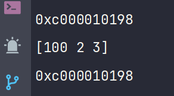

# Go 指针优化和内存管理

## Go 对指针的优化

### 简化的指针语法

在 Go 语言中，指针的使用相对简单直观。例如，定义一个指向整型的指针并对其进行操作：

```go
var number int = 10
var ptr *int = &number  // 获取变量 number 的地址
fmt.Println(*ptr)       // 输出指针 ptr 指向的值，即 10
```

我在这个示例中定义了一个整数变量 `number`，并通过 `&number` 获取其地址赋给指针 `ptr`。使用 `*ptr` 可以获取指针指向的值。

### 垃圾回收

Go 语言通过自动垃圾回收机制来管理内存，程序员无需手动释放内存，减少了内存泄漏和野指针的风险。

```go
type MyStruct struct {
    Field int
}

func main() {
    obj := new(MyStruct)  // 分配内存并返回指针
    obj.Field = 10
    // 无需手动释放 obj，垃圾回收器会自动处理
}
```

在这个示例中，我使用 `new` 分配了一个 `MyStruct` 类型的内存，并赋值给指针 `obj`。垃圾回收器会自动处理内存释放。

### 禁止指针算术

Go 语言不允许直接对指针进行算术运算，这种设计避免了常见的缓冲区溢出和内存损坏问题。在 C 或 C++ 中，指针算术是错误的常见来源。

### 逃逸分析

逃逸分析是 Go 语言中的一个重要概念，用于决定变量是在堆上还是栈上分配内存。一般情况下，局部变量在栈上分配，栈上的内存分配和回收速度非常快。但如果局部变量的引用在函数外部仍然可以访问，那么这个变量会在堆上分配。

```go
func createObject() *MyStruct {
    obj := MyStruct{Field: 42}
    return &obj
}

func main() {
    instance := createObject()
    // 可以使用 instance，即使 createObject 已经结束
}
```

在这个示例中，`createObject` 函数返回了局部变量的地址，由于返回的指针在函数外部使用，所以 `obj` 会在堆上分配。

### 内存对齐

Go 编译器自动处理内存对齐，确保了结构体和其他数据类型的高效访问。不恰当的内存对齐会导致性能下降，Go 的自动对齐机制优化了内存访问速度。

## 值传递和引用传递

在 Go 语言中，参数传递方式如下：

**值传递**：传递数据的副本，原始数据不会被改变。

**引用传递**：传递数据的引用或地址，原始数据可能被改变。

```go
package main

import "fmt"

func main() {
    numbers := []int{1, 2, 3}
    modifySlice(numbers)
    fmt.Println(numbers) // 输出 [100, 2, 3]
    fmt.Printf("%p\n", numbers)
}

func modifySlice(slice []int) {
    slice[0] = 100
    fmt.Printf("%p\n", slice)
}
```



### 重点

- Go 语言中的所有函数参数都是值传递，包括基本数据类型、结构体、切片、映射、通道等。
- 切片、映射和通道本身是引用类型，即使以值传递方式传递给函数，函数内部对它们的修改也会影响原始数据。需要注意的是，指针也是一种值类型，所以在 Go 语言中只有值传递。

## 结构体方法的定义

我可以为结构体定义方法，以操作其内部数据。

```go
package main

import (
    "fmt"
    "reflect"
)

func main() {
    user := User{}

    user.SetName("sumingcheng")
    user.SetAge(18)
    user.SetHobby("篮球")

    fmt.Printf("%+v\n", user)

    // 使用反射查看结构体定义了哪些方法
    t := reflect.TypeOf(&user)
    for i := 0; i < t.NumMethod(); i++ {
        method := t.Method(i)
        fmt.Println(method.Name)
    }
}

type User struct {
    name  string
    age   int
    hobby string
}

func (u *User) SetName(name string) {
    u.name = name
}

func (u *User) SetAge(age int) {
    u.age = age
}

func (u *User) SetHobby(hobby string) {
    u.hobby = hobby
}
```

在这个示例中，我定义了一个 `User` 结构体，并为其添加了 `SetName`、`SetAge` 和 `SetHobby` 方法。主函数中，创建了一个 `User` 实例，并调用这些方法设置字段值。使用 `reflect` 包可以查看结构体定义的所有方法。

## 注意事项

- **变量命名**：应使用易读的变量名，提升代码可读性。
- **指针使用**：在需要修改原始数据时，使用指针作为方法的接收者。
- **内存管理**：利用 Go 的垃圾回收机制，避免手动管理内存。
