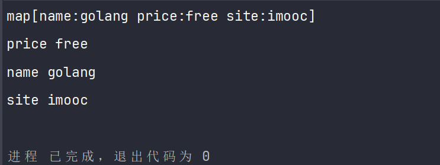

# Go map 类型详解

map 是一种包含多个键值对（key-value）的集合。

## 为什么说 map 是字典类型

在 Go 语言中，`map` 被称为字典类型，因为它存储唯一的键对应的值，并允许通过键快速查找或修改值。它的动态大小和高效查找特性符合字典数据结构的定义。

### 键值对存储

map 允许我们存储键值对。每个键都对应一个值，且每个键都是唯一的。

### 快速查找

通过键，我们可以快速查找到对应的值。在内部，map 使用哈希表（hash table）来实现，这保证了即使在大量数据下，键的查找也能保持高效。

### 动态大小

map 的大小是动态的，会随着键值对的添加和删除而变化。这与字典的定义相符，字典通常不需要在创建时指定大小，而是能够根据需要动态地增长和缩小。

## 定义和初始化

map 有三种定义方式：

**声明并初始化空的 map：**

```go
package main

import "fmt"

func main() {
	// 声明并初始化一个空的 map
	personInfo := map[string]string{}

	personInfo["name"] = "sumingcheng"
	personInfo["age"] = "18"

	fmt.Println(personInfo) // 输出：map[age:18 name:sumingcheng]
}
```

**直接初始化一个带有值的 map：**

```go
package main

import "fmt"

func main() {
	// 直接初始化一个带有值的 map
	personInfo := map[string]string{
		"name": "sumingcheng",
		"age":  "18",
	}

	fmt.Println(personInfo) // 输出：map[age:18 name:sumingcheng]
}
```

**使用 make 函数初始化 map：**

```go
package main

import "fmt"

func main() {
	// 使用 make 函数初始化 map，并指定初始容量
	personInfo := make(map[string]string, 3)
	personInfo["name"] = "sumingcheng"
	personInfo["age"] = "999"
	personInfo["hobby"] = "reading"
	// 超过容量，会自动扩容
	personInfo["city"] = "Beijing"

	fmt.Println(personInfo)      // 输出完整的 map
	fmt.Println(len(personInfo)) // 输出 map 的长度
}
```

**注意** 尽量使用有意义的变量名，使代码更易读。

## map 的读、写、改

```go
package main

import "fmt"

func main() {
	personInfo := map[string]string{
		"name": "sumingcheng",
		"age":  "18",
	}

	// 修改
	personInfo["age"] = "999"

	// 读取
	fmt.Println(personInfo["age"]) // 输出：999

	// 删除
	delete(personInfo, "age")
	fmt.Println(personInfo) // 输出：map[name:sumingcheng]
}
```

## 值可以保存任何类型

`interface{}` 是一种特殊的类型，称为空接口。空接口可以容纳任何类型的值，这类似于其他编程语言中的泛型类型。

```go
package main

import "fmt"

func main() {
	person := make(map[string]interface{})
	person["name"] = "sumingcheng"
	person["age"] = 30
	person["isEmployed"] = true

	fmt.Println(person)
}
```

## 判断键是否存在

```go
package main

import "fmt"

func main() {
	personInfo := map[string]string{
		"name":  "sumingcheng",
		"age":   "18",
		"hobby": "table tennis",
	}

	// 判断键是否存在
	value, exists := personInfo["name"]
	if exists {
		fmt.Println(value) // 输出：sumingcheng
	} else {
		fmt.Println("键不存在")
	}

	_, exists = personInfo["height"]
	if exists {
		fmt.Println("键存在")
	} else {
		fmt.Println("键不存在") // 输出：键不存在
	}
}
```

**注意** 在 `if` 表达式中声明的变量，其作用域仅在 `if` 块内，外部无法访问。

## 遍历 map

```go
package main

import "fmt"

func main() {
	personInfo := map[string]string{
		"name":  "sumingcheng",
		"age":   "18",
		"hobby": "table tennis",
	}

	// 使用 for range 遍历 map，遍历顺序是随机的
	for key, value := range personInfo {
		fmt.Println(key, value)
	}
}
```



**提示** 📝 map 是无序的集合，不要依赖 map 的遍历顺序。

## 键值对的存储原理

### 哈希表结构

Go 的 map 本质上是一个哈希表。哈希表是一种通过哈希函数将键映射到存储桶（bucket）的数据结构。每个存储桶可以存储一定数量的键值对。

### 存储桶（Bucket）

当我们添加一个键值对时，map 首先使用哈希函数计算键的哈希值，然后根据这个哈希值决定将该键值对存储到哪个存储桶中。每个存储桶可以存储多个键值对（在 Go 中，通常是 8 个）。

### 哈希冲突与溢出桶

当不同的键具有相同的哈希值时，会发生哈希冲突。Go 的 map 通过在同一个存储桶内链接多个键值对来解决这个问题。如果一个存储桶已满，它会链接到一个溢出桶。

### 动态扩容

当 map 中的元素越来越多，为了保持高效的访问和避免过多的哈希冲突，map 会进行扩容。这意味着创建一个更大的哈希表，并将旧表中的元素重新哈希到新表中。

### 内存布局

在内存中，map 的布局由几个主要部分组成：哈希函数、存储桶数组（指向各个存储桶的指针）以及各个存储桶（及其链接的溢出桶）。

### 键值对存储

在每个存储桶内部，键和值是紧密排列的。这意味着当我们遍历 map 时，并不是按照插入顺序，而是根据键在存储桶中的物理位置。

## 为什么要把键转换成哈希值

**快速查找** 最主要的原因是哈希表提供了近乎常数时间的查找效率（O(1)）。这意味着无论 map 中存储了多少元素，查找一个特定键的时间几乎是恒定的。

**键的类型和大小** 键可能是字符串、自定义类型或其他复杂的数据结构，可能很长或者结构复杂。直接比较这些键来查找值会非常低效。相反，哈希表通过计算键的哈希值来快速定位数据，减少了比较的次数。

**哈希值的均匀分布** 哈希函数通常设计成能将键均匀分布在哈希表中，减少冲突，提高性能。

**节省空间** 如果直接存储大型或复杂的键，可能会导致内存浪费。哈希表通常只存储键的哈希值和对应的值，更高效地利用内存。

**灵活性和一致性** 使用哈希表意味着无论键的类型如何，map 的使用方式都是一致的，增加了数据结构的灵活性和易用性。

## map 的多类型值

将值的类型设置为 `interface{}`，就可以存储多种类型的值。

```go
package main

import "fmt"

func main() {
	personInfo := make(map[string]interface{}, 3)
	personInfo["name"] = "sumingcheng"
	personInfo["age"] = 30
	personInfo["isEmployed"] = true

	fmt.Println(personInfo)
}
```

## 判断 map 中是否存在某个键

```go
package main

import "fmt"

func main() {
	personInfo := make(map[string]string, 3)
	personInfo["name"] = "sumingcheng"
	personInfo["site"] = "example.com"
	personInfo["price"] = "free"

	value, exists := personInfo["name"]
	fmt.Println(value, exists) // 输出：sumingcheng true
}
```

**注意** delete 函数没有返回值。

## 删除键值对

```go
package main

import "fmt"

func main() {
	personInfo := make(map[string]string, 3)
	personInfo["name"] = "sumingcheng"
	personInfo["site"] = "example.com"
	personInfo["price"] = "free"

	// 删除键为 "price" 的键值对
	delete(personInfo, "price")
	fmt.Println(personInfo)

	// 删除不存在的键，不会报错
	delete(personInfo, "nonexistent")
}
```

**提示** 删除不存在的键不会引发错误。
