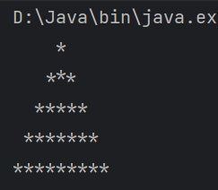
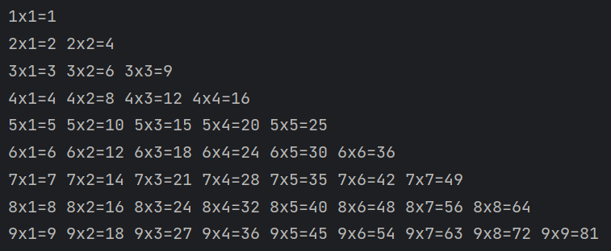

# Java 循环与控制结构

## While 循环

当需要在满足特定条件时重复执行一段代码时，我会使用 `while` 循环。下面的示例根据用户输入的数字，输出对应的工作日名称，直到 `dayOfWeek` 大于 5 为止。

```java
System.out.println("请输入一个数字");
Scanner scanner = new Scanner(System.in);
int dayOfWeek = scanner.nextInt();

while (dayOfWeek <= 5) {
    switch (dayOfWeek) {
        case 1:
            System.out.println("周一");
            break;
        case 2:
            System.out.println("周二");
            break;
        case 3:
            System.out.println("周三");
            break;
        case 4:
            System.out.println("周四");
            break;
        case 5:
            System.out.println("周五");
            break;
    }
    dayOfWeek++;
}
```

## Do-While 循环

`do-while` 循环至少会执行一次循环体，然后再判断条件是否满足。以下是一个简单的用户登录验证程序：

- 用户名和密码均为 `sumingcheng`。
- 程序会提示用户输入用户名和密码，直到输入正确为止。

```java
String userName = "sumingcheng";
String password = "sumingcheng";
Scanner scanner = new Scanner(System.in);
String inputUserName;
String inputPassword;

do {
    System.out.println("Please enter your username");
    inputUserName = scanner.next();
} while (!inputUserName.equals(userName));

do {
    System.out.println("Please enter your password");
    inputPassword = scanner.next();
} while (!inputPassword.equals(password));

System.out.println("Login successfully!");
```

## 记账本案例

我编写了一个简单的记账程序，可以实现以下功能：

- 查询账户余额
- 记录收入
- 记录支出
- 退出程序

用户可以通过选择菜单选项来执行相应的操作。以下是代码实现：

```java
import java.util.Scanner;
import java.math.BigDecimal;

BigDecimal balance = BigDecimal.ZERO;
int option = 0;

do {
    System.out.println("1. 查询账户余额，输出总额\n" +
            "2. 记录收入，总额+收入=新总额\n" +
            "3. 记录支出，总额-支出=新总额\n" +
            "4. 退出");
    option = new Scanner(System.in).nextInt();

    switch (option) {
        case 1:
            System.out.println("您的账户余额为" + balance);
            break;
        case 2:
            System.out.println("请输入收入金额");
            BigDecimal income = new Scanner(System.in).nextBigDecimal();
            balance = balance.add(income);
            System.out.println("您的账户余额为" + balance);
            break;
        case 3:
            System.out.println("请输入支出金额");
            BigDecimal expense = new Scanner(System.in).nextBigDecimal();
            balance = balance.subtract(expense);
            System.out.println("您的账户余额为" + balance);
            break;
        case 4:
            System.out.println("您已经退出了记账本！");
            break;
        default:
            System.out.println("您的输入有误，请重新输入！");
            break;
    }

} while (option != 4);
```

## 生成六位随机字符串

我需要生成一个由六个小写字母组成的随机字符串。以下是代码实现：

```java
import java.util.Random;

Random random = new Random();
StringBuilder randomStr = new StringBuilder();

do {
    char c = (char) (random.nextInt(26) + 97);
    randomStr.append(c);
} while (randomStr.length() < 6);

System.out.println(randomStr.toString());
```

注意：在生成随机字母时，我使用了 `random.nextInt(26) + 97`，这样可以得到从 `'a'` 到 `'z'` 的字符。

## For 循环

当知道需要循环的次数时，我会使用 `for` 循环。下面的代码输出从 1 到 10 的数字：

```java
for (int i = 1; i <= 10; i++) {
    System.out.println(i);
}
```

## Continue 语句

`continue` 语句用于跳过当前循环中的剩余语句，直接进入下一次循环。下面的代码输出 100 以内的奇数：

```java
for (int i = 0; i <= 100; i++) {
    if (i % 2 == 0) {
        continue;
    }
    System.out.println(i);
}
```

## Break 语句

`break` 语句用于立即跳出循环。下面的代码在遇到第一个偶数时跳出循环，因此只会输出数字 1：

```java
for (int i = 1; i <= 100; i++) {
    if (i % 2 == 0) {
        break;
    }
    System.out.println(i);
}
```

## 循环类型对比

- `for` 循环适合用于已知循环次数的情况。
- `while` 循环适合用于根据条件决定是否继续执行的情况。

两种循环可以相互替代，根据实际需求选择合适的循环结构。

## 双重循环练习

我使用双重循环来打印一个等腰三角形：

```java
for (int i = 1; i <= 5; i++) {
    for (int j = i; j < 5; j++) {
        System.out.print(" ");
    }

    for (int j = 1; j <= (i * 2 - 1); j++) {
        System.out.print("*");
    }
    System.out.println();
}
```

运行结果如下：



## 九九乘法表

我使用双重循环打印九九乘法表：

```java
for (int i = 1; i <= 9; i++) {
    for (int j = 1; j <= i; j++) {
        System.out.print(i + "x" + j + "=" + i * j + " ");
    }
    System.out.println();
}
```

运行结果如下：


