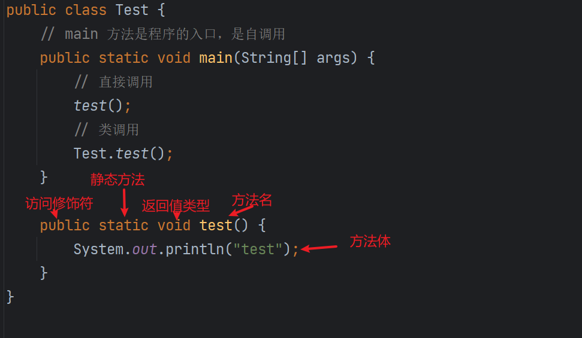

# Java 方法与函数

函数是对程序或流程的封装，具有封装性、复用性、易维护、易读性、易扩展和配置性。

## Java 中的方法

在 Java 中，所有的方法都是类的方法，必须包含修饰符。`main` 方法是程序的入口，会被自动调用。方法可以接收参数，用于在调用时传递数据。



下面是一个示例，展示了如何定义和调用方法：

```java
public class Test {
    public static void main(String[] args) {
        String result = add(1, 2);
        System.out.println(result);
    }

    public static String add(Number num1, Number num2) {
        int sum = num1.intValue() + num2.intValue();
        return String.valueOf(sum);
    }
}
```

在这个示例中，`add` 方法接受两个参数 `num1` 和 `num2`，并返回它们的和。

## 计算器示例

### 基本计算方法

以下是一个简单的计算器程序，可以执行基本的算术运算：

```java
import java.util.Scanner;

public class Calculator {
    public static void main(String[] args) {
        calculator();
    }

    public static void calculator() {
        Scanner scanner = new Scanner(System.in);

        System.out.println("请输入第一个数");
        int number1 = scanner.nextInt();

        System.out.println("请输入第二个数");
        int number2 = scanner.nextInt();

        System.out.println("请输入运算类型（+、-、*、/）");
        String operator = scanner.next();
        int result;

        switch (operator) {
            case "+":
                result = number1 + number2;
                break;
            case "-":
                result = number1 - number2;
                break;
            case "*":
                result = number1 * number2;
                break;
            case "/":
                if (number2 != 0) {
                    result = number1 / number2;
                } else {
                    System.out.println("除数不能为零");
                    return;
                }
                break;
            default:
                System.out.println("无效的运算类型");
                return;
        }

        System.out.println("运算结果是：" + result);
    }
}
```

### 封装计算方法

为了提高代码的复用性和可读性，可以将计算逻辑封装到一个独立的方法中：

```java
import java.util.Scanner;

public class Calculator {
    public static void main(String[] args) {
        Scanner scanner = new Scanner(System.in);

        System.out.println("请输入第一个数");
        int number1 = scanner.nextInt();

        System.out.println("请输入第二个数");
        int number2 = scanner.nextInt();

        System.out.println("请输入运算类型（+、-、*、/）");
        String operator = scanner.next();

        int result = calculate(operator, number1, number2);

        System.out.println("运算结果是：" + result);
    }

    public static int calculate(String operator, int number1, int number2) {
        switch (operator) {
            case "+":
                return number1 + number2;
            case "-":
                return number1 - number2;
            case "*":
                return number1 * number2;
            case "/":
                if (number2 != 0) {
                    return number1 / number2;
                } else {
                    System.out.println("除数不能为零");
                    return 0;
                }
            default:
                System.out.println("无效的运算类型");
                return 0;
        }
    }
}
```

在这个版本中，`calculate` 方法封装了计算逻辑，使代码更简洁、更易于维护。

## 方法的参数

方法的参数定义了方法可以接受的数据。在 Java 中，形参一旦定义，调用时的实参必须在数量和顺序上与之对应。形参的类型应能够包含实参的取值范围。Java 不支持可选参数，因此形参的类型和个数必须与实参一一对应。形参在方法内部的赋值不会影响实参的值。

## 方法的重载

方法的重载（Overloading）允许在同一个类中定义多个同名的方法，但它们的参数列表必须不同。当调用方法时，Java 会根据传递的参数类型和数量来选择匹配的方法。这有效地解决了默认值和可选参数的问题。

示例：

```java
public class OverloadingExample {
    public static void main(String[] args) {
        System.out.println(sum(10, 20));
        System.out.println(sum(10.5, 20.5));
        System.out.println(sum(10, 20, 30));
    }

    public static int sum(int a, int b) {
        return a + b;
    }

    public static double sum(double a, double b) {
        return a + b;
    }

    public static int sum(int a, int b, int c) {
        return a + b + c;
    }
}
```

## `return` 关键字

`return` 用于从方法中返回值。当方法内部不使用 `return` 时，返回类型必须声明为 `void`。`return` 会终止方法的执行，一次只能返回一个值。即使方法中有多个 `return` 语句，执行时也只会运行其中一个。

## 递归方法

递归是一种方法调用自身的编程技巧，必须包含终止条件，以避免无限循环。

示例：

```java
import java.util.Scanner;

public class RecursionExample {
    public static void main(String[] args) {
        Scanner scanner = new Scanner(System.in);
        System.out.println("请输入一个整数");
        int number = scanner.nextInt();
        countDown(number);
    }

    public static void countDown(int number) {
        if (number == 0) return;
        System.out.println(number);
        countDown(number - 1);
    }
}
```

在这个示例中，`countDown` 方法会递归地输出从输入数字到 1 的所有整数。

## 斐波那契数列

斐波那契数列是经典的递归应用案例。

```java
public class FibonacciExample {
    public static void main(String[] args) {
        System.out.println(fibonacci(10)); // 输出第 10 个斐波那契数
    }

    public static int fibonacci(int number) {
        if (number == 1 || number == 2) return 1;
        return fibonacci(number - 1) + fibonacci(number - 2);
    }
}
```

这个方法递归地计算斐波那契数列的第 `number` 项。

---

**注意事项**

- 在使用递归时，必须确保存在终止条件，以防止栈溢出。
- 方法的参数和返回值应设计合理，提升代码的可读性和维护性。
- 在进行算术运算时，应注意除数不能为零等特殊情况。
