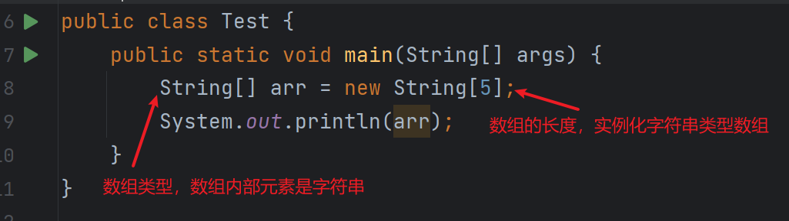
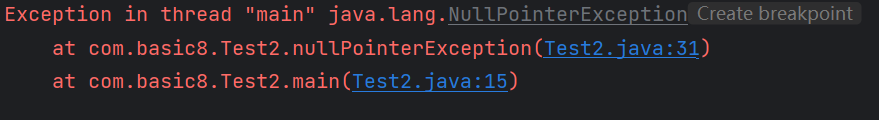
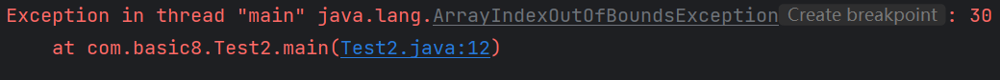
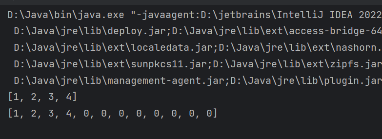

# Java 数组详解

## 数组的声明

```java
public class Test {
    public static void main(String[] args) {
        String[] arr = new String[5];
        System.out.println(arr.length);
    }
}
```

在上面的代码中，我声明了一个长度为 5 的字符串数组，并输出了数组的长度。

## 数组的默认输出



当直接打印数组对象时，输出的是 `Java` 中数组对象默认的 `toString()` 方法的结果。它显示了数组的类型和哈希码，例如 `[I@1b6d3586`。其中 `[I` 表示这是一个整型数组，`1b6d3586` 是数组对象的哈希码（实际上是数组对象内存地址的十六进制表示）。由于默认的 `toString()` 方法并不能提供数组的实际内容，需要使用其他方法获取数组的内容。

```java
int[] arr = {1, 2, 3, 4, 5};
System.out.println(arr); // 输出类似于 [I@1b6d3586
/*
 * [ 表示数组的维度数
 * I 表示数组的类型（I 代表 int 类型）
 */
```

## 使用 `Arrays.toString()` 输出数组内容

为了打印数组的实际内容，可以使用 `Arrays.toString()` 方法。

```java
import java.util.Arrays;

int[] arr = {1, 2, 3, 4, 5};
System.out.println(Arrays.toString(arr)); // 输出 [1, 2, 3, 4, 5]
```

## 遍历与迭代

### 迭代（Iterate）

迭代表示一个有顺序的过程，例如从 `版本1` 迭代到 `版本2`，但并没有连续性。

### 遍历（Traversal）

遍历是将整个数组中的数据逐一取出，整个过程称为遍历。

```java
public static void main(String[] args) {
    int[] numbers = {1, 2, 4, 5, 6, 7};
    // numbers 数组会被遍历
    for (int num : numbers) {
        System.out.print(num + " ");
    }
    // 输出：1 2 4 5 6 7
}
```

## 不定长参数

在 `Java` 中，方法可以接收不定长参数，即使用 `...` 表示的参数。这些参数实际上是一个数组。需要注意的是，可变参数必须是方法参数列表中的最后一个参数。

```java
public class Test2 {
    public static void main(String[] args) {
        int[] nums = {1, 2, 4, 5, 6, 7};
        forEachArgs(nums);

        argsTest(1, 2, 3, 4, 5);
    }

    public static void forEachArgs(int... args) {
        System.out.println(Arrays.toString(args));
    }

    public static void argsTest(int x, int... args) {
        System.out.println("第一个参数：" + x);
        System.out.println("剩余参数：" + Arrays.toString(args));
    }
}
```

在上面的代码中，`forEachArgs` 方法接收不定长的整数参数。`argsTest` 方法的第一个参数是 `int x`，后面的 `int... args` 接收剩余的参数。

## 数组的异常

### 空指针异常（NullPointerException）

当数组引用为 `null` 时，尝试操作数组会抛出 `NullPointerException`。



### 数组下标越界异常（ArrayIndexOutOfBoundsException）

当访问的数组索引超出了数组的范围，会抛出 `ArrayIndexOutOfBoundsException`。



## 数组长度

### 数组长度不可改变

数组的长度一旦创建，就不能更改。`Java` 中的数组是固定长度的，这样的设计可以优化底层实现，使其具有更高的性能。

```java
int length = 5;
int[] arr = new int[length];
System.out.println("数组长度：" + arr.length); // 输出 5
length = 10;
// 修改变量 length 的值，并不影响数组的长度
System.out.println("数组长度：" + arr.length); // 依然输出 5
```

### 扩展数组

如果需要扩大数组的容量，可以创建一个新的更大的数组，然后将旧数组的内容复制到新数组中。

```java
int[] arr = {1, 2, 3, 4};
int[] newArr = new int[arr.length * 3];

for (int i = 0; i < arr.length; i++) {
    newArr[i] = arr[i];
}

System.out.println("原数组：" + Arrays.toString(arr));    // 输出 [1, 2, 3, 4]
System.out.println("新数组：" + Arrays.toString(newArr)); // 输出 [1, 2, 3, 4, 0, 0, 0, 0, 0, 0, 0, 0]
```

未被赋值的数组元素会有默认值。

### 数据类型的默认值

| 数据类型 | 默认值             |
| -------- | ------------------ |
| byte     | 0                  |
| short    | 0                  |
| int      | 0                  |
| long     | 0L                 |
| float    | 0.0f               |
| double   | 0.0d               |
| char     | `\u0000`（空字符） |
| boolean  | false              |
| Object   | null               |
| String   | null               |



## 数组的复制

### 使用 `System.arraycopy`

`System.arraycopy` 方法可以高效地复制数组。

```java
int[] arr1 = {1, 2, 3};
int[] arr2 = new int[6];

System.arraycopy(arr1, 0, arr2, 3, arr1.length);

System.out.println(Arrays.toString(arr2)); // 输出 [0, 0, 0, 1, 2, 3]
```

参数说明：

- `arr1`：源数组
- `0`：从源数组的索引 0 开始复制
- `arr2`：目标数组
- `3`：从目标数组的索引 3 开始粘贴
- `arr1.length`：复制的长度

### 使用 `Arrays.copyOf`

`Arrays.copyOf` 方法可以创建一个新的数组，并将源数组的内容复制到新数组中。

```java
int[] arr1 = {1, 2, 3};
int[] arr3 = Arrays.copyOf(arr1, arr1.length * 3);

System.out.println(Arrays.toString(arr3)); // 输出 [1, 2, 3, 0, 0, 0, 0, 0, 0]
```

参数说明：

- `arr1`：源数组
- `arr1.length * 3`：新数组的长度

新数组的长度可以大于源数组的长度，未被赋值的元素将采用默认值。

# 数组的最佳实践

在使用数组时，我建议注意以下几点：

- **边界检查**：始终确保访问数组时不超过其边界，避免 `ArrayIndexOutOfBoundsException`。
- **初始化数组**：在使用数组前，确保已经正确初始化，避免 `NullPointerException`。
- **数组复制**：使用 `System.arraycopy` 或 `Arrays.copyOf` 来复制数组，可以提高效率。
- **数组长度**：数组的长度是固定的，如需动态调整，考虑使用 `ArrayList` 等集合类。
