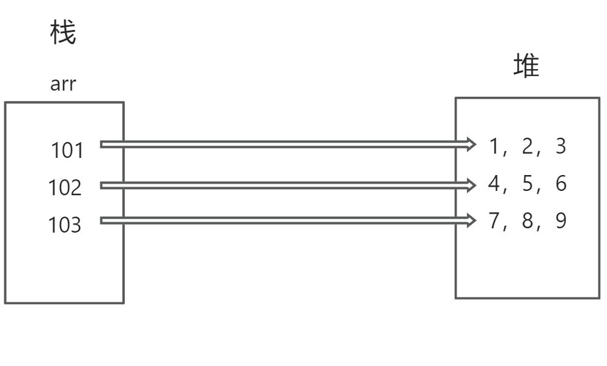

# Java 中的数组与排序算法

## 数组作为方法参数

在 Java 中，当数组作为方法的参数传递时，实际上传递的是数组的引用。虽然形参和实参都指向同一个数组对象，但形参和实参并不是同一个变量。

下面的示例演示了这一点：

```java
import java.util.Arrays;

public class ArrayParameterExample {
    public static void main(String[] args) {
        int[] originalArray = {1, 2, 3, 4, 5};
        int[] modifiedArray = doubleArrayValues(originalArray);

        // 原数组和修改后的数组是同一个引用
        System.out.println(originalArray == modifiedArray); // true
        System.out.println(Arrays.toString(originalArray)); // [2, 4, 6, 8, 10]
        System.out.println(Arrays.toString(modifiedArray)); // [2, 4, 6, 8, 10]
    }

    public static int[] doubleArrayValues(int[] array) {
        int length = array.length;
        for (int i = 0; i < length; i++) {
            array[i] *= 2;
        }
        return array;
    }
}
```

### 形参是什么

在上述示例中，方法 `doubleArrayValues` 的形参 `array` 是方法内部的一个局部变量，它存储了传入数组的引用。对形参 `array` 的修改会影响到原数组，因为它们指向同一个数组对象。

### 引用切断

当一个对象不再有任何引用指向它时，Java 的垃圾回收机制会回收这块内存空间。

## 二维数组

以下示例展示了如何遍历二维数组：

```java
public class TwoDimensionalArrayExample {
    public static void main(String[] args) {
        int[][] matrix = {
            {1, 2, 3},
            {3, 4, 5},
            {4, 5, 6}
        };
        for (int i = 0; i < matrix.length; i++) {
            for (int j = 0; j < matrix[i].length; j++) {
                System.out.print(matrix[i][j] + " ");
            }
            System.out.println();
        }
    }
}
```



## 杨辉三角

以下代码生成并打印杨辉三角：

```java
import java.util.Scanner;

public class PascalTriangle {
    public static void main(String[] args) {
        Scanner scanner = new Scanner(System.in);
        System.out.print("请输入行数");
        int rowCount = scanner.nextInt();
        int[][] triangle = new int[rowCount][];

        for (int i = 0; i < rowCount; i++) {
            triangle[i] = new int[i + 1];
            triangle[i][0] = 1;
            triangle[i][i] = 1;

            for (int j = 1; j < i; j++) {
                triangle[i][j] = triangle[i - 1][j - 1] + triangle[i - 1][j];
            }
        }

        for (int i = 0; i < rowCount; i++) {
            for (int k = 0; k < (rowCount - i - 1) * 2; k++) {
                System.out.print(" ");
            }
            for (int j = 0; j <= i; j++) {
                System.out.print(triangle[i][j] + "  ");
            }
            System.out.println();
        }
    }
}
```

## 数组查询

下面的程序实现了以下功能：

- 输入元素个数
- 输入随机数范围
- 输入猜测的数字
- 输出当前数组的最大值和最小值

```java
import java.util.Arrays;
import java.util.Random;
import java.util.Scanner;

public class ArraySearchExample {
    public static void main(String[] args) {
        Scanner scanner = new Scanner(System.in);

        System.out.print("请输入数字的个数");
        int elementCount = scanner.nextInt();
        System.out.print("请输入最大随机数");
        int maxRandomValue = scanner.nextInt();
        System.out.print("请输入猜测的数字");
        int guessedNumber = scanner.nextInt();

        int[] numbers = generateRandomArray(elementCount, maxRandomValue);

        System.out.println("生成的数组：" + Arrays.toString(numbers));

        boolean isFound = containsNumber(numbers, guessedNumber);
        if (isFound) {
            System.out.println("数字" + guessedNumber + "存在");
        } else {
            System.out.println("数字" + guessedNumber + "不存在");
        }

        int maximumValue = findExtremeValue(numbers, "MAX");
        System.out.println("最大值：" + maximumValue);
        int minimumValue = findExtremeValue(numbers, "MIN");
        System.out.println("最小值：" + minimumValue);
    }

    public static int[] generateRandomArray(int size, int maxValue) {
        int[] array = new int[size];
        Random random = new Random();
        for (int i = 0; i < size; i++) {
            array[i] = random.nextInt(maxValue);
        }
        return array;
    }

    public static boolean containsNumber(int[] array, int number) {
        for (int element : array) {
            if (element == number) {
                return true;
            }
        }
        return false;
    }

    public static int findExtremeValue(int[] array, String type) {
        int extremeValue = array[0];

        for (int i = 1; i < array.length; i++) {
            switch (type) {
                case "MAX":
                    if (array[i] > extremeValue) {
                        extremeValue = array[i];
                    }
                    break;
                case "MIN":
                    if (array[i] < extremeValue) {
                        extremeValue = array[i];
                    }
                    break;
                default:
                    break;
            }
        }
        return extremeValue;
    }
}
```

## 数组排序

### 冒泡排序

以下是冒泡排序的实现：

```java
public static int[] bubbleSort(int[] array) {
    int[] sortedArray = Arrays.copyOf(array, array.length);
    int length = sortedArray.length;
    int temp;

    for (int j = length - 1; j > 0; j--) {
        for (int i = 0; i < j; i++) {
            if (sortedArray[i] > sortedArray[i + 1]) {
                temp = sortedArray[i];
                sortedArray[i] = sortedArray[i + 1];
                sortedArray[i + 1] = temp;
            }
        }
    }
    return sortedArray;
}
```

### 选择排序

选择排序比冒泡排序效率更高，因为交换次数更少。

1. 从数组第一个元素开始，逐一对比，记录最小值的下标。
2. 一轮结束后，将最小值与当前轮的起始元素交换。
3. 重复以上步骤，直到排序完成。

```java
import java.util.Arrays;

public class SelectionSortExample {
    public static void main(String[] args) {
        int[] array = {2, 5, 7, 4, 7, 1, 0, 2};

        int[] sortedArray = selectionSort(array);
        System.out.println(Arrays.toString(sortedArray));
    }

    public static int[] selectionSort(int[] array) {
        int[] sortedArray = Arrays.copyOf(array, array.length);
        int minIndex;

        for (int i = 0; i < sortedArray.length - 1; i++) {
            minIndex = i;
            for (int j = i + 1; j < sortedArray.length; j++) {
                if (sortedArray[minIndex] > sortedArray[j]) {
                    minIndex = j;
                }
            }
            if (minIndex != i) {
                int temp = sortedArray[i];
                sortedArray[i] = sortedArray[minIndex];
                sortedArray[minIndex] = temp;
            }
        }
        return sortedArray;
    }
}
```

### 直接插入排序

以下是直接插入排序的实现：

```java
import java.util.Arrays;

public class InsertionSortExample {
    public static void main(String[] args) {
        int[] array = {4, 2, 6, 3, 1, 5};

        int[] sortedArray = insertionSort(array);
        System.out.println(Arrays.toString(sortedArray));
    }

    public static int[] insertionSort(int[] array) {
        int[] sortedArray = Arrays.copyOf(array, array.length);

        for (int i = 1; i < sortedArray.length; i++) {
            int current = sortedArray[i];
            int j = i - 1;
            while (j >= 0 && sortedArray[j] > current) {
                sortedArray[j + 1] = sortedArray[j];
                j--;
            }
            sortedArray[j + 1] = current;
        }
        return sortedArray;
    }
}
```

## 二分查找

二分查找的前提是数组必须是有序的，效率比较高。

```java
public static int binarySearch(int[] sortedArray, int key) {
    int low = 0;
    int high = sortedArray.length - 1;

    while (low <= high) {
        int mid = (low + high) >>> 1; // 防止溢出
        int midVal = sortedArray[mid];

        if (midVal < key) {
            low = mid + 1;
        } else if (midVal > key) {
            high = mid - 1;
        } else {
            return mid; // 找到关键字，返回索引
        }
    }
    return -1; // 未找到关键字
}
```

## Arrays 工具类

Java 提供了 `Arrays` 工具类，包含了各种操作数组的方法。

```java
import java.util.Arrays;

public class ArrayToolsExample {
    public static void main(String[] args) {
        int[] array = {4, 2, 6, 3, 1, 5};

        // 排序数组
        Arrays.sort(array);
        System.out.println(Arrays.toString(array)); // [1, 2, 3, 4, 5, 6]

        // 二分查找
        int index = Arrays.binarySearch(array, 2);
        System.out.println("数字 2 的索引：" + index); // 数字 2 的索引：1
    }
}
```

## 注意事项

- 进行数组操作时，要注意索引范围，防止 `ArrayIndexOutOfBoundsException` 异常。
- 对于需要大量插入和删除操作的场景，数组可能不是最佳选择，可以考虑使用 `ArrayList` 等集合类。
