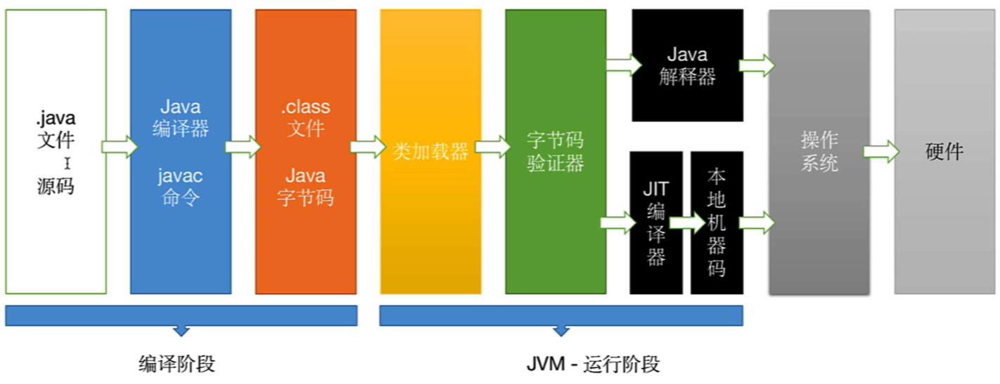

# Java 的三种开发版本及其编译与运行流程

## 三种开发版本

Java 有三种主要的开发版本，我在这里详细介绍。

**Java SE（Standard Edition）标准版**

用于开发桌面应用程序，提供了核心的`Java`类库和 API，是整个 Java 平台的基础。

**Java EE（Enterprise Edition）企业版**

基于`Java SE`，用于开发企业级的 Web 和分布式应用程序。它提供了如`Servlet`、`JSP`、`EJB`等组件，支持大型系统的开发和部署。

**Java ME（Micro Edition）微型版**

面向移动设备和嵌入式系统开发，提供了精简的类库，适用于资源受限的环境，如手机、PDA 等设备。

## Java 编译与运行流程

`Java`是一门严格的面向对象语言（基于类进行开发），既是编译型语言，又是解释型语言。这意味着`Java`代码需要先编译成字节码，然后再由虚拟机解释或即时编译执行。

我来详细说明`Java`的编译与运行流程。

首先，源代码（`.java`文件）通过`Java`编译器（`javac`）编译成字节码（`.class`文件）。这些字节码是与平台无关的。

接着，`Java`虚拟机（`JVM`）加载字节码并开始执行。

**Java 解释器**

`JVM`最初采用解释器的方式，逐行解释字节码指令并执行。由于解释器需要逐行将字节码翻译成机器码，执行速度较慢。

**JIT（Just-In-Time）编译器**

为提高执行效率，`JVM`引入了`JIT`编译器。`JIT`编译器在运行时将热点代码（经常执行的代码）编译成本地机器码。这样，后续执行时，直接运行编译后的机器码，速度大大提高。

**执行过程**

在实际运行中，`JVM`会先使用解释器执行代码。当发现某段代码被频繁执行时，`JIT`编译器会将其编译为本地机器码，以提高性能。

## JVM

`JVM`（Java 虚拟机）是一个抽象的计算机，具备以下特点。

**Java 平台的无关性**

`JVM`屏蔽了与各平台相关的信息，实现了跨平台运行。只要在目标平台上安装了相应的`JVM`，`Java`程序就可以运行。

**运行机制**

`JVM`负责将`Java`字节码加载、验证、解释或编译成目标平台的机器指令，并执行。

**一次编译，处处运行**

由于`Java`程序被编译成与平台无关的字节码，因此只需编译一次，即可在任何安装了`JVM`的设备上运行。
