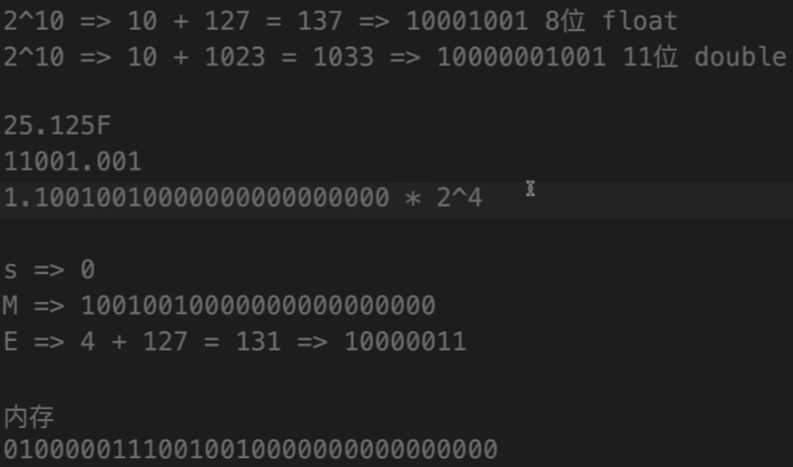

# Java 中的数据类型

## 基本类型

Java 提供了多种基本数据类型，用于表示不同类型的数值和字符。

### 整型

整型用于表示整数数值，包括`byte`、`short`、`int`和`long`。

`byte`类型占 1 字节（8 位），取值范围是`-2^7`到`2^7 - 1`，即`-128`到`127`。`short`类型占 2 字节（16 位），取值范围是`-2^15`到`2^15 - 1`，即`-32,768`到`32,767`。`int`类型占 4 字节（32 位），取值范围是`-2^31`到`2^31 - 1`，即`-2,147,483,648`到`2,147,483,647`。`long`类型占 8 字节（64 位），取值范围是`-2^63`到`2^63 - 1`，即`-9,223,372,036,854,775,808`到`9,223,372,036,854,775,807`。

### 浮点型

浮点型用于表示带小数的数值，包括`float`和`double`。

`float`类型占 4 字节（32 位），取值范围约为`-3.4e+38`到`3.4e+38`。`double`类型占 8 字节（64 位），取值范围约为`-1.7e+308`到`1.7e+308`。

### 布尔型

`boolean`类型用于表示逻辑上的真或假。在 Java 虚拟机中，`boolean`实际以`int`类型存储，占 4 字节（32 位）。

### 字符型

`char`类型占 2 字节，用于存储单个字符，取值范围是`0`到`65,535`。它采用 Unicode 字符集，每个字符都对应一个唯一的二进制整数。


需要注意的是，不能将大容量的数据类型存储到小容量的数据类型中，也就是“不可以小杯装大杯”。

## 引用类型

除了基本类型，Java 还提供了引用类型，包括字符串、数组和对象。

### 字符串

`String`类型用于表示由 Unicode 字符组成的字符序列，是一个有序的字符组合。

```java
String message = "sumingcheng";
```

### 数组

数组是用于存储同一类型元素的容器，可以是一维、多维等多种形式。

### 对象

对象是类的实例，包含属性和方法，用于描述现实世界中的事物。

# 进制

在计算机中，浮点数通常使用二进制表示。标准的二进制浮点数表示法为：


其中，符号位`s`表示浮点数的正负，`s=0`表示正数，`s=1`表示负数。有效数字`M`在内存中存储时省略了`1.`部分，读取时需要加上。指数`E`表示 2 的幂次，决定了数值的大小。

例如，`25.125`可以表示为：

```
25.125 = (-1)^0 × 1.1001001 × 2^4
```



# 浮点数的二进制表示

为了更好地理解浮点数的二进制表示，我编写了以下代码：

```java
public class TestFloatBinary {
    public static void main(String[] args) {
        // 将25.125转换为二进制表示

        // 整数部分：25
        // 25 / 2 = 12 ... 1
        // 12 / 2 = 6 ... 0
        // 6 / 2 = 3 ... 0
        // 3 / 2 = 1 ... 1
        // 1 / 2 = 0 ... 1
        // 倒序排列，整数部分的二进制为：11001

        // 小数部分：0.125
        // 0.125 × 2 = 0.25 ... 0
        // 0.25 × 2 = 0.5 ... 0
        // 0.5 × 2 = 1.0 ... 1
        // 取整部分，小数部分的二进制为：001

        // 合并整数和小数部分，得到25.125的二进制表示：11001.001

        // 对于0.4188的二进制表示：
        // 0.4188 × 2 = 0.8376 ... 0
        // 0.8376 × 2 = 1.6752 ... 1
        // 0.6752 × 2 = 1.3504 ... 1
        // 0.3504 × 2 = 0.7008 ... 0
        // 0.7008 × 2 = 1.4016 ... 1
        // 0.4016 × 2 = 0.8032 ... 0
        // 0.8032 × 2 = 1.6064 ... 1
        // 0.6064 × 2 = 1.2128 ... 1
        // 0.2128 × 2 = 0.4256 ... 0
        // 0.4256 × 2 = 0.8512 ... 0
        // 小数部分可能无限循环，导致存储时精度有限
    }
}
```

这说明了浮点数在计算机中的存储是有限的，小数部分可能会出现精度损失。

# 数据类型转换

## 自动类型转换

当我们将小容量的类型赋值给大容量的类型时，会发生自动类型转换。这类似于“大杯可以装小杯的水”。


## 强制类型转换

当需要将大容量的类型赋值给小容量的类型时，必须进行强制类型转换。这需要确保小容量的类型能够容纳大容量类型的值，否则会发生精度丢失。


## 精度丢失的案例

以下是一个精度丢失的示例：

```java
int number = 200;
byte smallNumber = (byte) number;

System.out.println(smallNumber); // 输出结果为 -56
```

解释：

- `int`类型的`number`变量占 4 字节，值为 200。
- 强制转换为`byte`类型时，只保留了低 8 位，高位被截断。
- 由于`byte`的取值范围是`-128`到`127`，结果出现了溢出，导致值变为`-56`。

另一个示例：

```java
int value = 128;
byte byteValue = (byte) value;

System.out.println(byteValue); // 输出结果为 -128
```

解释：

- `int`类型的`value`变量值为 128。
- 转换为`byte`时，128 超出了`byte`的取值范围，导致结果为`-128`。

因此，在进行强制类型转换时，必须确保数值在目标类型的取值范围内，否则会发生精度丢失。

## 其他注意事项

布尔类型不能转换为其他类型。在强类型语言中，`boolean`与数值类型是严格区分的。不同取值范围的类型之间不能直接赋值，需要进行显式的类型转换。

---

**提示**

在 Java 编程中，了解数据类型和类型转换对于编写高质量的代码至关重要。务必注意类型转换可能带来的精度丢失和溢出问题。

---
