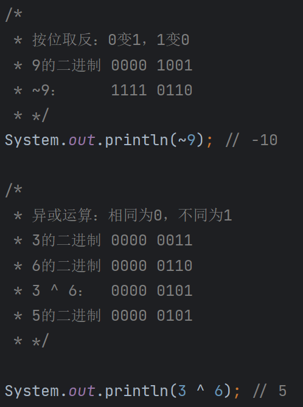

# 进制与位运算详解

## 进制

计数进位的方法称为进制（Numeration System）。常见的进制有以下几种。

**十进制（Decimal System）**

我们日常使用的计数系统，基数为 10，数位可以是 0 到 9。

**二进制（Binary System）**

计算机内部使用的计数系统，基数为 2，数位只能是 0 或 1。

**八进制（Octal System）**

基数为 8，数位为 0 到 7。

**十六进制（Hexadecimal System）**

基数为 16，数位为 0 到 9 以及字母 A 到 F，常用于表示内存地址、颜色值等。

## 进制的基数与位权

在进制系统中，有两个重要的概念：基数和位权。

**基数**

基数是进制的基本数。例如：

- 二进制的基数是 2。
- 八进制的基数是 8。
- 十进制的基数是 10。
- 十六进制的基数是 16。

**位权**

位权是指数位在数值中的权重，决定了该位对整个数值的影响。位权通常是基数的幂次方。

例如，在十进制数 123 中，各位的位权为：

- 最右边的 3，位权为 100。
- 中间的 2，位权为 101。
- 最左边的 1，位权为 102。

在二进制中，同样适用，位权为 2 的幂。

## 原码、反码与补码

计算机的运算器通常只执行加法，没有直接的减法运算。因此，减法通过加上一个数的相反数来实现。

乘法和除法也可以通过位移操作来优化：

- **乘法**：左移操作，数值每左移一位，相当于乘以 2。
- **除法**：右移操作，数值每右移一位，相当于除以 2。

### 符号位

在二进制表示有符号数时，最高位通常作为符号位：

- 符号位为 0，表示正数。
- 符号位为 1，表示负数。

### 原码、反码和补码的表示

**原码**

原码是数字的二进制表示形式，直接用最高位表示符号位，其余位表示数值的绝对值。

**反码**

正数的反码与原码相同。负数的反码是对其原码除符号位外的各个位取反。

**补码**

正数的补码与原码相同。负数的补码是在其反码的基础上加 1。

**示例**

以 8 位二进制数表示+6 和-6：

- **+6 的原码**：`0000 0110`
- **+6 的反码**：`0000 0110`
- **+6 的补码**：`0000 0110`

- **-6 的原码**：`1000 0110`
- **-6 的反码**：`1111 1001`（符号位不变，其他位取反）
- **-6 的补码**：`1111 1010`（反码加 1）

### 为什么要有反码和补码

使用补码有以下原因：

- **统一运算**：补码可以将减法运算转换为加法运算，简化了计算机的电路设计。
- **唯一的零表示**：补码表示中，零只有一种形式，避免了正零和负零的区别。
- **便于溢出检测**：补码运算有助于检测溢出错误。

计算机的内存中，整数通常以补码的形式存储。

## 位运算

位运算是直接对整数的二进制位进行操作。由于直接操作二进制位，位运算的性能非常高。

### 按位与 `&` 和按位或 `|`

- **按位与 `&`**：两个二进制数对应位都为 1，结果才为 1，否则为 0。
- **按位或 `|`**：两个二进制数对应位只要有一个为 1，结果为 1，只有当对应位都为 0 时，结果才为 0。

### 按位取反 `~` 和异或 `^`

- **按位取反 `~`**：对二进制数的每一位取反，0 变 1，1 变 0。
- **异或 `^`**：两个二进制数对应位相同为 0，不同为 1。

### 位移运算符

- **左移运算符 `<<`**

  将二进制数的所有位向左移动指定的位数，右边补 0。每左移一位，相当于乘以 2。

- **右移运算符 `>>`**

  将二进制数的所有位向右移动指定的位数，左边补符号位。每右移一位，相当于除以 2。

- **无符号右移运算符 `>>>`**

  将二进制数的所有位向右移动指定的位数，左边补 0，不论符号位。

### 示例

假设有整数 `8`，其二进制表示为 `00001000`：

- `8 << 1` 结果为 `16`，二进制为 `00010000`。
- `8 >> 1` 结果为 `4`，二进制为 `00000100`。
- `-8 >> 1` 结果为 `-4`，符号位保持不变，左边补 1。
- `-8 >>> 1` 结果为一个较大的正整数，因为左边补 0，符号位被当作数值位。

### 注意事项

- 位运算只能用于整数类型，如 `byte`、`short`、`int`、`long` 和 `char`。
- 在处理有符号数的位移时，需要注意符号位的影响。
