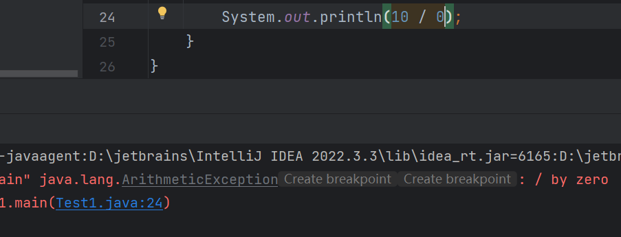

# Java 中的算术运算与浮点数精度

## 字符串拼接

在 Java 中，当字符串与其他类型的变量相加时，其他类型会被转换为字符串并进行拼接。需要注意，字符串是引用类型。

```java
float pi = 3.14f;
int count = 2;
boolean isValid = true;
String greeting = "Hello World";

// 字符串拼接
System.out.printf(greeting + pi + count + isValid); // Hello World3.142true
```

上述代码中，`greeting`与`pi`、`count`、`isValid`相加，结果是将各个变量转换为字符串后拼接在一起。

## `char`类型参与运算

当`char`类型的变量参与算术运算时，字符会被转换为对应的 Unicode 码值（整数）进行计算。

```java
int multiplier = 10;
char letter = 'b';

System.out.println(multiplier * letter); // 980
```

字符`'b'`的 Unicode 码值是 98，因此计算结果为`10 * 98 = 980`。

## 字符串不能参与乘除减运算

在 Java 中，字符串属于对象类型（`Object`），不是基本数据类型（`Primitive Type`）。基本数据类型可以参与加、减、乘、除等算术运算，但对象类型（包括字符串）不能直接进行这些运算。

## 整数相除

当整数相除时，如果两个操作数都是整数，结果会进行整数除法，舍弃小数部分。如果希望得到浮点数结果，可以将其中一个操作数强制转换为`float`或`double`类型。

```java
int numerator = 20;
int denominator = 8;

// 强制转换为浮点数，得到精确的除法结果
System.out.println((float) numerator / denominator); // 2.5

// 求余数
System.out.println(numerator % denominator); // 4
```

## 除数不能为零

在 Java 中，整数除法时，除数不能为零，否则会抛出`ArithmeticException`异常。



```java
int numerator = 10;
int denominator = 0;

System.out.println(numerator / denominator); // 抛出 ArithmeticException: / by zero
```

## 无穷大（Infinity）

当使用浮点数除以零时，Java 不会抛出异常，而是返回正无穷大`Infinity`或负无穷大`-Infinity`。

```java
System.out.println(1.0 / 0);   // Infinity
System.out.println(-1.0 / 0);  // -Infinity
```

这是因为浮点数运算遵循 IEEE 754 标准，允许用特殊值表示无穷大。

## 非数字（NaN）

当计算结果无法表示为一个实数时，Java 会返回`NaN`（Not a Number）。

```java
System.out.println(0.0 / 0);    // NaN
System.out.println(-0.0 / 0);   // NaN
```

`0.0 / 0.0`的结果是未定义的，因此返回`NaN`。

## 自增运算符

自增运算符`++`有前置和后置两种形式，分别是`++number`和`number++`。

- `number++`（后置自增）：先使用变量的值，再执行自增操作。
- `++number`（前置自增）：先执行自增操作，再使用变量的值。

```java
int number = 1;

System.out.println(number++); // 输出 1，number 变为 2
System.out.println(++number); // number 先变为 3，输出 3
```

## 浮点数运算的精度问题

### 精确计算

在某些情况下，浮点数运算可以得到精确的结果。

```java
System.out.println(2.5f - 0.5f); // 输出 2.0
```

上述计算结果准确无误，因为浮点数能够精确表示这些值。

### 精度丢失

由于计算机中浮点数的存储方式，某些浮点数运算可能会出现精度丢失。

```java
System.out.println(3.3f - 1.4f); // 输出 1.9000001
```

这是因为浮点数在二进制表示时，有些小数无法精确表示，导致运算结果存在微小误差。

### 注意事项

浮点数运算可能存在精度问题，尤其是在金融计算等对精度要求高的场合，建议使用`BigDecimal`类进行精确计算。
