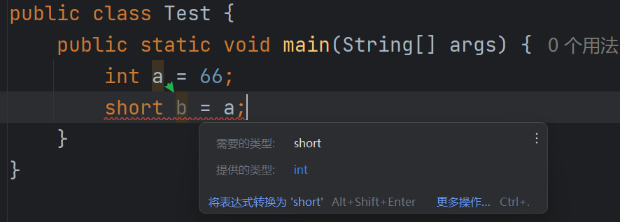
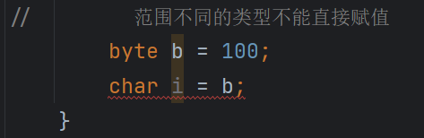
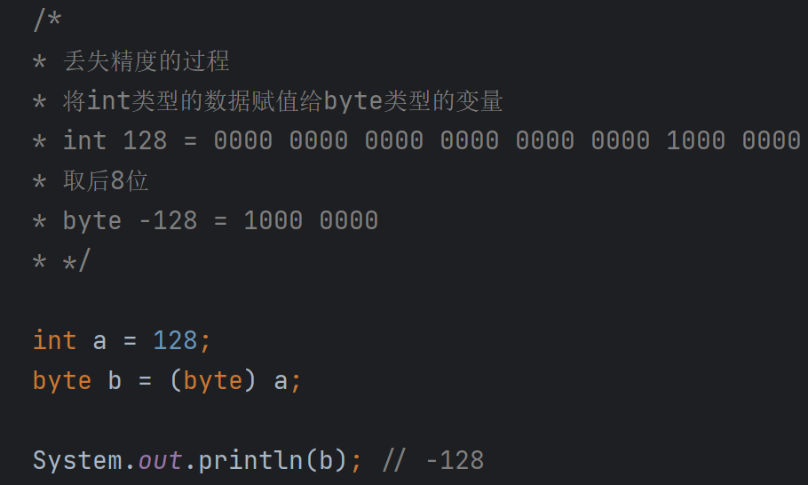

# Java 的数据类型和输入输出

## 基本数据类型

Java 提供了八种基本数据类型，用于表示整数、浮点数、字符和布尔值。

### 整数类型

整数类型用于表示没有小数部分的数字。

- **byte**：占用 1 字节（8 位），取值范围为`-2^7`到`2^7 - 1`，即`-128`到`127`。
- **short**：占用 2 字节（16 位），取值范围为`-2^15`到`2^15 - 1`，即`-32,768`到`32,767`。
- **int**：占用 4 字节（32 位），取值范围为`-2^31`到`2^31 - 1`，即`-2,147,483,648`到`2,147,483,647`。
- **long**：占用 8 字节（64 位），取值范围为`-2^63`到`2^63 - 1`，即`-9,223,372,036,854,775,808`到`9,223,372,036,854,775,807`。

### 浮点类型

浮点类型用于表示有小数部分的数字。

- **float**：占用 4 字节（32 位），取值范围约为`-3.4e+38`到`3.4e+38`。
- **double**：占用 8 字节（64 位），取值范围约为`-1.7e+308`到`1.7e+308`。

### 布尔类型

- **boolean**：在 Java 虚拟机中以`int`类型存储，占用 4 字节（32 位），取值为`true`或`false`。

### 字符类型

- **char**：占用 2 字节，取值范围为`0`到`65,535`，采用 Unicode 字符集，每个字符对应一个唯一的二进制整数。



需要注意，不能将大容量类型的数据赋值给小容量类型的变量，即“小杯不能装大杯的水”。

## 引用类型

引用类型包括类、接口、数组和字符串等。

### 字符串

`String`类型用于表示由 Unicode 字符组成的字符序列，是一个有序的字符组合。

```java
String name = "sumingcheng";
```

### 数组

数组是存储同一类型元素的容器，可以是一维、多维等形式。

### 对象

对象是类的实例，包含属性和方法，用于描述现实世界中的实体。

# 进制和浮点数表示

计算机中，数字以二进制形式存储。浮点数的标准二进制表示法为：


其中：

1. 符号位`s`表示数的正负，`s=0`为正数，`s=1`为负数。
2. 有效数字`M`在存储时省略前导的`1.`，读取时需加上。
3. 指数`E`表示 2 的幂次，决定了数的大小。

例如，`25.125`的二进制表示为：

```
25.125 = (-1)^0 × 1.1001001 × 2^4
```


# 浮点数的二进制表示方法

为了更好地理解浮点数的二进制表示，我编写了以下代码：

```java
public class FloatBinaryExample {
    public static void main(String[] args) {
        // 将25.125转换为二进制

        // 整数部分：25
        // 25 / 2 = 12 余 1
        // 12 / 2 = 6 余 0
        // 6 / 2 = 3 余 0
        // 3 / 2 = 1 余 1
        // 1 / 2 = 0 余 1
        // 倒序排列，整数部分的二进制为11001

        // 小数部分：0.125
        // 0.125 × 2 = 0.25，取整部分0
        // 0.25 × 2 = 0.5，取整部分0
        // 0.5 × 2 = 1.0，取整部分1
        // 小数部分的二进制为001

        // 合并整数和小数部分，得到25.125的二进制表示：11001.001

        // 对于0.4188的二进制表示：
        // 由于小数部分无限循环，存储时精度有限，导致精度损失
    }
}
```

这说明在计算机中，小数的二进制表示可能无法精确，导致精度丢失。

# 数据类型的转换

## 自动类型转换

当将容量小的类型赋值给容量大的类型时，Java 会自动进行类型转换，相当于“大杯可以装小杯的水”。



## 强制类型转换

将容量大的类型赋值给容量小的类型时，需要进行强制类型转换，需要确保小容量类型能够容纳转换后的值。




## 精度丢失的案例

以下示例展示了强制类型转换可能导致的精度丢失：

```java
int number = 200;
byte smallNumber = (byte) number;

System.out.println(smallNumber); // 输出为 -56
```

**解释：**

- `int`类型的`number`占用 4 字节，值为 200。
- 强制转换为`byte`类型时，只保留了低 8 位，高位被截断。
- 由于`byte`的取值范围是`-128`到`127`，结果出现溢出，导致值变为`-56`。

另一个示例：

```java
int value = 128;
byte byteValue = (byte) value;

System.out.println(byteValue); // 输出为 -128
```

因此，在进行强制类型转换时，需要特别注意可能的精度丢失。

**结论：**

大容量类型转换为小容量类型时，必须确保数值在目标类型的取值范围内，否则会发生精度丢失。

## 其他注意事项

- **布尔类型**不能与其他类型互相转换。在 Java 中，`boolean`类型只能是`true`或`false`，不能表示为数字。
- 不同取值范围的类型不能直接赋值，需要进行显式类型转换。

# Java 包与输入输出

## Java 包

Java 的包是类的集合，通过`import`语句可以导入包中的类，以便在程序中使用。

## 输入和输出

Java 提供了`Scanner`类，用于从控制台获取用户输入。

```java
import java.util.Scanner;

public class InputExample {
    public static void main(String[] args) {
        // 创建Scanner对象，等待用户输入
        Scanner scanner = new Scanner(System.in);
        // 获取输入的文本
        String input = scanner.next();
        System.out.println("输入结束");
        System.out.println("输入的内容为：" + input);
    }
}
```

### 多种类型的输入和输出

可以使用`Scanner`的不同方法获取各种类型的输入。

```java
import java.util.Scanner;

public class MultiInputExample {
    public static void main(String[] args) {
        Scanner scanner = new Scanner(System.in);

        System.out.println("请输入姓名");
        String name = scanner.next();

        System.out.println("请输入年龄");
        int age = scanner.nextInt();

        System.out.println("请输入性别（男/女）");
        char gender = scanner.next().charAt(0);

        System.out.println("请输入身高");
        double height = scanner.nextDouble();

        System.out.println("姓名：" + name);
        System.out.println("年龄：" + age);
        System.out.println("性别：" + gender);
        System.out.println("身高：" + height);
    }
}
```

### 简易计算器示例

以下代码实现了一个简单的计算器，可以进行加减乘除运算。

```java
import java.util.Scanner;

public class SimpleCalculator {
    public static void main(String[] args) {
        Scanner scanner = new Scanner(System.in);

        System.out.println("请输入第一个小数");
        float number1 = scanner.nextFloat();

        System.out.println("请输入第二个小数");
        float number2 = scanner.nextFloat();

        System.out.println("请选择运算符（+、-、*、/）");
        char operator = scanner.next().charAt(0);

        System.out.print("运算结果为：" + number1 + " " + operator + " " + number2 + " = ");

        switch (operator) {
            case '+':
                System.out.println(number1 + number2);
                break;
            case '-':
                System.out.println(number1 - number2);
                break;
            case '*':
                System.out.println(number1 * number2);
                break;
            case '/':
                if (number2 != 0) {
                    System.out.println(number1 / number2);
                } else {
                    System.out.println("除数不能为零");
                }
                break;
            default:
                System.out.println("无效的运算符");
        }
    }
}
```

### 使用`BigDecimal`优化精度问题

`float`和`double`类型在精确计算时可能会出现精度丢失。为了解决这个问题，可以使用`BigDecimal`类。

**`BigDecimal`的特点：**

- 提供高精度的算术运算。
- 支持设置精度和舍入模式，确保计算结果的准确性。
- 常用于财务计算、科学计算等需要高精度的场合。

**示例代码：**

```java
import java.util.Scanner;
import java.math.BigDecimal;

public class BigDecimalCalculator {
    public static void main(String[] args) {
        Scanner scanner = new Scanner(System.in);

        System.out.println("请输入第一个小数");
        String input1 = scanner.next();

        System.out.println("请输入第二个小数");
        String input2 = scanner.next();

        System.out.println("请选择运算符（+、-、*、/）");
        char operator = scanner.next().charAt(0);

        BigDecimal number1 = new BigDecimal(input1);
        BigDecimal number2 = new BigDecimal(input2);

        System.out.print("运算结果为：" + number1 + " " + operator + " " + number2 + " = ");

        switch (operator) {
            case '+':
                System.out.println(number1.add(number2));
                break;
            case '-':
                System.out.println(number1.subtract(number2));
                break;
            case '*':
                System.out.println(number1.multiply(number2));
                break;
            case '/':
                if (number2.compareTo(BigDecimal.ZERO) != 0) {
                    System.out.println(number1.divide(number2, 10, BigDecimal.ROUND_HALF_UP));
                } else {
                    System.out.println("除数不能为零");
                }
                break;
            default:
                System.out.println("无效的运算符");
        }
    }
}
```

### 注意事项

- 使用`BigDecimal`的构造函数时，建议传入`String`类型参数，避免精度问题。
- 在进行除法运算时，需要指定精度和舍入模式。
