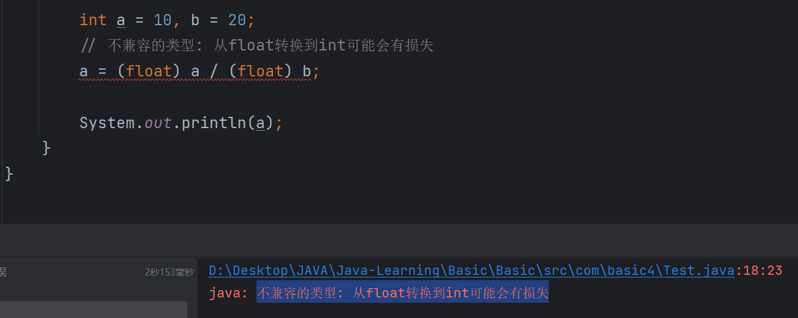
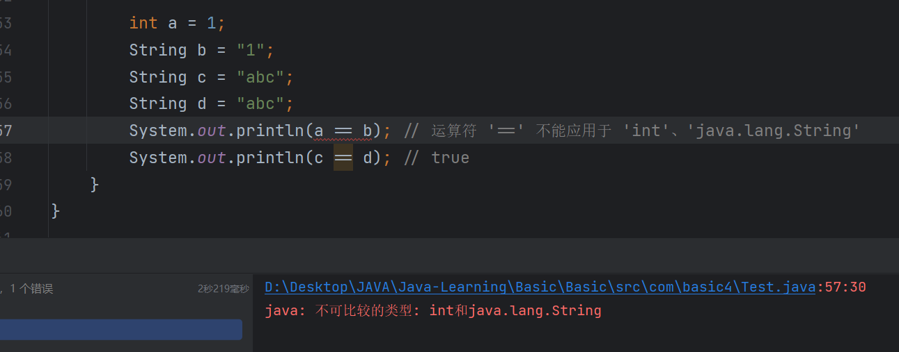

# 一元与二元运算

在`Java`中，运算符可以分为一元运算符和二元运算符。

- **一元运算符**：只作用于一个操作数，例如自增`++`、自减`--`、取反`!`、取负`-`等。
- **二元运算符**：作用于两个操作数，例如加法`+`、减法`-`、乘法`*`、除法`/`等。

复合赋值运算符（如`+=`、`-=`、`*=`、`/=`）是二元运算符的简化形式，但在使用时具备一元运算的特点。

```java
int result = a + 1; // 二元运算符，加法
a += 1;             // 复合赋值运算符，等价于 a = a + 1
```

## 类型转换

二元运算符在运算时可能会引起类型转换，尤其是在操作不同数据类型时，可能导致数据丢失。

一元运算符只对单个操作数进行操作，类型转换的问题相对简单。

```java
byte a = 1;
byte b = 2;
// 二元运算，byte 类型会提升为 int 类型，需要强制转换回 byte
a = (byte)(a + b);
System.out.println(a); // 输出 3
// 使用复合赋值运算符，自动进行类型转换
a += b;
System.out.println(a); // 输出 5
```

在上面的例子中，`a + b`会提升为`int`类型，因此需要强制转换。而`a += b`会自动进行类型转换，不需要强制转换。

## 不兼容的类型

如果需要进行浮点数的除法运算，应确保操作数都是浮点类型，避免类型不兼容的问题。



# Java 中的等于运算

在`Java`中，基本类型比较的是值，引用类型比较的是地址。因此，`Java`没有`===`运算符。

```java
int num1 = 1;
int num2 = 2;
float num3 = 1.1f;
double num4 = 1.0;

System.out.println(num1 > num3);  // false
System.out.println(num4 == num1); // true
System.out.println(num3 > num4);  // true
System.out.println(num3 > num2);  // false
System.out.println(num1 >= num4); // true
```

```java
int num = 2;
float numF = 1.1f;
char letter = 'a'; // 字符 'a' 的 Unicode 编码为 97

System.out.println(num < letter);   // true，因为 2 < 97
System.out.println(numF < letter);  // true，因为 1.1 < 97
```

## 与字符串的比较



```java
String str1 = "abc";
String str2 = "abc";
String str3 = "ccc";

System.out.println(str1 == str2); // true，指向同一字符串常量池中的对象
System.out.println(str3 == str2); // false，指向不同的对象
```

## 新建对象的地址不同

要判断字符串内容是否相等，应使用`equals`方法。`==`比较的是对象的引用地址。

```java
String s1 = new String("abc");
String s2 = new String("abc");

System.out.println(s1 == s2);       // false，不同的对象
System.out.println(s1.equals(s2));  // true，内容相同
```

使用`new`关键字创建的字符串对象，位于堆内存中，每次创建都会生成新的对象。

## 字符和数字的比较

```java
char charNum = '1'; // 字符 '1' 的 Unicode 编码为 49
int intNum = 1;

System.out.println(charNum == intNum); // false，比较的是 49 和 1
```

# 逻辑运算

## 与、或、非运算

逻辑运算符用于布尔逻辑判断：

- 逻辑与：`&&`
- 逻辑或：`||`
- 逻辑非：`!`

这些运算符常用于控制流语句中，根据条件执行不同的代码块。
