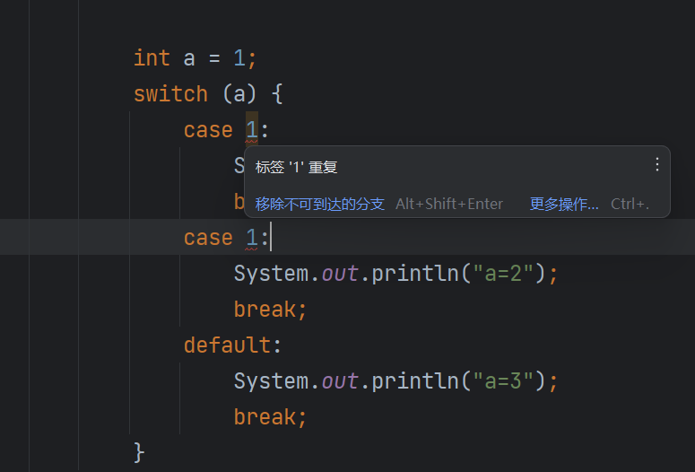

# Java 条件语句：if-else 和 switch

## if-else 语句

在编写`if-else`语句时，我建议尽量不要省略`else`分支，应处理所有可能的情况，确保代码的完整性和健壮性。同时，保持使用连续的`if-else`结构，而不是多个独立的`if`语句，以优化程序性能和可读性。

## switch 语句

`switch`语句用于根据变量的值执行不同的代码块，涉及关键字`switch`、`case`、`break`、`yield`等。

### 支持的类型

`switch`语句支持以下数据类型的条件表达式：

- `byte`
- `short`
- `char`
- `int`
- `enum`
- `String`

最终，这些类型都会被转换为`int`。这是因为为了确保`switch`语句的正确性，Java 编译器会将条件表达式转换为整数。在转换过程中，编译器使用对象的`hashCode()`方法生成一个整数值，作为`switch`语句的条件表达式，然后进行比较。

### 不支持的类型

`switch`语句不支持以下数据类型的条件表达式：

- `long`
- `float`
- `double`
- `boolean`

原因是这些类型在比较和跳转时不具备固定的大小和排列方式，可能导致精度丢失或无法准确处理。例如，浮点数无法精确表示所有实数，使用`==`比较浮点数可能会出现误差。而`long`类型的数据范围超过`int`，强制转换可能损失精度。`boolean`类型只有两个可能的值，不适合用于`switch`这种多分支选择结构。

如果需要使用这些类型作为条件表达式，建议使用`if-else`语句来实现。

### case 的规则

- `case`的值不能重复。
- 虽然`default`分支不是强制要求的，但我建议始终包含`default`，以处理未被覆盖的情况，提高代码的健壮性。



### 示例代码

以下是一个`switch`语句的示例：

```java
import java.util.Scanner;

public class SwitchExample {
    public static void main(String[] args) {
        int inputValue;
        Scanner scanner = new Scanner(System.in);
        System.out.println("请输入一个数字：");
        inputValue = scanner.nextInt();

        switch (inputValue) {
            case 1:
                System.out.println("输入值为1");
                break;
            case 2:
                System.out.println("输入值为2");
                break;
            default:
                System.out.println("输入值为：" + inputValue);
                break;
        }
    }
}
```

### 多个 case 共享代码块

可以让多个`case`共享同一个代码块，实现条件的贯穿：

```java
import java.util.Scanner;

public class LevelExample {
    public static void main(String[] args) {
        int inputValue;
        Scanner scanner = new Scanner(System.in);
        System.out.println("请输入一个数字：");
        inputValue = scanner.nextInt();

        switch (inputValue) {
            case 1:
            case 2:
            case 3:
                System.out.println("初级");
                break;
            case 4:
            case 5:
            case 6:
                System.out.println("中级");
                break;
            case 7:
            case 8:
            case 9:
                System.out.println("高级");
                break;
            default:
                System.out.println("输入错误");
                break;
        }
    }
}
```

### Java 14+增强的 switch 语法

在 Java 14 及以上版本，`switch`语句得到了增强，可以使用逗号分隔多个`case`值，更加简洁：

```java
switch (inputValue) {
    case 1, 2, 3:
        System.out.println("初级");
        break;
    case 4, 5, 6:
        System.out.println("中级");
        break;
    case 7, 8, 9:
        System.out.println("高级");
        break;
    default:
        System.out.println("输入错误");
        break;
}
```

### switch 表达式

在 Java 14 及以上版本，引入了`switch`表达式，可以直接返回值。这种语法在 Java 8 及以下版本中无法运行，需要注意版本兼容性。

```java
import java.util.Scanner;

public class AchievementExample {
    public static void main(String[] args) {
        final int PRIMARY_SCORE = 60;
        final int INTERMEDIATE_SCORE = 80;
        final int SENIOR_SCORE = 100;

        Scanner scanner = new Scanner(System.in);
        System.out.println("请输入级别（初级/中级/高级）：");
        String level = scanner.next();

        int achievement = switch (level) {
            case "初级" -> PRIMARY_SCORE;
            case "中级" -> INTERMEDIATE_SCORE;
            case "高级" -> SENIOR_SCORE;
            default -> {
                System.out.println("找不到合适的级别：" + level);
                yield 0; // 返回默认值
            }
        };

        System.out.println("成绩：" + achievement);
    }
}
```

在这个示例中，我使用了`switch`表达式和`yield`关键字来返回对应的成绩。如果输入的级别不匹配，会输出提示信息并返回默认值。

## 注意事项

- 使用`switch`语句时，应注意版本兼容性，某些特性可能只在较新的 Java 版本中支持。
- 对于不支持的类型，如`long`、`float`、`double`和`boolean`，建议使用`if-else`语句。
- 始终为`switch`语句提供`default`分支，处理未被列举的情况，提高代码的健壮性。
