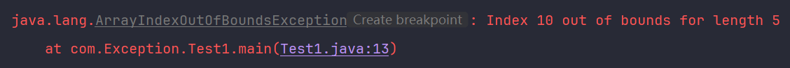
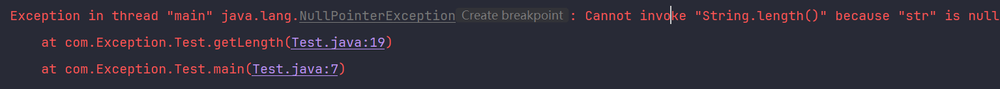
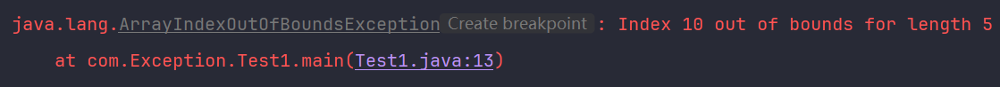
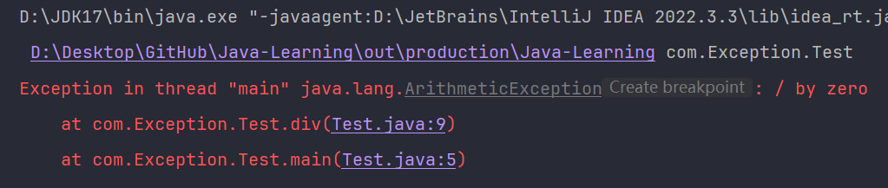
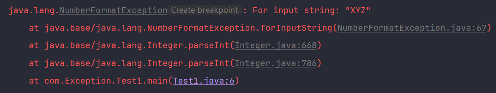
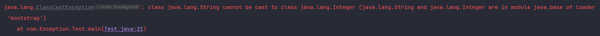

# Java 异常处理指南

异常与错误的本质区别在于异常通常可以被程序处理，而错误则是程序无法处理的严重问题。在编写代码时，笔者关注如何处理异常，而不是试图捕获和处理错误。

## Throwable 类

这是 Java 异常层次结构的根类。所有错误和异常都是此类的子类。`Throwable` 提供了常用的方法，如 **getMessage()**、**toString()** 和 **printStackTrace()**，用于获取异常信息和堆栈跟踪。

## Exception 类

这是所有可检查异常的基类。可检查异常必须被捕获（catch）或声明抛出（throws）。`Exception` 类继承自 `Throwable` 类，确保程序能够适当地处理这些异常。

## RuntimeException 类

这是所有运行时异常的基类。运行时异常不需要捕获或声明抛出，通常表示编程错误。`RuntimeException` 类继承自 `Exception` 类，常见于逻辑错误或不合理的假设。

## Error 类

这是所有错误的基类。错误通常在正常操作中不会出现的严重问题，例如 **OutOfMemoryError**。`Error` 类也继承自 `Throwable` 类，表示虚拟机无法恢复的状态。

## 各种具体的异常类

### IOException

`IOException` 表示发生 I/O 错误时抛出的异常。这是一个非常通用的异常类，用于处理与输入/输出相关的问题。

```java
try {
    FileInputStream fileStream = new FileInputStream("non_existing_file.txt");
} catch (IOException e) {
    e.printStackTrace();
}
```

### FileNotFoundException

当试图打开不存在的文件时，将抛出 `FileNotFoundException`。它是 `IOException` 的一个子类，专门用于指示文件无法找到的情况。

```java
try {
    FileInputStream fileStream = new FileInputStream("non_existing_file.txt");
} catch (FileNotFoundException e) {
    e.printStackTrace();
}
```



### NullPointerException

当应用程序试图在需要对象的地方使用 `null` 时，将抛出 `NullPointerException`。这是最常见的运行时异常之一，通常由于未正确初始化对象导致。

```java
String text = null;
try {
    int length = text.length();
} catch (NullPointerException e) {
    e.printStackTrace();
}
```



### ArrayIndexOutOfBoundsException

当数组索引超出有效范围时，将抛出 `ArrayIndexOutOfBoundsException`。这种异常通常由逻辑错误引起，访问了数组中不存在的元素。

```java
int[] numbers = new int[5];
try {
    int value = numbers[10];
} catch (ArrayIndexOutOfBoundsException e) {
    e.printStackTrace();
}
```



### ArithmeticException

当执行算术运算时出现异常情况时，将抛出 `ArithmeticException`，例如，除以零。这类异常通常由数学错误引起。

```java
try {
    int result = 10 / 0;
} catch (ArithmeticException e) {
    e.printStackTrace();
}
```



### NumberFormatException

当应用程序试图将字符串转换为数值类型，但该字符串无法转换为适当的格式时，将抛出 `NumberFormatException`。这通常由于输入数据格式不正确导致。

```java
try {
    int number = Integer.parseInt("XYZ");
} catch (NumberFormatException e) {
    e.printStackTrace();
}
```



### ClassCastException

当试图将对象强制转换为不兼容的类时，将抛出 `ClassCastException`。这种异常通常由错误的类型转换操作引起。

```java
Object obj = new String("hello");
try {
    // 尝试将 obj（一个 String 对象）强制转换为 Integer。
    // 由于 String 不能被转换为 Integer，所以这会引发 ClassCastException。
    Integer number = (Integer) obj;
} catch (ClassCastException e) {
    e.printStackTrace();
}
```


