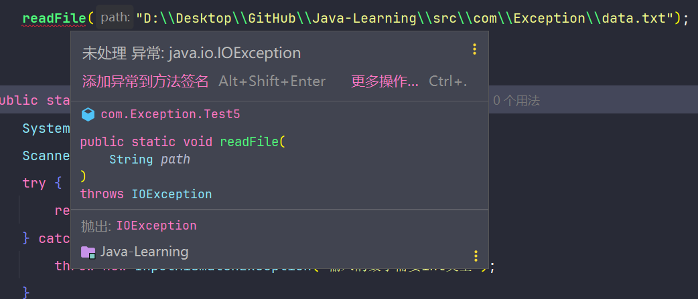
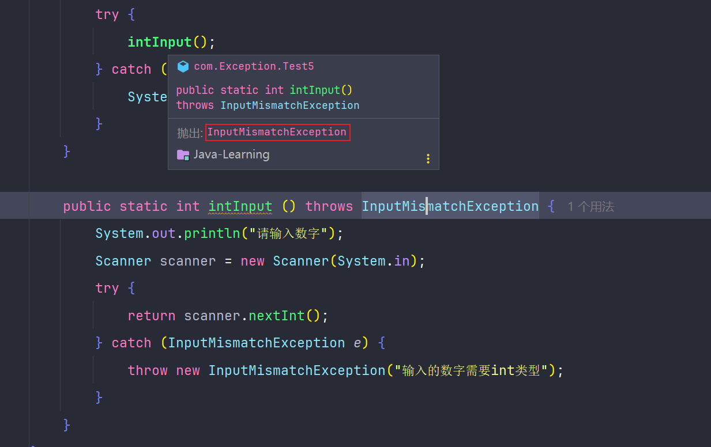

# 自定义异常与使用

## 自定义异常类

```java
package com.Exception;

public class CustomException extends Exception {
    public CustomException(String message) {
        super(message)  // 调用父类构造方法
    }
}
```

## 使用自定义异常

```java
package com.Exception;

public class Test5 {
    public static void main(String[] args) {
        try {
            boolean isValid = false;
            if (!isValid) {
                throw new CustomException("这是自定义的异常信息");
            }
        } catch (CustomException ex) {
            System.out.println(ex.getMessage());
        }
    }
}
```

## 读取文件

```java
import java.io.File;
import java.io.FileInputStream;
import java.io.IOException;

public static void readFile(String filePath) throws IOException {
    try (FileInputStream fileInputStream = new FileInputStream(new File(filePath))) {
        int data = fileInputStream.read();
        while (data != -1) {
            System.out.print((char) data);
            data = fileInputStream.read();
        }
    } catch (IOException e) {
        throw new IOException("文件读取失败");
    }
}
```

## 封装方法

当一个方法可能抛出异常时，调用该方法时需要进行异常处理。否则，编译时会提示异常未处理。





## 封装异常类

使用自定义异常类有助于明确异常类型，提升代码的可读性和维护性。

```java
package com.Exception;

import java.util.InputMismatchException;

public class InputTypeException extends InputMismatchException {
    public InputTypeException() {
        super();
    }

    public InputTypeException(String message) {
        super(message);
    }
}
```

## 受检异常和非受检异常

### 受检异常

受检异常类似于严格的老师，在编写代码时必须处理这些异常。编译器会检查这些异常，确保通过`try-catch`或`throws`声明进行处理。这类异常通常发生在程序控制之外，如文件未找到或网络连接失败。它们是`Exception`的子类，但不包括由程序员错误导致的异常。

### 非受检异常

非受检异常如同隐藏的陷阱，通常由编程错误引起，如空指针访问或数组越界。编译器不会强制处理这些异常，但良好的编程习惯要求预防这类错误。这类异常包括`RuntimeException`的所有子类和`Error`，后者通常表示严重问题，如系统资源耗尽，应用程序一般不处理。

### 如何判断异常类型

如果异常是`java.lang.RuntimeException`的子类，或是`java.lang.Error`，则属于非受检异常。如果异常是`java.lang.Exception`的子类，但不是`RuntimeException`的子类，则属于受检异常。
