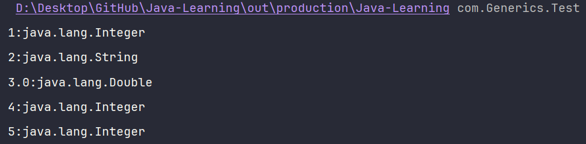
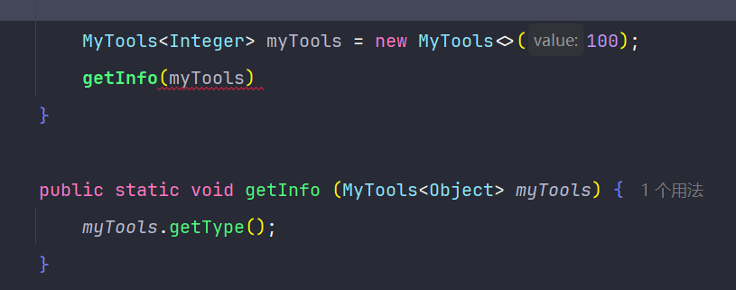
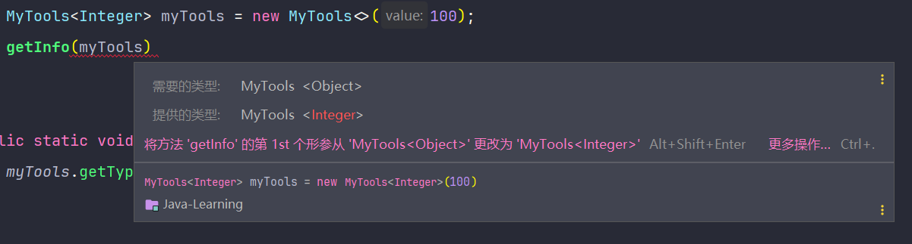

# Java 泛型方法与通配符详解

## 泛型方法

在 Java 中，泛型方法可以让相同的代码逻辑在一个函数内处理不同类型的数据，提高了代码的复用性和可读性。泛型方法中必须包含与形参列表对应的泛型标识集合，也就是说，泛型标识需要和形参相对应。泛型标识列表的定义顺序应与形参一一对应，这有助于方法的完整性和可读性。

下面是一个泛型方法的示例：

```java
package com.generics;

public class GenericMethod {
    public <T, E> boolean myEquals(T firstValue, E secondValue) {
        return firstValue.equals(secondValue);
    }
}
```

在这个示例中，我定义了一个泛型方法 `myEquals`，它接受两个不同类型的参数，并比较它们是否相等。泛型标识 `<T, E>` 与形参 `T firstValue` 和 `E secondValue` 一一对应。

## 静态方法中的泛型

由于静态方法不依赖于类的实例，因此无法获取到泛型类的泛型标识的具体类型。因此，泛型方法无论是静态方法还是实例方法，定义的泛型标识都与泛型类无关。

## 可变参数列表

泛型方法还可以接受可变参数列表，使得方法更加灵活。下面是一个接受可变参数的泛型方法示例：

```java
public static <T> void printTypes(T... values) {
    for (T value : values) {
        System.out.println(value);
        System.out.println(value.getClass().getName());
    }
}
```

调用该方法：

```java
GenericMethod.printTypes(1, "2", 3.0, 4, 5);
```

运行结果如下：



在这个示例中，我使用了可变参数列表 `T... values`，可以传入任意数量的参数，方法内部遍历并打印每个参数的值和类型。

## 泛型类型的传递

如果在实例化泛型类时不传递实际的泛型类型，默认情况下会将泛型参数视为 `Object` 类型，但这样会失去泛型带来的类型安全和代码简洁性。

当泛型参数的类型是 `Object` 时，没有特定的继承关系限制，可以传递任何类型的对象给泛型类或方法。然而，这种情况下，泛型的优势就无法体现。

下面是一个泛型类的示例：

```java
package com.generics;

public class MyTools<T> {
    private final T value;

    public MyTools(T value) {
        this.value = value;
    }

    public T getValue() {
        return value;
    }

    public void printType() {
        System.out.println(value.getClass().getSimpleName());
    }
}
```

在这个类中，我定义了一个泛型成员变量 `value`，并提供了获取值和打印类型的方法。

如果不指定泛型类型，实例化时会默认使用 `Object` 类型：

```java
MyTools tool = new MyTools("Hello");
tool.printType(); // 输出：String
```





## 不确定具体类型的通配符

当不知道传入的具体类型时，可以使用通配符 `?`，它代表无界通配符（Unbounded Wildcard），表示可以持有任何类型的对象。

示例：

```java
public static void displayInfo(MyTools<?> tool) {
    tool.printType();
}
```

在这个方法中，`MyTools<?>` 可以接受任何类型的 `MyTools` 实例。

### 上限通配符

如果想限制泛型参数的类型，使其必须是某个类的子类，可以使用上限通配符 `<? extends Class>`。

```java
public static void displayNumberInfo(MyTools<? extends Number> tool) {
    tool.printType();
}
```

这里，`MyTools<? extends Number>` 只能接受泛型类型为 `Number` 或其子类的实例。

### 下限通配符

下限通配符 `<? super Class>` 用于限制泛型参数的下限，使其必须是某个类的父类。

```java
public static void printPersonName(Family<? super Father> family) {
    Object person = family.getPerson();
    // System.out.println(person.getName());
}
```

在这个示例中，`Family<? super Father>` 表示泛型类型必须是 `Father` 的父类，这样可以确保方法的安全性。

更多关于 `Family` 类的实现，可以参考：[Java-Learning/src/com/Generics/family at main · sumingcheng/Java-Learning](https://github.com/sumingcheng/Java-Learning/tree/main/src/com/Generics/family)

---

**注意事项**

- 在使用泛型时，尽量指定实际的泛型类型，避免使用原生类型（Raw Type），以充分利用泛型带来的类型安全和代码可读性。
- 在泛型方法中，泛型标识需要与形参列表对应，确保代码的完整性和可读性。
- 使用通配符时，要根据实际需求选择合适的上限或下限通配符，以确保方法的正确性和安全性。

---
