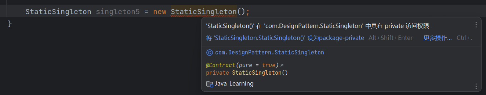

# 设计模式

为了更好地规范和优化，设计模式提供了一套系统的方法论。在 Java 中共有 23 种设计模式，常用的有十几种。

## 单例模式 Singleton

单例模式确保一个类只有一个实例存在。

```java
package com.DesignPattern;

/*
 * 单例模式
 * */
public class Test {
    public static void main (String[] args) {
        // 饿汉模式 类加载时就创建对象
        HungryManSingleton singleton1 = HungryManSingleton.getInstance();
        HungryManSingleton singleton2 = HungryManSingleton.getInstance();
        System.out.println(singleton1 == singleton2); // true

        // 懒汉模式 类加载时不创建对象
        LazyManSingleton singleton3 = LazyManSingleton.getInstance(1, 2);
        LazyManSingleton singleton4 = LazyManSingleton.getInstance(3, 4);
        System.out.println(singleton3 == singleton4); // true

        singleton3.sumingcheng();
        singleton4.sumingcheng();
    }
}
```

### 饿汉模式

饿汉模式通过静态属性直接初始化实例对象，类加载后立即创建，程序结束后被释放。

构造器私有化，类中创建实例，并提供一个获取实例的方法。

```java
package com.DesignPattern;

/*
 * 创建单例的方法
 * 1.构造器私有化
 * 2.类中构造实例
 * 3.提供一个获取实例的方法
 * */
public class HungryManSingleton {
    // 私有的构造器
    private HungryManSingleton () {
    }

    // 给静态属性初始化为本类的实例对象
    private static HungryManSingleton instance = new HungryManSingleton();

    // 通过静态方法获取实例
    public static HungryManSingleton getInstance () {
        return instance;
    }

    public void sumingcheng () {
        System.out.println("sumingcheng");
    }
}
```

### 懒汉模式（推荐）

懒汉模式在调用方法时才初始化实例，因此被称为懒汉。

```java
package com.DesignPattern;

public class LazyManSingleton {
    private LazyManSingleton () {
    }

    private int a;
    private int b;

    private LazyManSingleton (int a, int b) {
        this.a = a;
        this.b = b;
    }

    private static LazyManSingleton instance;

    public static LazyManSingleton getInstance (int a, int b) {
        if (instance == null) {
            instance = new LazyManSingleton(a, b);
        }
        return instance;
    }

    public static LazyManSingleton getInstance () {
        if (instance == null) {
            instance = new LazyManSingleton();
        }
        return instance;
    }

    public void sumingcheng () {
        System.out.println("懒汉模式 " + (a + b));
    }
}
```

## 两种模式对比

饿汉模式通过静态属性直接初始化实例对象，类加载后创建，程序结束后释放，虽然占用内存时间较长，但效率较高。

懒汉模式在静态方法中创建实例，方法调用时初始化，程序结束后释放。推荐使用懒汉模式，但在多线程环境下，当前的懒汉单例模式可能存在问题。

## 静态方法类

所有的方法都是静态的，例如 `Mach` 类。构造方法私有化并将方法静态化，使得类无法被实例化。然而，静态方法类的缺点是常驻内存。

```java
package com.DesignPattern;

public class StaticSingleton {
    private StaticSingleton () {
    }

    public static void sumingcheng () {
        System.out.println("staticSingleton");
    }
}
```



## 为什么需要单例模式

设计工具类时，没有必要创建多个实例，因为工具类通常只有类的方法而没有属性。单例模式可以减少对象创建时的内存消耗，并提高访问效率。
