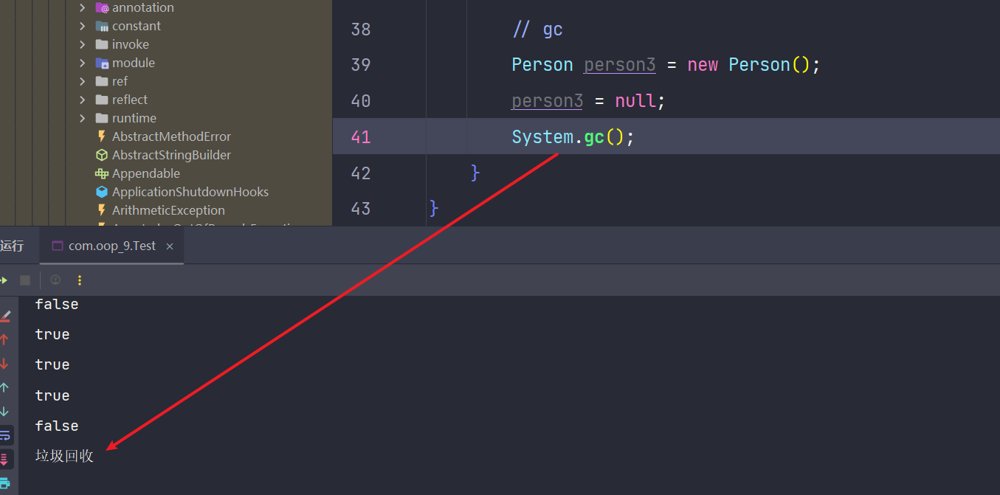

# 通用方法

Object 类提供了一些基本方法，这些方法对于所有的 Java 对象都是可用的。方法如下。

## equals(Object obj)

比较两个对象是否相等。默认情况下，`equals` 方法比较的是对象的引用是否相同。然而，许多类会重写此方法以比较对象的实际内容。

```java
String str1 = "sumingcheng";
String str2 = "sumingcheng";

// 如果字符串的内容相同，返回 true
System.out.println(str1.equals(str2)); // true
System.out.println(str1 == str2); // true

String str3 = new String("sumingcheng");
String str4 = new String("sumingcheng");

// equals 如果字符串的内容相同，返回 true
System.out.println(str3.equals(str4)); // true
// 如果不是字面量字符串，而是实例化字符串对象，那么等号判断的是引用地址
System.out.println(str3 == str4); // false
```

### equals 方法的五大特性

#### 自反性

一个对象与自身比较，结果必定相等。就像你看镜子里的自己，当然是自己。

#### 对称性

如果对象 A 等于对象 B，那么对象 B 也应该等于对象 A。就像如果 A 是 B 的朋友，B 也应该是 A 的朋友。

#### 传递性

如果对象 A 等于对象 B，且对象 B 等于对象 C，那么对象 A 也应该等于对象 C。就像 A、B、C 三个人互为朋友，A 和 C 也应互为朋友。

#### 一致性

在对象的状态未改变的情况下，多次比较结果应一致。就像两本完全一样的书，无论看多少次内容都不变。

#### 非空性

任何对象与 `null` 比较结果都是不相等的。就像任何东西与“没有东西”比较，肯定是不一样的。

## hashCode()

返回对象的哈希码。哈希码在哈希表等数据结构中用于快速定位对象。

```java
Person person = new Person();
int hash = person.hashCode();
System.out.println(hash); // 输出对象的哈希码
```

## toString()

返回对象的字符串表示。默认实现返回类名加上对象的哈希码，但通常会被重写以提供更有意义的信息。

```java
Person person = new Person();
System.out.println(person.toString()); // 输出对象的字符串表示
```

## getClass()

返回对象的运行时类。该方法是一个本地方法，使用 C++ 实现，无法被重写。

```java
Person person = new Person();
Class<?> clazz = person.getClass();
System.out.println(clazz.getName()); // 输出对象的类名
```

## clone()

创建并返回对象的一个副本。要使用 `clone` 方法，对象的类必须实现 `Cloneable` 接口，并重写 `clone` 方法。

```java
public class Person implements Cloneable {
    private String name;

    public Person(String name) {
        this.name = name;
    }

    @Override
    protected Object clone() throws CloneNotSupportedException {
        return super.clone();
    }
}

// 使用示例
Person person1 = new Person("sumingcheng");
try {
    Person person2 = (Person) person1.clone();
    System.out.println(person2.getName()); // sumingcheng
} catch (CloneNotSupportedException e) {
    e.printStackTrace();
}
```

## finalize()

在垃圾回收器确定不存在对该对象的更多引用时被调用。`finalize` 方法在对象被垃圾回收前执行一次，用于资源释放等操作。但由于其不确定性和性能问题，建议避免使用。

```java
public class Person {
    @Override
    protected void finalize() throws Throwable {
        System.out.println("垃圾回收");
    }
}

// 使用示例
Person person = new Person();
person = null;
System.gc(); // 请求垃圾回收
```

**注意事项**

- `finalize` 方法的调用时间不确定，且可能不会被调用。因此，依赖于 `finalize` 来释放资源是不可靠的。推荐使用显式的资源管理方法，如 `try-with-resources`。
- 在重写 `equals` 方法时，应同时重写 `hashCode` 方法，以确保哈希相关的数据结构（如 `HashMap`、`HashSet`）的正常工作。
- `clone` 方法的使用较为复杂，且存在许多潜在问题（如浅拷贝与深拷贝）。在大多数情况下，推荐使用复制构造函数或静态工厂方法来创建对象副本。

## 类方法示例

以下示例展示了如何使用 Object 类的基本方法：

```java
package com.oop_9;

public class Test {
    public static void main(String[] args) {
        Person person = new Person();
        // 输出对象的字符串表示，例如 com.oop_9.Person@4eec7777
        System.out.println(person.toString());
        // 输出对象的运行时类，例如 class com.oop_9.Person
        System.out.println(person.getClass());
        // 输出对象类的名称，例如 com.oop_9.Person
        System.out.println(person.getClass().getName());
        // 输出对象的哈希码，例如 1324119927
        System.out.println(person.hashCode());
        // 将哈希码转换为十六进制字符串，例如 4eec7777
        System.out.println(Integer.toHexString(person.hashCode()));
    }
}
```

## 其他方法

- `wait()`、`notify()`、`notifyAll()`：这些方法与对象的监视器相关，用于实现多线程同步。`wait` 使当前线程等待，直到另一个线程调用 `notify` 或 `notifyAll` 来唤醒它们。

**示例**

```java
synchronized (object) {
    try {
        object.wait(); // 当前线程等待
    } catch (InterruptedException e) {
        e.printStackTrace();
    }
}

synchronized (object) {
    object.notify(); // 唤醒一个等待该对象的线程
}

synchronized (object) {
    object.notifyAll(); // 唤醒所有等待该对象的线程
}
```

## 注意事项

- 使用 `equals` 和 `hashCode` 方法时，应遵循它们的契约，确保对象在哈希表中的正确行为。
- 避免在 `finalize` 方法中执行重要的资源释放操作，因其执行时间不确定，且可能不被调用。
- 多线程环境下，合理使用 `wait`、`notify` 和 `notifyAll` 方法，确保线程安全和避免死锁。

## 提示

- 始终重写 `toString` 方法，以提供对象的有意义字符串表示，便于调试和日志记录。
- 在需要对象比较逻辑时，优先考虑使用 `equals` 方法，并确保同时重写 `hashCode` 方法。
- 尽量减少使用 `clone` 方法，转而使用更安全和灵活的对象复制方式，如复制构造函数或静态工厂方法。



# 类方法

以下示例展示了如何使用 Object 类的基本方法：

```java
package com.oop_9;

public class Test {
    public static void main(String[] args) {
        Person person = new Person();
        // 输出对象的字符串表示，例如 com.oop_9.Person@4eec7777
        System.out.println(person.toString());
        // 输出对象的运行时类，例如 class com.oop_9.Person
        System.out.println(person.getClass());
        // 输出对象类的名称，例如 com.oop_9.Person
        System.out.println(person.getClass().getName());
        // 输出对象的哈希码，例如 1324119927
        System.out.println(person.hashCode());
        // 将哈希码转换为十六进制字符串，例如 4eec7777
        System.out.println(Integer.toHexString(person.hashCode()));
    }
}
```

**代码解析**

### Person 类

```java
package com.oop_9;

public class Person {
    public int getHashCode() {
        return this.hashCode();
    }

    @Override
    protected void finalize() throws Throwable {
        System.out.println("垃圾回收");
    }
}
```

- `getHashCode` 方法：返回对象的哈希码。
- `finalize` 方法：在对象被垃圾回收时调用，输出 "垃圾回收"。请注意，`finalize` 方法的执行时间不确定，且不建议依赖其进行资源管理。

**使用示例**

```java
Person person3 = new Person();
person3 = null;
System.gc(); // 请求垃圾回收
```

- 将 `person3` 设为 `null` 后，调用 `System.gc()` 请求垃圾回收。此时，如果垃圾回收器执行，会调用 `person3` 对象的 `finalize` 方法，输出 "垃圾回收"。

**注意事项**

- 垃圾回收机制是周期性的，并非在调用 `System.gc()` 后立即回收对象。
- 不应依赖垃圾回收来释放关键资源，建议使用显式的资源管理策略。
