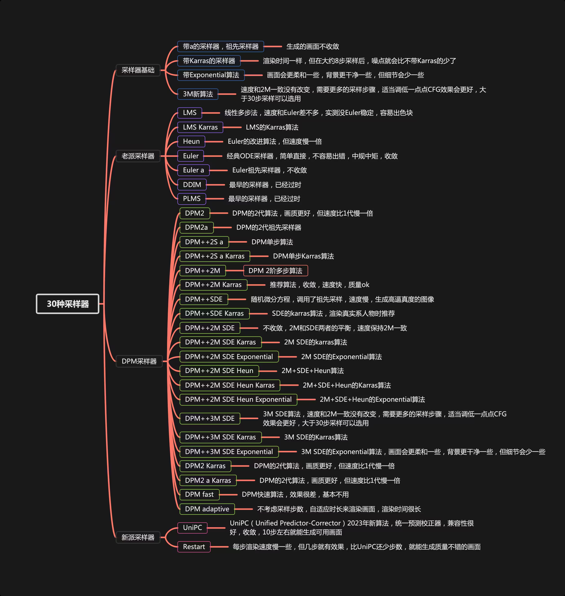

# stable-diffusion

1. 潜空间扩散模型（LDM）latent diffusion model，其实就是一种模型,扩散模型。
2. Stable Diffusion 是通过与 Stability AI 和 Runway 的合作实现的，它基于先前的工作，主要是关于高分辨率图像合成与潜在扩散模型

## 两个开源项目

1. [https://github.com/CompVis/stable-diffusion](https://github.com/CompVis/stable-diffusion)
2. [https://github.com/AUTOMATIC1111/stable-diffusion-webui](https://github.com/AUTOMATIC1111/stable-diffusion-webui)

### 衍生 GUI

1. stable-diffusion-WebUI v1.5
2. stable-diffusion-ComfyUI v1.5
3. stable-diffusion-Fooocus v1.0

## 大模型：核心

**ckpt、safetensors（快速,安全）强烈推荐使用的格式**

> "Stable diffusion"最初是在 256X256 的数据集上训练的潜在扩散模型的基础上，使用 512X512 的数据集进行进一步训练而发展起来的。在 2.0 版本之后，它转向使用更大的 768X768 的图片进行训练。
>
> 因此，"stable diffusion"在生成接近 512X512 分辨率的图片时表现更佳，而 2.0 版本后的模型在至少一边分辨率为 768 像素时效果更好。在生成图像时，首先产生一个随机噪声，这在隐空间中表现为一个张量，其大小受想要生成的图像分辨率的影响。例如，4X64X64 的隐空间张量对应 512X512 的图像，而 4X96X96 的张量对应 768X512 的图像。
>
> 当使用 512X512 的数据集训练的潜在模型去生成 256X256 的图像时，它只生成图像的一部分。但这种现象可能会因为"stable diffusion"在训练中加入了不同分辨率的数据集而减弱.

### Stable-Diffusion 1.5

> 在训练 stable-diffusion 1.5 大模型时，使用了大小为 512x512 的图像，这些图像来自 LAION-5B 数据库的一个子集。此外，还有信息显示，Stable Diffusion 的初始训练是在低分辨率的 256x256 图像上进行的，这些图像来自 LAION-5B 的完整集合中的 LAION-2B-EN 子集，该子集包含了 23 亿个英文标注的图像。还有一个名为 LAION-High-Resolution 的 LAION-5B 子集，其中包含了 1.7 亿个分辨率大于 1024x1024 的图像，但这些图像在训练前被缩小到 512x512。

### Stable-Diffusion 2.0

> 在 stable-diffusion 2.0 模型的训练过程中，初始基于 512x512 的图像进行训练，后续又在 768x768 的图像上进行了 140k 步的额外训练。
>
> 此外，stable-diffusion 2.0 模型的一个改进包括增加了默认图像大小到 768x768 像素，这对提高图像质量有所帮助。

### Stable Diffusion XL

> 截止目前较新的模型可以再 8GB VRAM 的消费者 GPU 或现成的云实例上有效地工作。渲染更大更好的图片，例如 1024\*1024 的图像
>
> [下载地址](https://huggingface.co/stabilityai/stable-diffusion-xl-base-1.0/discussions)

### 下载次数对比

| **模型名称**                             | **上传者**  | **用途**                    | **下载次数** |
| ---------------------------------------- | ----------- | --------------------------- | ------------ |
| stabilityai/stable-diffusion-xl-base-1.0 | stabilityai | 文本到图像（Text-to-Image） | 3.93M        |
| runwayml/stable-diffusion-v1-5           | runwayml    | 文本到图像（Text-to-Image） | 8.83M        |
| stabilityai/stable-diffusion-2-1         | stabilityai | 文本到图像（Text-to-Image） | 5.26M        |

## VAE：潜在扩散模型

VAE 是一种深度学习模型，它能够学习如何有效地对数据进行压缩（编码）和恢复（解码）。它的特点是在编码过程中，不是直接压缩为一个确定的值，而是压缩为一个概率分布（通常是高斯分布）。这使得 VAE 在解码时可以产生多种可能的输出，这种多样性使其在生成任务上表现出色。

本质是作为滤镜或者是调色的作用，更改风格

## LoRa：低秩适应模型

1.  使用 loar 可以生成特定的衣服特定的风格，根据需要生成不同于底模(大模型)的图片，体积小，效果好
2.  消耗小：2060:6GB 即可
3.  步数：image_repeat_epoch/bathc_size = total steps

| image      | 素材     | 原图质量越高，模型质量越好,但也不要过 |
| ---------- | -------- | ------------------------------------- |
| Repeat     | 学习次数 | 次数越多，效果越好,过多会过拟合       |
| Epoch      | 循环     | 循环越多，效果越好,过多会过拟合       |
| Batch size | 并行数量 | 越高，越快。过高收敛效果会差          |

4.  速率/质量

| Unet_lr           | 学习率，使用时候覆盖 lr | 学习率越高，速度越快 | 1e-4                   |
| ----------------- | ----------------------- | -------------------- | ---------------------- |
| Learning rete     | 学习率                  | 同上                 | 1e-4                   |
| Text_encoder_lr   | 学习率                  | 同上                 | 5e-5                   |
| Network Dimension | 学习精度                | 精度越高，细节越好   | 128,输出文件大小 140MB |
| optimazer         | 优化器                  |                      | 1e-4                   |

## LoRa 制作模型流程

1. 制作素材https://www.birme.net/
2. 打 tag：提示词反推，针对提示词进行优化
3. 批素材生成模型
4. 使用模型，调整参数，再次训练
5. 满意的模型

| tag 类型 | 内容                       | 说明 |
| -------- | -------------------------- | ---- |
| 主题     | 1 boy 1girl                | 主体 |
| 动作     | sitting，looking at viewer |      |
| 人物特征 | short hair                 |      |
| 视角     | upper body                 |      |
| 光影     | night，absuerdres：1.2     |      |

## 训练设置

Lora 训练总步数：1500~6000

1. 二次元：10~16 step
2. 写实：17~35 step
3. 场景：50 起步 step

## 做图流程

1. 选择合适的大模型和其他模型
2. 填写正向、反向关键词
3. 使用随机种子抽卡，4 图
4. 根据效果调整关键词，直到选中心怡图片，锁定种子
5. 根据选中图进行图生图，二次优化、三次优化、局部优化、放大或者高清修复等等
6. 完成图，将图进行放大或者拼接
7. 出图

# 文生图

## 关键词

### 基础知识

> () 强度变为 1.1 倍  
> [] 强度变为 0.9 倍  
> (keyword:XX) 强度变为 XX 倍
>
> 以下俩个例子都是强度变为 1.1 倍  
> (keyword)  
> (keyword:1.1)
>
> 以下俩个例子都是强度变为 0.9 倍  
> `[keyword](0.9倍)` 
> (keyword:0.9)
>
> 可以使用多个()或[]来影响强度  
> 例如，多个使用时就是简单的相乘  
> (keyword): 1.1 倍  
> ((keyword)): 1.21 倍  
> (((keyword))): 1.33 倍
>
`[[keyword]]`: 0.81倍  
`[[[keyword]]]`: 0.73 倍
>
> 偏移 Lora 模型: lora:offset_0.2:0.3

### 渐变

## 采样方法/Sampling method

**Euler**

> 基于 Karras 论文，在 K-diffusion 实现
>
> 20-30steps 就能生成效果不错的图片
>
> 采样器设置页面中的 sigma noise，sigma tmin 和 sigma churn 会影响

### **Euler a**

> 使用了祖先采样（Ancestral sampling）的 Euler 方法
>
> 受采样器设置中的 eta 参数影响

**LMS**

> 线性多步调度器（Linear multistep scheduler）源于 K-diffusion

**heun**

> 基于 Karras 论文，在 K-diffusion 实现
>
> 受采样器设置页面中的 sigma 参数影响

**DPM2**

> Katherine Crowson 在 K-diffusion 实现
>
> 受采样器设置页面中的 sigma 参数影响

**DPM2 a**

> 使用了祖先采样（Ancestral sampling）的 DPM2 方法
>
> 受采样器设置中的 ETA 参数影响

**DPM++ 2S a**

> 基于 Cheng Lu 等人的论文，在 K-diffusion 实现的 2 阶单步并使用了祖先采样（Ancestral sampling）的方法
>
> 受采样器设置中的 eta 参数影响
>
> Cheng Lu 的 github](https://github.com/LuChengTHU/dpm-solver)中也提供已经实现的代码，并且可以自定义，1、2、3阶，和单步多步的选择
>
> webui 使用的是 K-diffusion 中已经固定好的版本

### **DPM++ 2M**

> 基于 Cheng Lu 等人的论文的论文，在 K-diffusion 实现的 2 阶多步采样方法
>
> 被社区玩家称为最强采样器，速度和质量平衡优秀
>
> 比上方版本更优秀也更复杂

**DPM++ SDE**

> 基于 Cheng Lu 等人的论文的，DPM<u>的 SDE 版本（随机微分方程），DPM</u>原本是 ODE（常微分方程）
>
> 在 K-diffusion 实现的版本中调用了祖先采样（Ancestral sampling）方法，所以受采样器设置中的 ETA 参数影响

**DPM fast**

> 基于 Cheng Lu 等人的论文，在 K-diffusion 实现的固定步长采样方法，用于 steps 小于 20 的情况
>
> 受采样器设置中的 ETA 参数影响

**DPM adaptive**

> 基于 Cheng Lu 等人的论文，在 K-diffusion 实现的自适应步长采样方法
>
> 受采样器设置中的 ETA 参数影响

**LMS Karras**

> 基于 Karras 论文，运用了相关 Karras 的 noise schedule 的方法，可以算作是 LMS 使用 Karras noise schedule 的版本

**DPM2 Karras**

> 使用 Karras noise schedule 的版本

**DPM2 a Karras**

> 使用 Karras noise schedule 的版本

**DPM++ 2S a Karras**

> 使用 Karras noise schedule 的版本

### **DPM++ 2M Karras**

> 使用 Karras noise schedule 的版本

**DPM++ SDE Karras**

> 使用 Karras noise schedule 的版本

### **DDIM**

> 随 latent diffusion 的最初 repository 一起出现， 基于 Jiaming Song 等人的论文
>
> 目前最容易被当作对比对象的采样方法
>
> 在采样器设置界面有自己的 ETA

**PLMS**

> 元老级，随 latent diffusion 的最初 repository 一起出现

### **UniPC**

> 目前最新采样器，基于 Wenliang Zhao 等人的论文
>
> 理论上目前最快采样器，10 步即可获得高质量结果

字体较大的为推荐的采样器

## 采样步数/Sampling steps

在图像生成中，我们开始时有一个充满噪声的图像。通过采样步骤，我们逐渐清除这些噪声，就像是逐步清晰地揭示出一幅隐藏的画作。早期方法如 DDPM 非常慢，需要很多步骤才能得到清晰的图片，而且耗费大量时间和计算资源。

后来，人们开发了更快的技术，比如 DDIM，大大减少了所需的步骤和时间。更先进的方法，如 DPM++ 2M 和 UniPC，使这个过程更加迅速，只需更少的步骤就能得到高质量的图像。虽然这些快速方法可能在准确性和多样性上有所牺牲，但它们大大提高了效率。

总的来说，我建议使用更快的**采样技术**，如 DDIM、DPM++ 2M 或 UniPC，因为它们节省时间同时保持了相当好的图像质量。但是，具体选择哪一个还需要根据你的具体需求和可用资源来决定。

## 提示词引导系数/CFG Scale

**CGF 为 0**：图像生成完全是随机的，不受文本提示的影响。

**CGF 较高**：生成的图像会更多地根据你的文本提示来形成。

:::success
**CFG 处于 2-6 时会创意力（不可控性）提高**

**CFG 处于 10-15 时，你的作品受到你的提示的良性影响**

**CFG 处于 16-20 时，你得确定你的提示真的是你想要的，否则效果不会太好**

**CFG 高于 20 时，可能会产生一些奇怪的现象（反正挺离谱的）**

:::

## 高清修复/Hires. fix

### 图像放大器/Upscaler

#### **LDSR**

中文名为**潜在扩散超分辨率**模型，放大器们中唯一和 diffusion 模型靠边的，它出现于 stable diffusion 的 v1.4 版本。

LDSR 虽然能提供不错的放大效果（写实类），但是非常缓慢，不是很推荐。

#### **R-ESRGAN 4x+**

中文名为**真实-增强型超分辨率生成对抗网络（R-ESRGAN）\***_**模型，R-ESRGAN 4x+是\***_**ESRGAN**的增强版。

GAN 在图像超分辨率这个领域发展很早，所以目前效果出色，能保留精细的细节并产生清晰锐利的图像。

而 R-ESRGAN 4x 在恢复各种真实世界图像时有更强效果，能产生更平滑的图像。

#### **R-ESRGAN 4x+ Anime6B**

上面的模型在六十亿参数的动漫数据集上训练的结果，理论上相对上面能在二次元风格的图片上产生更优秀的效果。

以上俩个放大模型你可能需要前往设置进行添加

### 放大步数/Hires steps

:::success
整个 Hires. fix 过程你可以理解为我们在图像进行放大后，再基于该图像进行了二次生成（图生图）

这个 Hires steps 就是我们二次生成时的步数，如果数值保持为 0，就代表和原有图像生成时的步数相同。

由于该步数对最终图像影响很大，所以生成图片时还请自行尝试对你模型和提示词和采样方法比较适合的步数。

:::

### 去噪强度/Denoising strength

:::success
**噪声强度与放大器值**：在使用`latent`系列的放大器时，如果放大器值在 0.5 到 0.8 之间，添加适度的噪声可以获得更好的效果。如果放大器值较低，结果可能会非常模糊，缺乏细节。

**使用 ESRGAN 时的特殊情况**：如果你使用像 ESRGAN 这样的放大器，可以不添加噪声（即将噪声强度设为 0）。这样做会直接放大图片而不重新生成，节省时间。

**二次生成的选择**：即使使用 ESRGAN，一些用户可能仍选择添加噪声。这实际上创建了一个“图生图”的流程，可能会消耗更多时间，但某些用户（或“魔法师”）偏爱这种方法，因为它可能引入额外的创造性或独特性。

:::

### 放大倍数/Upscale by

:::success
当我们试图生成高像素级别图片时，我们通常让 stable diffusion 生成一张 512X768 附近的图片，然后通过高清修复生成至更大的图片

当我们生成真实图片时，我们一般采用 R-ESRGAN 4x+，当我们生成二次元图片时我们一般采用 R-ESRGAN 4x+ Anime6B

:::

## 图像生成种子/Seed

一个用于随机生成种子（骰子），一个用于获取上张图的种子（回收）

## 附加/Extra

#### **种子变异/Variation seed**

你可以填入你想使用的变异种子，具体规则和 seed 一致

#### **变异强度/Variation strength**

变异种子和原种子的差异强度，为 0 时为原种子，为 1 时是新种子

## 脚本/Script

### 描述词矩阵/Prompt matrix

使用|分离多个提示词，系统将会组合每个提示词用来生成图像。

:::success
a busy city street in a modern city|illustration|cinematic lighting

会生成四幅图像，分别为

a busy city street in a modern city

a busy city street in a modern city, illustration

a busy city street in a modern city, cinematic lighting

a busy city street in a modern city, illustration, cinematic lighting

:::

### 载入描述词/Prompts from file or textbox

可以通过此脚本创建一个列表用于顺序生成

:::success
--prompt "photo of sunset"

--prompt "photo of sunset" --negative_prompt "orange, pink, red, sea, water, lake" --width 1024 --height 768 --sampler_name "DPM++ 2M Karras" --steps 10 --batch_size 2 --cfg_scale 3 --seed 9

--prompt "photo of winter mountains" --steps 7 --sampler_name "DDIM"

--prompt "photo of winter mountains" --width 1024

:::

### XYZ 图/XYZ plot

创建具有不同参数的多个图像网格。X 和 Y 用作行和列，而 Z 网格用作批处理维度（次数）。

使用 X 类型、Y 类型和 Z 类型字段选择应由行、列和批次使用的参数，并将这些参数以逗号分隔输入到 X/Y/Z 值字段中。

# 图生图

**接下来只介绍和图生图不同的部分**

## 询问/Interrogate

### 询问 CLIP(推荐)

:::success
CLIP 模型是一个革命性的人工智能，它融合了语言理解和计算机视觉，使得它能理解和解释图像及文本。其核心功能是实现跨模态转换，即能将文本转换为与之相关的图像，也能从图像生成描述性文本。

:::

### 询问 DeepBooru

:::success
clip 注重画面内的联系，生成的自然语言描述

DeepBooru 则是对二次元图片生成标签，对二次元的各种元素把握很好

:::

## 缩放模式/Resize mode

:::success
**拉伸（Just resize）** --简单的将图片缩放至指定比例，不保证原图尺寸比

**裁剪（Crop and resize）**--将图片按比例进行缩放，多余的直接裁剪掉

**填充（Resize and fill）**--将图片按比例进行缩放，缺少的部分填充

**隐空间直接缩放（latent upscale）**--其实与前面三个不同，这个是常用于图像超分辨率的快捷选项，低显存谨慎使用。

:::

:::success
该选项直接在隐空间对图片进行缩放（拉伸），因为直接作用在隐空间所以需要比较高的去噪强度，0.7 左右比较适合，较低会造成图像模糊。

:::

## 去噪强度/Denoising strength

范围 0-1，数值越大代表离原图距离越远

## 采样步数/Sampling steps

基本与文生图相同

值得注意的是，默认情况下在去噪强度较低的时候，实际采样步数会下降

具体公式为：采样步数 X 去噪强度=实际采样步数

## 脚本/Script

这里的功能比较多，常用的基本和文生图一样

### 使用 SD 放大/SD upscale

使用的时候要设置好重叠范围，保证图像没那么强的割裂感

:::success
运行后的步骤为

- 将图像进行放大 2,3,4 倍
- 将图像按指定的宽高进行分割成数个片段
- 将每个片段都做一次图生图
- 然后将片段拼回，达成放大效果

:::

# 图像增强/Extras

高清修复是图像增强/Extras 的一部分
