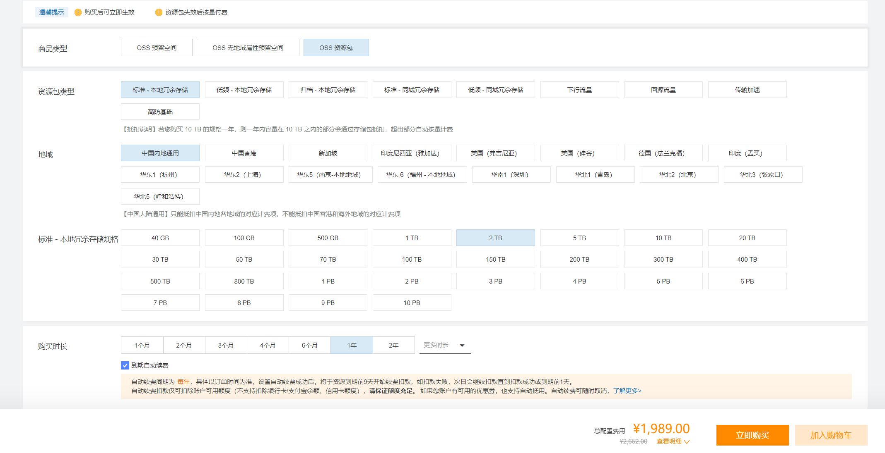

# 云服务部署方案与价格

## OSS 价格

### 资源包

1989.00



### 按量付费

使用按量付费模式，2TB 存储的费用为 0.12 元每 GB，每月计算为：

```plaintext
0.12 * 2048 * 12 = 2949.12
```

[价格计算器](https://www.aliyun.com/price/product?spm=5176.21213303.J_qCOwPWspKEuWcmp8qiZNQ.3.78782f3dk5nfnn&scm=20140722.S_card%40%40%E4%BA%A7%E5%93%81%40%40218843.S_card0.ID_card%40%40%E4%BA%A7%E5%93%81%40%40218843-RL_OSS-LOC_search%7EUND%7Ecard%7EUND%7Eitem-OR_ser-V_3-P0_0#/oss/detail/ossbag)

资源包模式比按量付费更加经济。

### 分片上传

参考文档：[如何在受版本控制的存储空间中上传文件\_对象存储(OSS)-阿里云帮助中心](https://help.aliyun.com/zh/oss/developer-reference/upload-objects-8#section-s5v-4mz-zme)

## CDN 价格

CDN 的价格通常低于 OSS，但需要注意偶尔会产生`OSS-CDN`的回源流量。

[价格计算器](https://www.aliyun.com/price/product?spm=5176.21213303.J_qCOwPWspKEuWcmp8qiZNQ.3.78782f3dk5nfnn&scm=20140722.S_card%40%40%E4%BA%A7%E5%93%81%40%40218843.S_card0.ID_card%40%40%E4%BA%A7%E5%93%81%40%40218843-RL_OSS-LOC_search%7EUND%7Ecard%7EUND%7Eitem-OR_ser-V_3-P0_0#/flowbag/detail/flowbag)

## ECS 价格

按照 CPU、内存和带宽进行付费，通常选择一套固定配置，后期可以根据需要进行弹性扩容。ECS 的主要成本集中在这些配置上。

在选择带宽类型时，建议关注秒级并发能力，以确保服务的稳定性和响应速度。

[价格计算器](https://www.aliyun.com/price/product?spm=5176.21213303.J_qCOwPWspKEuWcmp8qiZNQ.3.78782f3dk5nfnn&scm=20140722.S_card%40%40%E4%BA%A7%E5%93%81%40%40218843.S_card0.ID_card%40%40%E4%BA%A7%E5%93%81%40%40218843-RL_OSS-LOC_search%7EUND%7Ecard%7EUND%7Eitem-OR_ser-V_3-P0_0#/ecs/detail/vm)

## 参考文章

[如何使用 ECS 和 OSS 搭建在线教育视频课程分享网站-阿里云帮助中心](https://help.aliyun.com/document_detail/612670.html?spm=5176.12818093_-1363046575.0.0.3be916d0VM6pDu)
