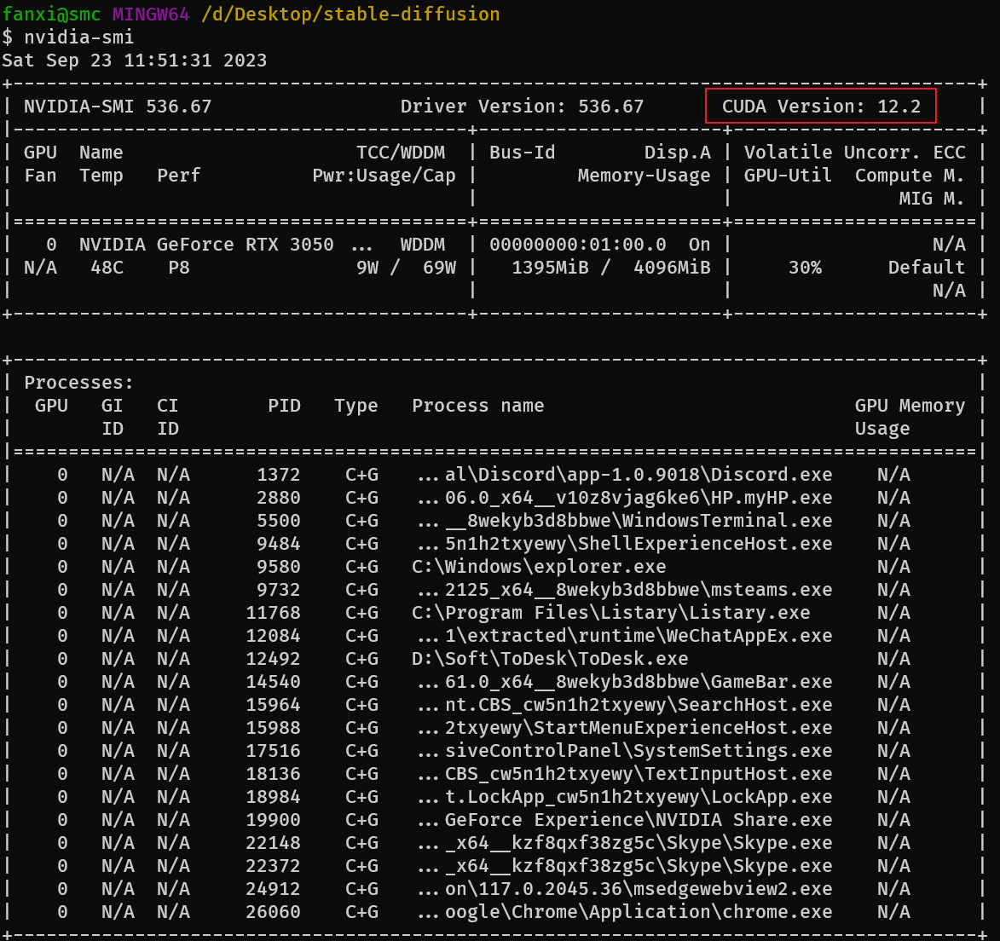
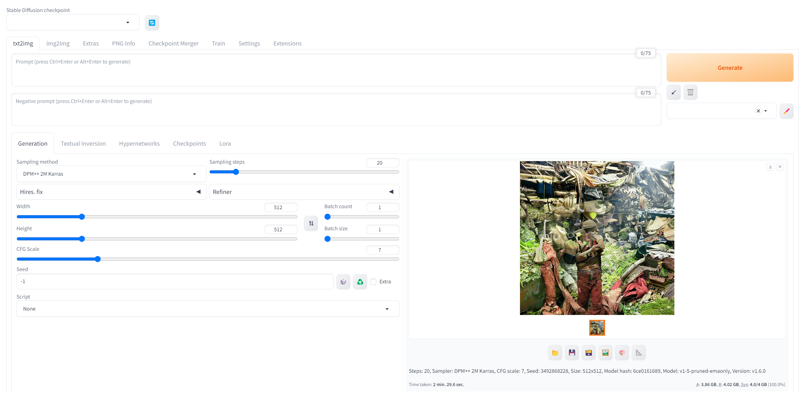
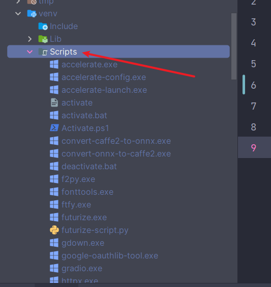
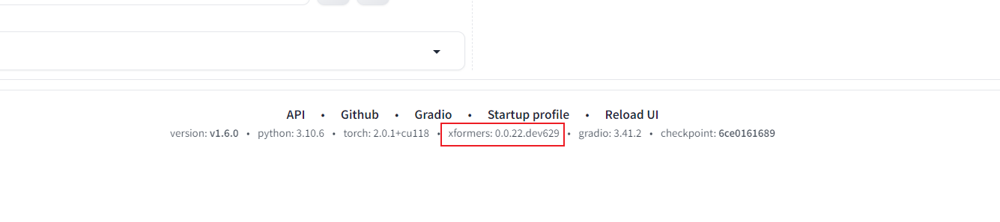

# 基础环境

1. 安装 Python 3.10.6（较新版本的 Python 不支持 torch），选中“Add Python to PATH”
2. 更新显卡驱动到最新
3. nvidia-smi，找到对应的 CUDA 版本号

```shell
nvidia-smi
```



3. 这里我的版本号是 12.2，下载地址

[https://developer.nvidia.com/cuda-downloads?target_os=Windows&target_arch=x86_64&target_version=11&target_type=exe_local](https://developer.nvidia.com/cuda-downloads?target_os=Windows&target_arch=x86_64&target_version=11&target_type=exe_local)

4. 安装 Git

[Git - 安装 Git](https://git-scm.com/book/zh/v2/%E8%B5%B7%E6%AD%A5-%E5%AE%89%E8%A3%85-Git)

5. clone 并运行

```bash
git clone https://github.com/AUTOMATIC1111/stable-diffusion-webui.gi
```

**运行 webui-user.bat**

6. **建议使用官方或者阿里云的源**

```bash
pip config set global.index-url https://pypi.org/simple/
```

```bash
pip config set global.index-url https://mirrors.aliyun.com/pypi/simple/
```

# 启动



# 解决 xformers 模块找不到

```bash
no module 'xformers'. Processing without...
No module 'xformers'. Proceeding without it.
```

进入该目录下



运行

```bash
pip install --force-reinstall --no-deps --pre xformers
```

修改`COMMANDLINE_ARGS`代码，如果你启动后是` 0.0.0.0`就去掉`--listen`

```bash
COMMANDLINE_ARGS = --xformers --opt-sdp-no-mem-attention --listen --enable-insecure-extension-access
```

重新启动


