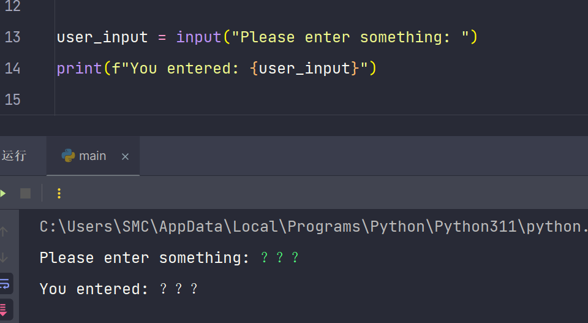

# 编码和字符集

## Unicode 字符集

我将 Unicode 理解为一个字符集，为世界上所有文字和符号分配唯一的码点。Unicode 本身不负责定义存储方式，而是仅定义字符与码点的映射关系。字符 'A' 的 Unicode 码点是 U+0041。实际存储和传输字符时需要选择具体的编码方案。

## UTF-8 UTF-16 UTF-32

UTF-8 UTF-16 UTF-32 是常见的 Unicode 编码方案，将 Unicode 码点转为字节序列。UTF-8 是变长编码，用 1 到 4 个字节表示一个字符，并且与 ASCII 向后兼容。UTF-16 使用 2 或 4 个字节，UTF-32 为每个字符分配固定 4 个字节。当我说一个文件使用 UTF-8 编码时，意味着文件中的字节序列是由 UTF-8 将 Unicode 码点转换而来。

在 Python 中，内部字符串表示采用 Unicode 码点。当我要将字符串写入文件或通过网络传输时，需要使用 UTF-8 等编码方案将其转换为字节序列。我在实际开发中常采用 UTF-8 存储文本文件，并在打开文件时显式指定编码为 UTF-8，从而确保跨平台兼容与正确的字符显示。

## 标识符规则

在 Python 中，标识符的第一个字符必须是字母 A-Z 或 a-z 或下划线 \_，后续字符可以是字母、数字和下划线。Python 区分大小写，因此 variable 与 Variable 是两个不同的标识符。

从 Python 3 开始，标识符允许使用非 ASCII 字符，例如中文。尽管如此，我在实际开发中仍倾向于使用英文和下划线作为标识符，以提升代码的可读性与跨平台协作性。

## 关键字

Python 的关键字包括：

- if、elif、else：用于条件判断
- while、for：用于循环
- break：中断循环
- continue：跳过当前循环迭代的剩余部分
- def：定义函数
- return：从函数返回值
- class：定义类
- try、except、finally：异常处理
- raise：抛出异常
- import、from：导入模块
- with：简化异常处理中的资源管理
- pass：空操作
- yield：在生成器中返回值
- lambda：定义匿名函数
- global、nonlocal：声明全局和非局部变量
- assert：用于调试
- del：删除引用
- and、or、not：逻辑操作符
- is、in：成员测试操作符
- True、False、None：内置常量

```python
import keyword
print(keyword.kwlist)
```


在编写代码时，如果我不确定某个单词是否为关键字，可使用 keyword.kwlist 来查询，以避免使用关键字作为标识符。

## 注释

在实际开发中我会通过注释为代码提供上下文和说明。当需要说明复杂逻辑或为后来者指路时，注释能提升代码的可维护性。

### 单行注释

```python
# 这里解释下一行代码的功能
print("Hello, World!")  # 这行用于输出问候语
```

### 多行注释

```python
'''
这是一段跨越多行的注释
可在此说明复杂逻辑或文档化代码接口
'''
print("Hello, World!")
```

## 行与缩进

Python 通过缩进而非花括号来表示代码块结构。我会严格遵循相同的缩进风格，这能使代码更整洁清晰。

```python
if True:
    print("This is true.")
    for index in range(5):
        print(index)
```

在此示例中，我通过一致的缩进明确了 if 和 for 语句块的范围。

### 多行语句

在 Python 中，一行中未完成的语句可继续在下一行。使用反斜杠或在括号中分行可使代码更易读。在实际开发中，我会 ��� 长表达式分多行以保持代码清晰。

```python
total = itemPriceOne + \
        itemPriceTwo + \
        itemPriceThree

fruitItems = [
    "apple",
    "banana",
    "cherry"
]
```

如果是多行字符串，我会使用三引号：

```python
multiLineText = '''
This is a multi-line
string in Python.
'''
```

合理利用多行语句有助于提升代码可读性，但我会避免过度分割简单的表达式。

## 空行

适当使用空行有助于分隔函数、类或逻辑段落，从而提升可读性。根据 [PEP 8](https://peps.python.org/pep-0008/) 风格指南，函数和类之间通常使用两个空行分隔，类中方法之间使用一个空行分隔。导入不同类型的模块时使用空行区分标准库、第三方库和本地模块，以便快速识别代码结构。

```python
import os
import sys

from flask import Flask, render_template

from my_local_module import my_function


def functionOne():
    pass


def functionTwo():
    pass
```

## 等待用户输入

在交互式程序中，我可以使用 input 函数读取用户输入。当用户输入数据后返回字符串格式结果。如果我需要数值，会将返回值转换为整数或浮点数。

```python
userInput = input("Please enter something ")
print(f"You entered {userInput}")

userNumber = int(input("Please enter a number "))
print(f"You entered {userNumber}")
```



input 函数会返回字符串，即便用户输入数 ��� 也同样如此。如果用户输入非数字字符而我调用 int 转换，会产生异常。在实际开发中，我会使用异常处理确保程序在输入不合法时能够给出提示或采取默认值。

```python
try:
    userNumber = int(input("Please enter a number "))
    print(f"Your number is {userNumber}")
except ValueError:
    print("That is not a valid number")
```

## 同一行显示多条语句

我可以在同一行使用分号分隔多条语句，不过这会降低可读性。在实际项目中我很少这样做，因为清晰度与可维护性更为重要。

```python
x = 5; y = 10; print(x + y)
```

## 代码块

Python 使用缩进表示代码块，从而减少额外的标记符号。当我在 for 或 if 等结构中书写代码时，我会保持 4 个空格的统一缩进，以便让代码结构一目了然。

```python
for index in range(5):
    print(index)
    print("Inside the for loop")
print("Outside of the for loop")
```


